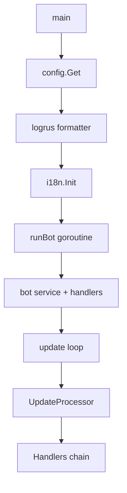
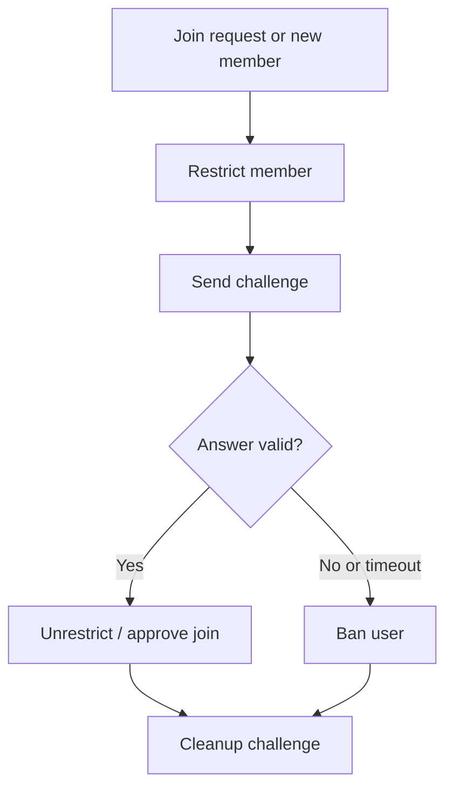
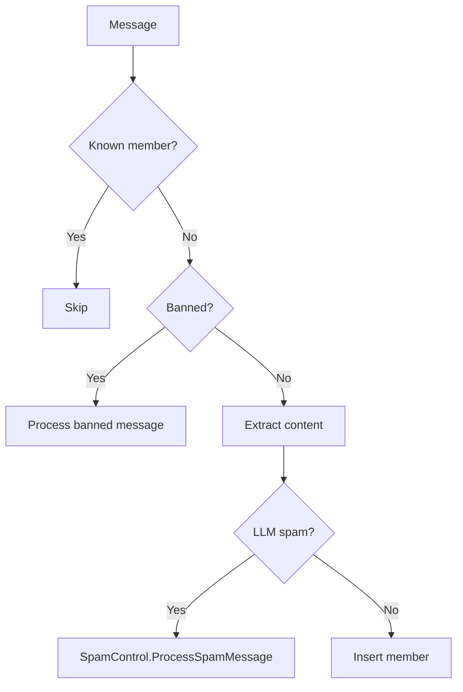
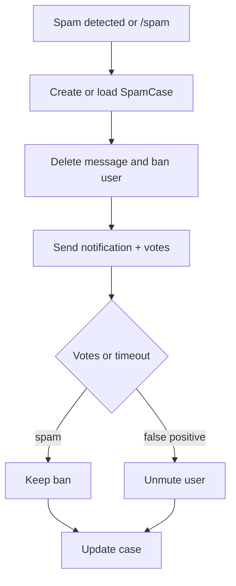

# Architecture Overview

This document describes the architecture, model, structure, and flows derived from the Go source code in this repository. It is intended as a complete reference for refactoring and future evolution.

## Scope

- Sources: all Go files under `cmd/` and `internal/`, plus `resources/embed.go`.
- Non-Go assets are referenced only when the Go code embeds or loads them (for example migrations and i18n resources).

## System Purpose

Telegram bot that protects group chats by:

- Gatekeeping new members with a challenge.
- Detecting spam in first messages using LLMs and community voting.
- Enforcing bans/mutes and logging events.

## Module Map

| Package | Responsibility | Notes |
| --- | --- | --- |
| `cmd/ngbot` | Entry point, lifecycle, handler registration | `main.go` |
| `internal/config` | Environment config + log formatter | `config.go`, `log_formatter.go` |
| `internal/infra` | Workdir, resource path, executable watcher | Used by DB and main |
| `internal/i18n` | Translations, language list | Embedded resources |
| `internal/bot` | Core service, caching, update processing | Handler orchestration |
| `internal/handlers/admin` | Admin commands | `/lang`, `/start` |
| `internal/handlers/chat` | Gatekeeper + reactor | Joins, messages, reactions |
| `internal/handlers/moderation` | Ban service + spam control + spam detector | External banlist, voting |
| `internal/adapters` | LLM interface + implementations | OpenAI + Gemini |
| `internal/db` | Domain data models + DB client interface | Settings, spam cases |
| `internal/db/sqlite` | SQLite implementation + migrations | Embedded migrations |
| `resources` | Embedded files | i18n, gatekeeper challenges, migrations |

## Entry, Lifecycle, and Runtime Topology

- `cmd/ngbot/main.go` is the entry point.
- It loads config, sets logrus formatter, and initializes i18n.
- It spawns the bot loop in a goroutine and waits for:
  - OS signals (SIGINT, SIGTERM, SIGHUP).
  - Executable file changes (`infra.MonitorExecutable`).
  - Errors from the bot loop.

## Core Application Service (`internal/bot`)

### Service

`service` is the central application orchestrator:

- Holds the Telegram bot client and DB client.
- Maintains in-memory caches:
  - `memberCache`: chatID -> userID -> expiry.
  - `settingsCache`: chatID -> Settings.
- Warm-up phase loads caches from DB.
- Periodic cleanup removes members who left chats.

### UpdateProcessor

`UpdateProcessor` selects enabled handlers and calls them in order. The handler order is defined by registration and `NG_HANDLERS` config. In `main.go`, handlers are registered in this order:

1. Gatekeeper (`gatekeeper`)
2. Admin (`admin`)
3. Reactor (`reactor`)

Each handler returns `(proceed bool, err error)`. When a handler returns `proceed = false`, processing stops for that update.

`UpdateProcessor` also:

- Drops outdated updates (`UpdateTimeout = 5m`).
- Skips updates without message/channel post timestamps.

### Telegram Helpers

Shared Telegram helper functions exist in `internal/bot/update_processor.go`:

- `DeleteChatMessage`, `BanUserFromChat`, `RestrictChatting`, `UnrestrictChatting`
- `ApproveJoinRequest`, `DeclineJoinRequest`
- `ExtractContentFromMessage`, `GetMessageType`, name helpers

There is also a separate helper wrapper in `internal/infrastructure/telegram` which is not currently used by handlers.

## Configuration (`internal/config`)

- Uses `envconfig` with prefix `NG_`.
- Config is loaded once with `sync.Once`.
- Config values include:
  - Telegram token, LLM settings, handler list.
  - Spam control parameters (timeouts, min voters, verbosity).
  - Reactor flags (flagged emojis).
- `NbFormatter` provides colored log output with file and line info.

## i18n and Resources (`internal/i18n`, `resources`)

- Translations are loaded from embedded `resources/i18n/translations.yml`.
- Gatekeeper challenges are loaded per-language from `resources/gatekeeper/challenges/*.yml`.
- Resources are embedded via `resources/embed.go`.

## Persistence Layer

### Interfaces and Models (`internal/db`)

`db.Client` defines the storage port:

- Chat settings CRUD.
- Member tracking.
- KV store for background fetch timestamps.
- Spam case lifecycle (cases, votes).
- Recent joiner tracking.
- Banlist storage.
- User restrictions tracking.

Core models:

| Model | Fields (selected) | Purpose |
| --- | --- | --- |
| `Settings` | id, language, enabled, challenge_timeout, reject_timeout | Per-chat configuration |
| `SpamCase` | id, chat_id, user_id, message_text, status, resolved_at | Voting workflow |
| `SpamVote` | case_id, voter_id, vote, voted_at | Community votes |
| `RecentJoiner` | chat_id, user_id, join_message_id, processed | Post-join processing |
| `UserRestriction` | user_id, chat_id, restricted_at, expires_at | Temporary restrictions |
| `Challenge` | comm_chat_id, chat_id, user_id, success_uuid, expires_at | Gatekeeper challenge state |

### SQLite Adapter (`internal/db/sqlite`)

- Uses `sqlx` and `modernc.org/sqlite`.
- Runs embedded migrations on startup via `sql-migrate`.
- Implements all `db.Client` methods.

Observed tables from SQL usage:

- `chats`, `chat_members`
- `spam_cases`, `spam_votes`
- `recent_joiners`
- `user_restrictions`
- `banlist`
- `kv_store`
- `gatekeeper_challenges`

## LLM Adapters (`internal/adapters/llm`)

Port: `adapters.LLM`

- `Detect(ctx, message)` returns spam decision.
- `ChatCompletion(ctx, messages)` provides chat completion.
- `WithModel`, `WithParameters`, `WithSystemPrompt` mutate adapter state.

Adapters:

- OpenAI (`internal/adapters/llm/openai`): uses `go-openai`, supports custom base URL.
- Gemini (`internal/adapters/llm/gemini`): uses `google/generative-ai-go`, custom safety settings.

## Handlers

### Gatekeeper (`internal/handlers/chat/gatekeeper.go`)

Purpose: challenge new joiners, restrict chat permissions, and ban on failure.

Key data structures:

- `gatekeeper_challenges`: persistent storage for active challenges.
- `Variants`: challenge variants loaded from resources.

Main flows:

- `ChatJoinRequest` or `NewChatMembers` create a challenge.
- Challenge is sent with inline keyboard buttons.
- Callback query validates answer, unrestricts or bans.
- Background routines:
  - Periodic processing of expired challenges from DB.
  - Processing `recent_joiners` from DB for known-banned checks.

### Reactor (`internal/handlers/chat/reactor.go`)

Purpose: spam detection on first messages and reaction-based moderation.

Pipeline:

1. Membership check: skip known members.
2. Banlist check via `BanService`.
3. Content extraction from message.
4. LLM spam detection.
5. Process spam via `SpamControl` or mark member as trusted.

It also handles:

- Reactions: bans user if flagged emoji count exceeds threshold.
- Commands: `/testspam`, `/skipreason`, `/spam`.

The handler keeps `lastResults` for `/skipreason` (unbounded map).

### Admin (`internal/handlers/admin/admin.go`)

- `/lang` sets chat language (admin-only).
- `/start` responds with a success message.
- `/ban` exists but is commented out (not active).

### Moderation (`internal/handlers/moderation`)

#### Ban Service

- Fetches known spammers from `lols.bot` lists.
- Stores fetch timestamps in KV store (`kv_store`).
- Maintains `knownBanned` in memory and persists to `banlist`.
- Provides operations:
  - `CheckBan` (API lookup + cached lists).
  - `MuteUser`, `UnmuteUser` (restriction records).
  - `BanUserWithMessage`, `UnbanUser`.

#### Spam Detector

- Uses LLM chat completion with a fixed prompt and a large set of examples.
- Expects "0" (not spam) or "1" (spam) output.
- Cleans the model output to extract a valid decision.

#### Spam Control

- Creates `SpamCase` records and sends notifications.
- Deletes the suspect message and bans the user on detection.
- Supports in-chat voting or channel logging with voting buttons.
- Resolves cases on timeout or when voter threshold is reached.

## Event System (`internal/event`)

- `event.Bus` is a buffered queue of `Queueable`.
- `RunWorker` starts a loop that dequeues and dispatches events to subscribers.
- There is no subscription or enqueue usage outside this package at the moment.

## Background Jobs and Concurrency

Active background routines include:

- `service.warmupCache` (startup).
- `service.CleanupLeftMembers` (every 24h).
- Gatekeeper:
  - Processing `recent_joiners` (every minute).
  - Processing expired challenges (every minute).
- BanService:
  - Daily and hourly banlist fetch.

## External Systems

- Telegram Bot API (OvyFlash/telegram-bot-api).
- LLM APIs:
  - OpenAI-compatible endpoints.
  - Gemini (Google Generative AI).
- Banlist APIs (lols.bot).

## Notable Behaviors and Nuances

- Handler order matters; `Gatekeeper` runs before `Reactor`.
- `UpdateProcessor` skips updates older than 5 minutes and ignores updates without message timestamps.
- Gatekeeper challenges are persisted in SQLite and cleaned up on expiration.
- `Reactor.lastResults` is bounded in memory.

## Suggested Reading Order for Refactoring

1. `cmd/ngbot/main.go` and `internal/config`.
2. `internal/bot` service and update processor.
3. `internal/handlers/chat` (Gatekeeper, Reactor).
4. `internal/handlers/moderation` (SpamControl, BanService, SpamDetector).
5. `internal/db` and `internal/db/sqlite`.
6. `internal/adapters/llm` (OpenAI, Gemini).
