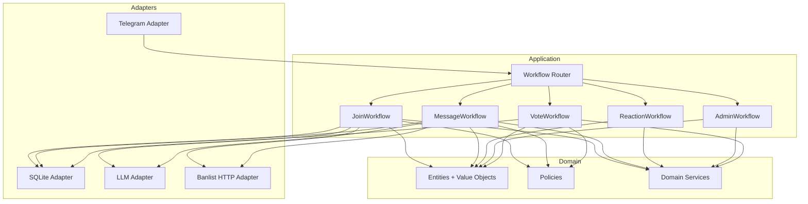

# Architecture Modernization Plan

This plan proposes a workflow-first, hexagonal/DDD aligned architecture that reduces code size, consolidates logic, and improves correctness and testability.

## Goals

- Reduce duplication and total code surface area.
- Organize behavior around explicit workflows (use cases).
- Isolate domain logic from infrastructure (clean/hexagonal).
- Improve reliability (no data races, idempotent flows).
- Improve testability (ports, deterministic workflows).

## Non-Goals

- Rewriting functionality from scratch.
- Changing external behavior unless explicitly required.
- Introducing new external dependencies without need.

## Target Architecture (Layered Hexagonal)

## Domain Model Consolidation

### Entities / Value Objects

- ChatID, UserID, MessageID
- Settings
- Member
- SpamCase, SpamVote
- UserRestriction
- RecentJoiner
- Challenge (new domain entity for gatekeeper)

### Policies (pure functions)

- SpamDecisionPolicy (mapping LLM response to decision)
- VotingPolicy (min voters, percentage, tie-breaks)
- GatekeeperPolicy (attempt limits, timeouts)
- MessageEligibilityPolicy (first message rules, skip reasons)

### Domain Services

- ChallengeService (create, verify, expire)
- MembershipService (add/remove/check)
- SpamReviewService (create case, apply actions)

## Workflow-First Application Layer

### Workflow Definitions

| Workflow | Trigger | Core Steps | Side Effects |
| --- | --- | --- | --- |
| JoinWorkflow | ChatJoinRequest or NewChatMembers | load settings -> check banlist -> restrict -> create challenge -> await answer -> decide | restrict, approve/decline, ban |
| MessageWorkflow | Message | check member -> check banlist -> extract content -> LLM check -> decide -> persist member | delete/ban, case create, member insert |
| ReactionWorkflow | ReactionCount | count flagged -> threshold check | delete/ban |
| VoteWorkflow | CallbackQuery(spam_vote) | record vote -> check thresholds -> resolve case | update case, unmute/ban |
| AdminWorkflow | Command | validate permissions -> update settings | config updates |

### Workflow Router

Single entrypoint that:

- Parses `Update` to a normalized `IncomingEvent`.
- Routes to workflow based on event type.
- Ensures idempotency and timeouts are enforced.

## Ports and Adapters

### Ports (interfaces near workflows)

Define interfaces next to the workflow that uses them:

- ChatGateway (send, delete, restrict, approve, ban)
- SettingsRepo, MemberRepo
- SpamCaseRepo, SpamVoteRepo
- BanlistRepo
- LLMClient
- Clock, Scheduler
- MetricsRecorder, Tracer (optional)

### Adapters

- Telegram adapter implementing ChatGateway.
- SQLite adapter implementing all repos.
- OpenAI/Gemini implementing LLMClient.
- HTTP banlist adapter implementing BanlistRepo.

## Code Reduction Actions

- Consolidate Telegram operations (remove `internal/infrastructure/telegram` or `internal/bot` helpers; keep one).
- Merge duplicated settings creation logic (BaseHandler + Service).
- Remove unused packages (`internal/event`, `internal/utils/text`) or integrate if needed.
- Replace local Cyrillic normalization in Reactor with a single shared helper.
- Replace multiple message parsing helpers with one in Application layer.
- Collapse spam detection examples into data file if it reduces code size.

## Reliability and Bug Reduction

- Replace Gatekeeper in-memory maps with:
  - A persistent `Challenge` store in DB, or
  - A concurrency-safe in-memory store with TTL and mutex.
- Add idempotency keys for challenge callbacks and spam votes.
- Add bounded cache for `lastResults` (ring buffer or TTL map).
- Ensure all goroutines have cancel paths (Scheduler port).
- Enforce consistent error wrapping and classification.

## Testing Strategy

| Layer | Tests | Notes |
| --- | --- | --- |
| Domain | unit tests | pure logic, table-driven |
| Application | workflow tests | mock ports, deterministic clock |
| Adapters | integration tests | SQLite repo and Telegram adapter stubs |

## Phased Execution Plan

| Phase | Objective | Key Work | Deliverables |
| --- | --- | --- | --- |
| 0 | Safety baseline | Add minimal tests for current flows; capture current behavior | Baseline tests + docs |
| 1 | Domain extraction | Create domain entities + policies | `internal/domain` with unit tests |
| 2 | Workflow layer | Implement workflows with port interfaces | `internal/app` workflows + router |
| 3 | Adapter alignment | Move Telegram/SQLite/LLM to adapters | Adapters implement ports |
| 4 | Cleanup | Remove duplicates, unused packages | Reduced code, slimmer handlers |
| 5 | Hardening | Add TTL caches, concurrency fixes | Reliability improvements |

## Migration Strategy

- Keep existing handlers as adapters that forward to workflows.
- Move logic one workflow at a time (start with MessageWorkflow).
- Maintain feature parity by comparing behavior on fixtures.
- Remove old code only after workflow tests pass.

## Open Decisions (to confirm before implementation)

- Persisted challenges vs in-memory TTL.
- Minimum acceptable behavior changes in spam voting flow.
