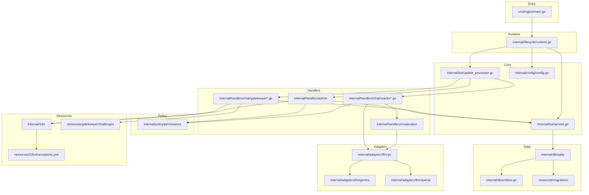
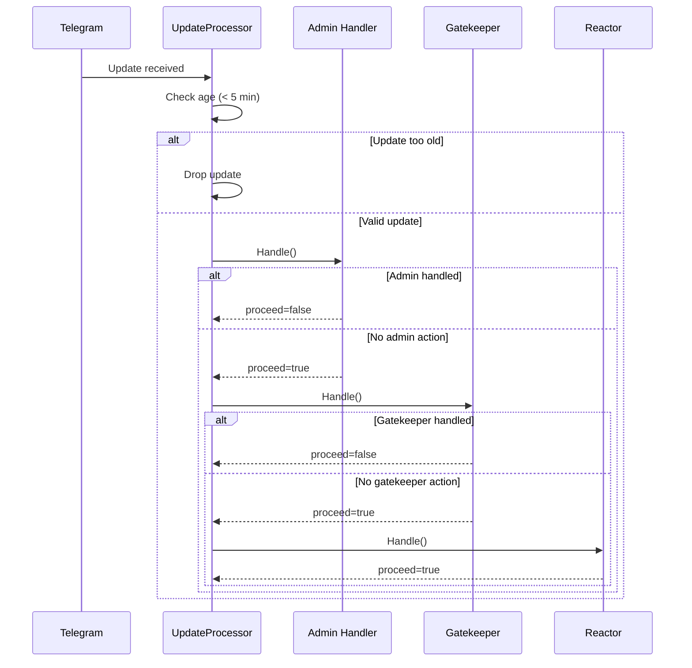
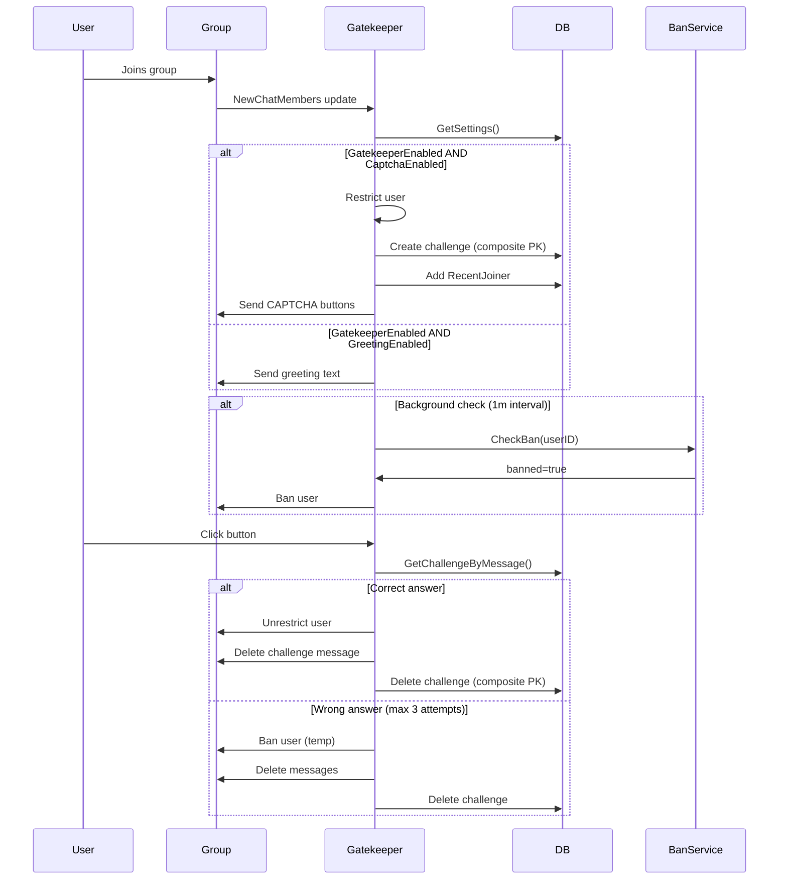
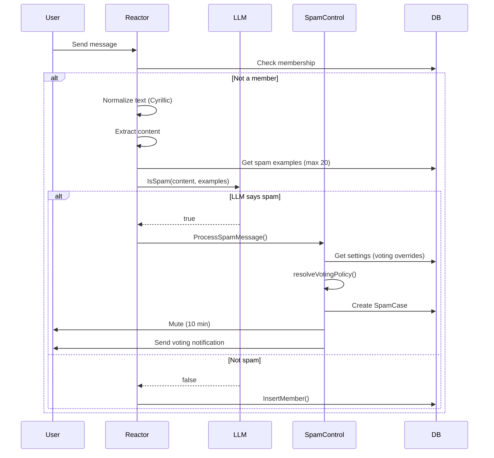
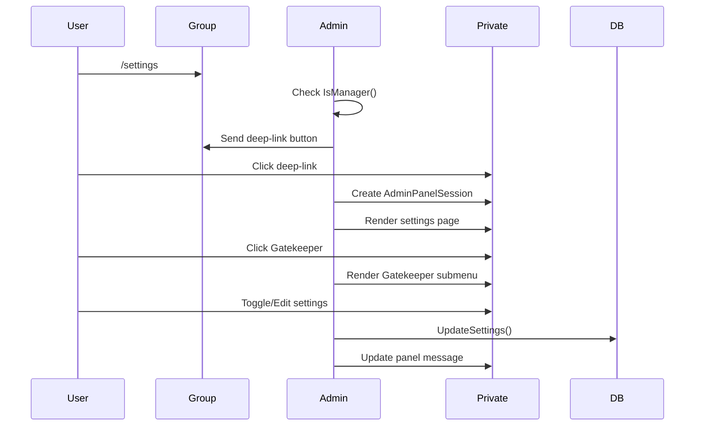
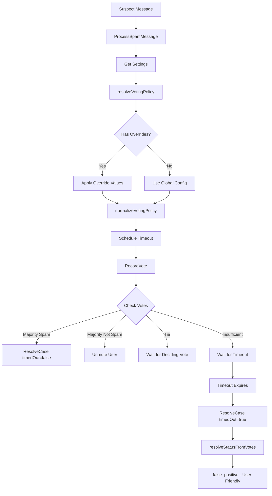

# ngbot Codebase Map

> Auto-generated by Cartographer. Last mapped: 2026-02-19 (updated with uncommitted changes)

## System Overview

**ngbot** is a Telegram chat gatekeeper bot that protects groups from spam and automated bot joins. It provides CAPTCHA-based entry verification with configurable options, LLM-powered spam detection, and community voting moderation.



## Directory Structure

```
ngbot/
├── cmd/ngbot/main.go              # Application entry point, runtime wiring
├── internal/
│   ├── bot/                       # Core bot service and update processing
│   │   ├── service.go             # Membership tracking, settings, caching
│   │   ├── service_test.go        # Service lifecycle tests
│   │   ├── update_processor.go    # Update dispatch, handler registry
│   │   └── dependencies.go        # Interface definitions (Service, Handler)
│   ├── config/                    # Configuration loading (env vars)
│   │   ├── config.go              # NG_* environment variables
│   │   └── log_formatter.go       # Custom logrus formatter
│   ├── db/                        # Database layer (hexagonal)
│   │   ├── dependencies.go        # Client interface (50+ methods)
│   │   ├── entities.go            # Data structures (Settings, Challenge, etc.)
│   │   ├── settings.go            # DefaultSettings(), ErrNotFound
│   │   ├── spam_tracking.go       # SpamReport, UserRestriction
│   │   └── sqlite/                # SQLite implementation
│   │       ├── client.go          # SQLite bootstrap (conn+migrations)
│   │       ├── client_settings_members.go  # Settings & members CRUD
│   │       ├── client_challenges.go        # Gatekeeper challenges (composite PK)
│   │       ├── client_challenges_test.go   # Parallel join request tests
│   │       ├── client_spam.go              # Spam/restrictions/banlist
│   │       ├── client_kv.go                # KV store operations
│   │       ├── admin_panel.go              # Admin panel sessions
│   │       └── migrations_test.go          # Index verification tests
│   ├── adapters/                  # External service adapters
│   │   ├── llm.go                 # LLM interface
│   │   └── llm/
│   │       ├── entities.go        # Chat completion types
│   │       ├── gemini/            # Google Gemini adapter
│   │       └── openai/            # OpenAI-compatible adapter
│   ├── handlers/                  # Update handlers (chain of responsibility)
│   │   ├── dependencies.go        # Compile-time interface verification
│   │   ├── base/handler.go        # Shared handler utilities, default settings
│   │   ├── admin/                 # Admin commands and panel
│   │   │   ├── admin.go           # Core struct, lifecycle, Handle()
│   │   │   ├── panel_handler.go   # /settings flow, callback routing
│   │   │   ├── panel_access_service.go    # Permission checks
│   │   │   ├── panel_commands.go  # State machine actions (gatekeeper submenu)
│   │   │   ├── panel_constants.go # Pagination, timeouts, captcha options
│   │   │   ├── panel_encoding.go  # ChatID/MessageID encoding
│   │   │   ├── panel_lifecycle.go # Session cleanup worker
│   │   │   ├── panel_render.go    # Render orchestration, greeting preview
│   │   │   ├── panel_renderer.go  # UI rendering
│   │   │   ├── panel_session_service.go    # Session persistence
│   │   │   └── panel_types.go     # Page/action/command types (gatekeeper pages)
│   │   ├── chat/                  # Gatekeeper/Reactor use-cases
│   │   │   ├── gatekeeper.go      # Orchestrator, lifecycle
│   │   │   ├── gatekeeper_captcha.go       # Button generation, keyboard layout
│   │   │   ├── gatekeeper_captcha_test.go  # Button generation tests
│   │   │   ├── gatekeeper_challenge_service.go  # Callback handling
│   │   │   ├── gatekeeper_join_processor.go     # Join flow, greeting text
│   │   │   ├── gatekeeper_scheduler.go          # Background workers
│   │   │   ├── reactor.go         # Orchestrator, pipeline stages
│   │   │   ├── reactor_command_router.go     # /ban, /testspam, /skipreason
│   │   │   ├── reactor_message_pipeline.go   # Spam detection pipeline
│   │   │   ├── reactor_message_pipeline_test.go  # Spam examples tests
│   │   │   ├── reactor_reaction_moderator.go # Reaction-based moderation
│   │   │   └── reactor_text_normalizer.go    # Cyrillic homoglyph normalization
│   │   └── moderation/            # Spam detection, ban service
│   │       ├── ban_service.go     # Interface, lifecycle, public API
│   │       ├── ban_service_actions.go     # Restrict/ban/unban actions
│   │       ├── ban_service_fetch.go       # Banlist fetch/retry/cache
│   │       ├── spam_control.go    # Voting system, per-chat policy overrides
│   │       ├── spam_control_policy_test.go  # Voting policy tests (NEW)
│   │       ├── spam_detector.go   # LLM-based detection
│   │       └── spam_detector_test.go   # LLM prompt construction tests
│   ├── lifecycle/                 # Runtime component orchestration
│   │   ├── runtime.go             # Component interface, LIFO stop
│   │   └── runtime_test.go        # Order verification tests
│   ├── policy/                    # Shared policy packages
│   │   └── permissions/           # Manager/moderator role checks
│   │       └── permissions.go     # IsManager, IsPrivilegedModerator
│   ├── i18n/                      # Internationalization
│   │   ├── i18n.go                # Translation loading/lookup
│   │   ├── languages.go           # Language name lookup
│   │   └── translations_consistency_test.go  # AST-based key consistency
│   └── infra/                     # Infrastructure utilities
│       ├── filesystem.go          # Working directory management
│       └── health_check.go        # Executable modification monitor
├── resources/
│   ├── embed.go                   # Go embed directive
│   ├── i18n/translations.yml      # 30 language translations
│   ├── gatekeeper/challenges/     # Per-language emoji challenges
│   └── migrations/                # SQL migration files
│       ├── 20260219143000-add-gatekeeper-settings.sql
│       ├── 20260219143100-disable-gatekeeper-for-all-chats.sql
│       ├── 20260219143200-fix-gatekeeper-challenge-primary-key.sql
│       └── 20260219150000-add-community-voting-overrides.sql  # Per-chat voting config (NEW)
├── go.mod                         # Dependencies
├── Dockerfile                     # Multi-stage build
├── compose.yaml                   # Docker Compose config
└── .env.example                   # Configuration template
```

## Module Guide

### Core Bot Module (`internal/bot/`)

**Purpose**: Central bot service and update processing pipeline

| File | Purpose | Key Exports |
|------|---------|-------------|
| `service.go` | Membership/settings management with caching | `NewService()`, `IsMember()`, `GetSettings()` |
| `service_test.go` | Service initialization and lifecycle tests | `TestServiceGetSettingsCreatesDefaults`, `TestServiceStartStop` |
| `update_processor.go` | Update dispatch to handlers | `UpdateProcessor`, `RegisterUpdateHandler()`, 24 `MessageType` constants |
| `dependencies.go` | Interface contracts | `Service`, `Handler`, `Client` interfaces |

**Key Patterns**:
- Two-level caching (members: 5-min TTL, settings: no expiry)
- Handler registry with chain of responsibility
- Update timeout: 5 minutes (stale updates dropped)
- Global `registeredHandlers` map (not thread-safe)

**Dependencies**: `telegram-bot-api`, `db`, `config`, `errgroup`

---

### Lifecycle Module (`internal/lifecycle/`)

**Purpose**: Component lifecycle orchestration with ordered start/stop

| File | Purpose | Key Exports |
|------|---------|-------------|
| `runtime.go` | Component orchestration | `Component` interface, `Runtime`, `NewRuntime()` |
| `runtime_test.go` | Order verification tests | LIFO stop order validation |

**Key Patterns**:
- `Component` interface: `Start(ctx) error`, `Stop(ctx) error`
- LIFO stop order (last started = first stopped)
- Rollback on start failure

---

### Handlers Module (`internal/handlers/`)

**Purpose**: Update processing chain with specialized handlers

| Handler | Purpose | Chain Order |
|---------|---------|-------------|
| `Admin` | `/lang`, `/settings`, admin panel with gatekeeper submenu | 1 (stops on match) |
| `Gatekeeper` | CAPTCHA challenges (configurable options) for new members | 2 (stops for callbacks) |
| `Reactor` | Spam detection, message processing | 3 (always runs) |

#### Admin Handler Files

| File | Purpose |
|------|---------|
| `admin.go` | Core struct, lifecycle, `Handle()` dispatcher |
| `panel_handler.go` | `/settings` flow, deep-linking, callback routing |
| `panel_access_service.go` | Permission checks, bot membership tracking |
| `panel_commands.go` | State machine actions (gatekeeper, voting overrides, greeting edit) |
| `panel_constants.go` | Pagination, timeouts, captcha options, voting options |
| `panel_encoding.go` | Binary encoding for chat/message IDs in callbacks |
| `panel_lifecycle.go` | Background session cleanup worker |
| `panel_render.go` | Render dispatch (gatekeeper, LLM, voting submenus) |
| `panel_renderer.go` | UI rendering (text + keyboards) |
| `panel_session_service.go` | Session persistence, callback parsing |
| `panel_types.go` | `panelPage`, `panelState`, `panelCommand` (cascading menu structure) |

**Admin Panel Pages** (Cascading Menu Structure):

| Page | Description |
|------|-------------|
| `panelPageHome` | Main menu |
| `panelPageGatekeeper` | Gatekeeper settings (master, captcha, greeting toggles) |
| `panelPageGatekeeperCaptcha` | CAPTCHA settings submenu |
| `panelPageGatekeeperCaptchaOptions` | CAPTCHA options count selection |
| `panelPageGatekeeperChallengeTimeout` | Challenge timeout configuration |
| `panelPageGatekeeperRejectTimeout` | Reject timeout configuration |
| `panelPageGatekeeperGreeting` | Greeting settings with preview |
| `panelPageLLM` | LLM First Message settings (spam examples cap: 20) |
| `panelPageVoting` | Community Voting main page |
| `panelPageVotingTimeout` | Voting timeout override (Inherit, 1m-30m) |
| `panelPageVotingMinVoters` | Min voters override (Inherit, 1-10) |
| `panelPageVotingMaxVoters` | Max voters override (Inherit, No cap, 5-20) |
| `panelPageVotingMinPercent` | Min voters % override (Inherit, 1%-20%) |

#### Gatekeeper Handler Files

| File | Purpose |
|------|---------|
| `gatekeeper.go` | Orchestrator, lifecycle, `Handle()` |
| `gatekeeper_captcha.go` | CAPTCHA button generation, smart keyboard layout (2 rows for 6+) |
| `gatekeeper_challenge_service.go` | Challenge callback handling |
| `gatekeeper_join_processor.go` | Join/request flow, greeting text with placeholders |
| `gatekeeper_scheduler.go` | Background workers (spam check, expired challenges) |
| `gatekeeper_captcha_test.go` | Button generation and keyboard layout tests |

#### Reactor Handler Files

| File | Purpose |
|------|---------|
| `reactor.go` | Orchestrator, pipeline stages, callback handling |
| `reactor_command_router.go` | `/testspam`, `/skipreason`, `/ban` commands |
| `reactor_message_pipeline.go` | First-message spam detection pipeline |
| `reactor_message_pipeline_test.go` | Spam example loading tests |
| `reactor_reaction_moderator.go` | Reaction-based moderation |
| `reactor_text_normalizer.go` | Cyrillic homoglyph normalization |

#### Moderation Files

| File | Purpose |
|------|---------|
| `ban_service.go` | Interface, lifecycle, public API |
| `ban_service_actions.go` | Mute/Ban/Unmute/Unban actions |
| `ban_service_fetch.go` | External banlist fetch with retry |
| `spam_control.go` | Community voting system, per-chat policy resolution |
| `spam_control_policy_test.go` | Voting policy and resolution tests (NEW) |
| `spam_detector.go` | LLM-powered classification |
| `spam_detector_test.go` | LLM prompt construction tests |

**Community Voting Policy System**:

| Component | Purpose |
|-----------|---------|
| `votingPolicy` struct | Holds `Timeout`, `MinVoters`, `MaxVoters`, `MinVotersPercentage` |
| `resolveVotingPolicy()` | Merges global config with per-chat overrides |
| `normalizeVotingPolicy()` | Ensures sensible defaults (min 1 voter, 5min timeout) |
| `resolveStatusFromVotes()` | Determines spam/false_positive/defer based on votes |

**Voting Resolution Logic**:

| Scenario | Result |
|----------|--------|
| Spam majority | `spam` status → user banned |
| Not-spam majority | `false_positive` status → user unmuted |
| Tie vote | Defer resolution (wait for deciding vote) |
| Insufficient votes + timeout | `false_positive` status (user-friendly) |

**Dependencies**: `bot`, `db`, `adapters/llm`, `i18n`, `config`, `policy/permissions`

---

### Database Module (`internal/db/`)

**Purpose**: SQLite persistence with repository pattern

| File | Purpose |
|------|---------|
| `dependencies.go` | `Client` interface (50+ methods) |
| `entities.go` | Data structures with `db` tags |
| `settings.go` | `DefaultSettings()`, `ErrNotFound` |
| `spam_tracking.go` | `SpamReport`, `UserRestriction` |
| `sqlite/client.go` | SQLite bootstrap, pool, migrations |
| `sqlite/client_settings_members.go` | Settings & members CRUD |
| `sqlite/client_challenges.go` | Challenge CRUD (composite PK: comm_chat_id, user_id, chat_id) |
| `sqlite/client_challenges_test.go` | Parallel join request tests |
| `sqlite/client_spam.go` | Spam/restrictions/banlist CRUD |
| `sqlite/client_kv.go` | KV store operations |
| `sqlite/admin_panel.go` | Admin sessions, spam examples |

**Key Entities**:
| Entity | Purpose |
|--------|---------|
| `Settings` | Per-chat configuration (includes gatekeeper sub-settings) |
| `Challenge` | CAPTCHA state (composite PK: comm_chat_id + user_id + chat_id) |
| `SpamCase` | Spam report with voting |
| `AdminPanelSession` | Admin UI state |

**Settings Entity - Gatekeeper Fields**:
| Field | Type | Default | Description |
|-------|------|---------|-------------|
| `GatekeeperEnabled` | bool | false | Master switch |
| `GatekeeperCaptchaEnabled` | bool | false | CAPTCHA sub-feature |
| `GatekeeperGreetingEnabled` | bool | false | Greeting sub-feature |
| `GatekeeperCaptchaOptionsCount` | int | 5 | Options count (3,4,5,6,8,10) |
| `GatekeeperGreetingText` | string | "" | Custom greeting text |

**Settings Entity - Community Voting Override Fields** (NEW):
| Field | Type | Default | Description |
|-------|------|---------|-------------|
| `CommunityVotingTimeoutOverrideNS` | int64 | -1 | Voting timeout override (nanoseconds) |
| `CommunityVotingMinVotersOverride` | int | -1 | Minimum voters override |
| `CommunityVotingMaxVotersOverride` | int | -1 | Maximum voters override |
| `CommunityVotingMinVotersPercentOverride` | int | -1 | Minimum voters percentage override |

> **Note**: Value `-1` (`SettingsOverrideInherit`) means "use global config"

**Gotchas**:
- `db.ErrNotFound` used for missing lookups
- `SpamVote.Vote`: `true` = NOT spam (inverted)
- Connection pool: 42 max open connections
- Pure-Go SQLite driver (`modernc.org/sqlite`)
- `sync.RWMutex` protects all operations
- Challenge PK supports parallel join requests per user across linked chats

---

### Policy Module (`internal/policy/permissions/`)

**Purpose**: Permission checking utilities

| Function | Description |
|----------|-------------|
| `IsManager(member)` | Creator OR admin with `CanManageChat` OR `CanPromoteMembers` |
| `IsPrivilegedModerator(member)` | Manager OR admin with `CanRestrictMembers` |

---

### LLM Adapters (`internal/adapters/llm/`)

**Purpose**: Abstraction over OpenAI and Google Gemini APIs

```go
type LLM interface {
    ChatCompletion(ctx, messages) (Response, error)
}
```

| Adapter | Default Model | Notes |
|---------|---------------|-------|
| `gemini.API` | `gemini-2.5-flash-lite` | Uses `google.golang.org/genai`, `BLOCK_NONE` safety |
| `openai.API` | `gpt-4o-mini` | Supports custom base URL |

**Gotchas**:
- Gemini: roles mapped (`assistant` -> `model`)
- Gemini: safety policy always `BLOCK_NONE`

---

### i18n Module (`internal/i18n/`)

**Purpose**: Multi-language support for bot messages

| File | Purpose |
|------|---------|
| `i18n.go` | Translation loading/lookup |
| `languages.go` | ISO code to name mapping |
| `translations_consistency_test.go` | AST-based key consistency verification |

**Supported Languages**: be, bg, cs, da, de, el, en, es, et, fi, fr, hu, id, it, ja, ko, lt, lv, nb, nl, pl, pt, ro, ru, sk, sl, sv, tr, uk, zh (30 total)

---

## Data Flow

### Telegram Update Processing



### Gatekeeper Challenge Flow



### Spam Detection Flow



### Admin Panel Flow



### Community Voting Resolution Flow (NEW)



## Configuration

### Environment Variables (NG_* prefix)

| Variable | Default | Description |
|----------|---------|-------------|
| `NG_TOKEN` | *required* | Telegram bot token |
| `NG_LANG` | `en` | Default language |
| `NG_HANDLERS` | `admin,gatekeeper,reactor` | Enabled handlers |
| `NG_LOG_LEVEL` | `2` | Log verbosity (0-6) |
| `NG_DOT_PATH` | `~/.ngbot` | Data directory |
| `NG_LLM_API_KEY` | *required* | LLM API key |
| `NG_LLM_API_MODEL` | `gpt-4o-mini` | Model name |
| `NG_LLM_API_URL` | `https://api.openai.com/v1` | OpenAI-compatible endpoint |
| `NG_LLM_API_TYPE` | `openai` | Provider (openai/gemini) |
| `NG_FLAGGED_EMOJIS` | `👎,💩` | Reaction ban triggers |
| `NG_SPAM_MIN_VOTERS` | `2` | Min votes for action |
| `NG_SPAM_MAX_VOTERS` | `10` | Max voters |
| `NG_SPAM_MIN_VOTERS_PERCENTAGE` | `5` | Vote threshold % |
| `NG_SPAM_VOTING_TIMEOUT` | `5m` | Voting window |

## Conventions

### Go Code Style
- Go 1.25+ with modern tooling
- Self-documenting code (minimal comments)
- `gofumpt` formatting
- `any` instead of `interface{}`
- Context as first parameter

### Architecture
- Hexagonal/DDD structure
- Interface-based dependency injection
- Consumer-local storage ports (`adminStore`, `gatekeeperStore`, `reactorStore`, `spamStore`, `banStore`)
- Repository pattern for database
- Handler chain of responsibility

### Database
- SQLite with embedded migrations
- `db:` struct tags for sqlx
- `sync.RWMutex` for thread safety
- Composite primary keys for parallel operations

### Testing
- Table-driven tests beside code (`*_test.go`)
- Stub/mock interfaces for isolation
- `t.Parallel()` for concurrent execution
- AST parsing for static analysis (i18n consistency)

## Gotchas

1. **Handler chain order matters**: Admin → Gatekeeper → Reactor
2. **SpamVote.Vote is inverted**: `true` = NOT spam, `false` = IS spam
3. **Lifecycle is mandatory**: Long-lived workers must implement `Component`
4. **Update timeout is 5 minutes**: Old updates silently dropped
5. **Cyrillic normalization**: Used to detect homoglyph spam
6. **External banlist**: Uses lols.bot API with retry/timeout
7. **Gatekeeper fallback**: `lang -> en -> built-in defaults`
8. **Admin panel session TTL**: 1 hour
9. **CAPTCHA max attempts**: 3
10. **Reaction threshold**: 5 flagged emojis = auto-ban
11. **Global handler registry**: `registeredHandlers` map is NOT thread-safe
12. **Log formatter depth**: `runtime.Caller(6)` assumes specific call stack
13. **Gatekeeper disabled by default**: New chats require explicit enable
14. **Challenge composite PK**: `(comm_chat_id, user_id, chat_id)` supports parallel joins
15. **Captcha options validation**: Only `[3, 4, 5, 6, 8, 10]` allowed
16. **Greeting placeholders**: `{user}`, `{chat_title}`, `{chat_link_titled}`, `{timeout}`
17. **Voting override sentinel**: `-1` means "inherit from global config" (not disabled)
18. **Insufficient votes behavior**: Timeout → `false_positive` (user-friendly, not spam)
19. **Tie vote behavior**: Waits for deciding vote (doesn't auto-spam)
20. **Max spam examples cap**: 20 per chat (reduced from 50)

## Navigation Guide

### To add a new handler
1. Create package in `internal/handlers/<name>/`
2. Implement `bot.Handler` interface
3. Add compile-time check in `internal/handlers/dependencies.go`
4. Register in `cmd/ngbot/main.go`: `bot.RegisterUpdateHandler("name", handler)`
5. Add to `NG_HANDLERS` env var

### To add a new LLM provider
1. Create package in `internal/adapters/llm/<provider>/`
2. Implement `adapters.LLM` interface
3. Add factory case in `cmd/ngbot/main.go`
4. Add `NG_LLM_API_TYPE` option

### To add new translations
1. Add entries to `resources/i18n/translations.yml`
2. Add challenge file in `resources/gatekeeper/challenges/<lang>.yml`
3. Add language name in `internal/i18n/languages.go`
4. Run tests: `go test ./internal/i18n/...` (consistency check)

### To modify spam detection
1. **Examples**: Edit `internal/handlers/moderation/spam_detector.go` few-shot examples
2. **Logic**: Modify `reactor_message_pipeline.go` pipeline stages
3. **Voting**: Adjust `internal/handlers/moderation/spam_control.go`

### To add database tables
1. Create migration in `resources/migrations/YYYYMMDDHHMMSS-description.sql`
2. Add entity to `internal/db/entities.go`
3. Add methods to `internal/db/dependencies.go` interface
4. Implement in appropriate `internal/db/sqlite/client_*.go`
5. Add tests in `internal/db/sqlite/*_test.go`

### To modify gatekeeper settings
1. **UI**: `internal/handlers/admin/panel_render.go` (Gatekeeper submenu)
2. **Commands**: `internal/handlers/admin/panel_commands.go` (toggle/set actions)
3. **Types**: `internal/handlers/admin/panel_types.go` (pages, actions, state)
4. **Defaults**: `internal/handlers/base/handler.go` (DefaultSettings)
5. **Logic**: `internal/handlers/chat/gatekeeper*.go` (CAPTCHA, greeting)

### To modify community voting settings
1. **UI**: `internal/handlers/admin/panel_render.go` (Voting submenu pages)
2. **Commands**: `internal/handlers/admin/panel_commands.go` (`setVotingTimeoutOverride`, etc.)
3. **Types**: `internal/handlers/admin/panel_types.go` (voting pages, actions)
4. **Constants**: `internal/handlers/admin/panel_constants.go` (voting options)
5. **Policy resolution**: `internal/handlers/moderation/spam_control.go` (`resolveVotingPolicy`, `normalizeVotingPolicy`)
6. **Database**: `internal/db/entities.go` (override fields), `internal/db/sqlite/client_settings_members.go`

## Dependencies

| Package | Purpose |
|---------|---------|
| `github.com/OvyFlash/telegram-bot-api` | Telegram Bot API |
| `github.com/sashabaranov/go-openai` | OpenAI client |
| `google.golang.org/genai` | Gemini client |
| `modernc.org/sqlite` | Pure-Go SQLite |
| `github.com/jmoiron/sqlx` | SQL extensions |
| `github.com/rubenv/sql-migrate` | Migrations |
| `github.com/sirupsen/logrus` | Logging |
| `github.com/sethvargo/go-envconfig` | Env config |
| `gopkg.in/yaml.v2` | YAML parsing |
| `github.com/pborman/uuid` | UUID generation |
| `golang.org/x/sync/errgroup` | Concurrent error handling |

## Recent Changes (2026-02-19)

### Community Voting Overrides (Uncommitted)
- **Per-chat voting configuration**: Override global voting settings per chat
- **New Settings fields**: `CommunityVotingTimeoutOverrideNS`, `CommunityVotingMinVotersOverride`, `CommunityVotingMaxVotersOverride`, `CommunityVotingMinVotersPercentOverride`
- **Sentinel value**: `-1` (`SettingsOverrideInherit`) means use global config
- **Migration**: `20260219150000-add-community-voting-overrides.sql`
- **New test**: `spam_control_policy_test.go` with voting policy resolution tests

### Improved Voting Resolution (Uncommitted)
- **Insufficient votes at timeout**: Now marks as `false_positive` (was: spam)
- **Tie votes**: Now waits for deciding vote (was: spam wins)
- **New functions**: `resolveVotingPolicy()`, `normalizeVotingPolicy()`, `resolveStatusFromVotes()`
- **Vote count fields**: Renamed to `spamVotes`/`notSpamVotes` for clarity

### Admin Panel Cascading Menus (Uncommitted)
- **LLM First Message page**: Moved spam examples under dedicated submenu
- **Community Voting page**: Full voting configuration UI with inheritance support
- **Gatekeeper sub-pages**: CAPTCHA Settings and Greeting Settings now have dedicated leaf screens
- **45+ new i18n keys**: Added for all new UI elements across 30 languages

### Reactor Changes (Uncommitted)
- **Max spam examples**: Reduced from 50 to 20 per chat
- **Uses DefaultSettings**: Now uses `db.DefaultSettings(chat.ID)` instead of inline defaults

### Gatekeeper Enhancements
- **Configurable CAPTCHA options**: 3, 4, 5, 6, 8, or 10 buttons
- **Custom greeting text**: Template placeholders `{user}`, `{chat_title}`, `{chat_link_titled}`, `{timeout}`
- **Dual feature toggle**: Independent CAPTCHA and greeting controls
- **Smart keyboard layout**: 6+ buttons split into 2 rows

### Admin Panel Submenu
- **Gatekeeper Settings page**: Master switch, sub-feature toggles, timeout settings
- **Greeting Editor page**: Text input with live preview

### Database Schema Changes
- **New Settings fields**: `GatekeeperCaptchaEnabled`, `GatekeeperGreetingEnabled`, `GatekeeperCaptchaOptionsCount`, `GatekeeperGreetingText`
- **Composite primary key**: `gatekeeper_challenges` now uses `(comm_chat_id, user_id, chat_id)` for parallel join support
- **Default changed**: `GatekeeperEnabled` defaults to `false`

### New Tests
- `client_challenges_test.go`: Parallel join request verification
- `reactor_message_pipeline_test.go`: Spam example loading
- `spam_detector_test.go`: LLM prompt construction
- `translations_consistency_test.go`: AST-based i18n key consistency
- `spam_control_policy_test.go`: Voting policy resolution (NEW, uncommitted)
