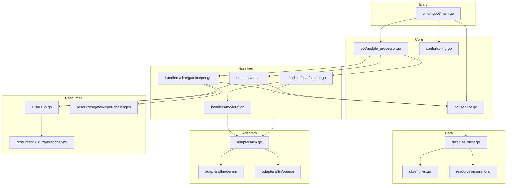
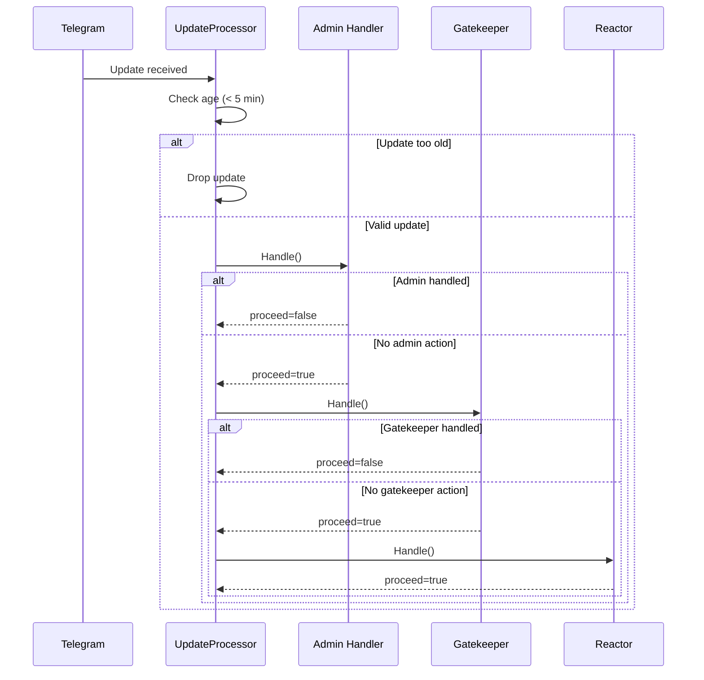
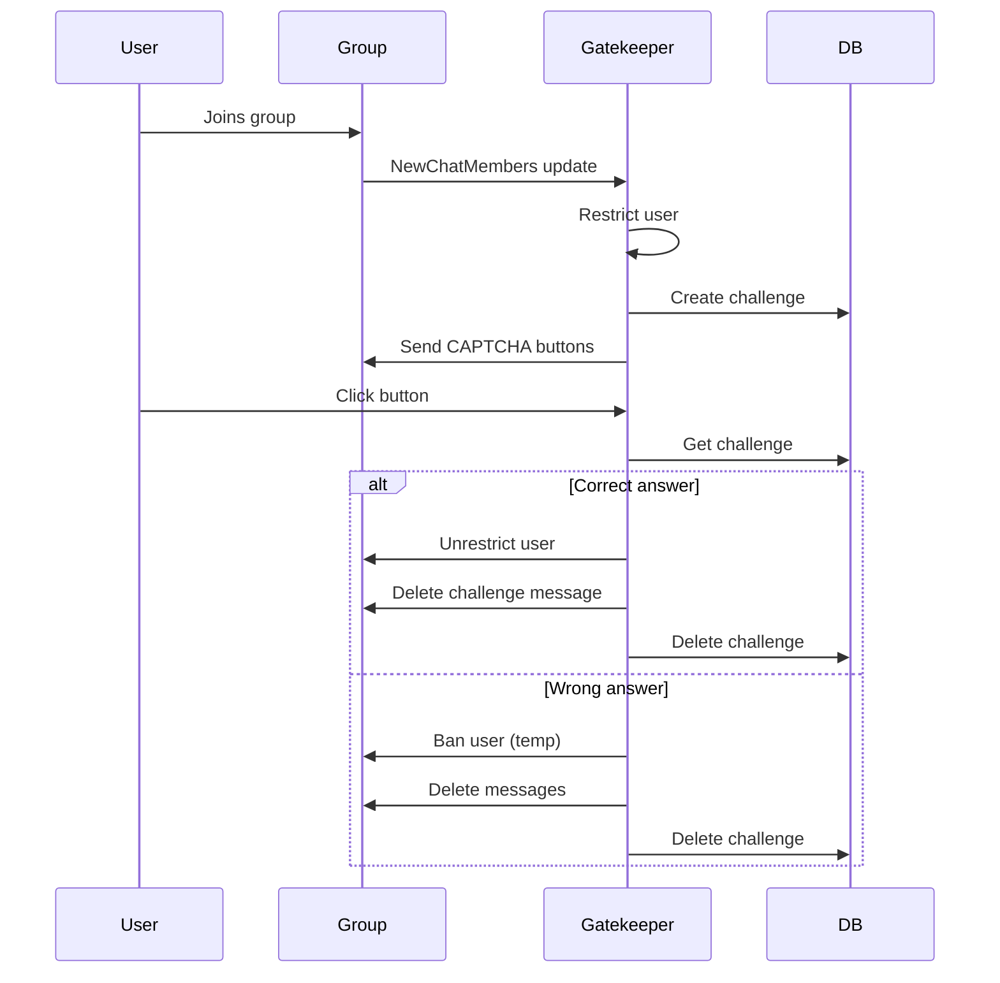
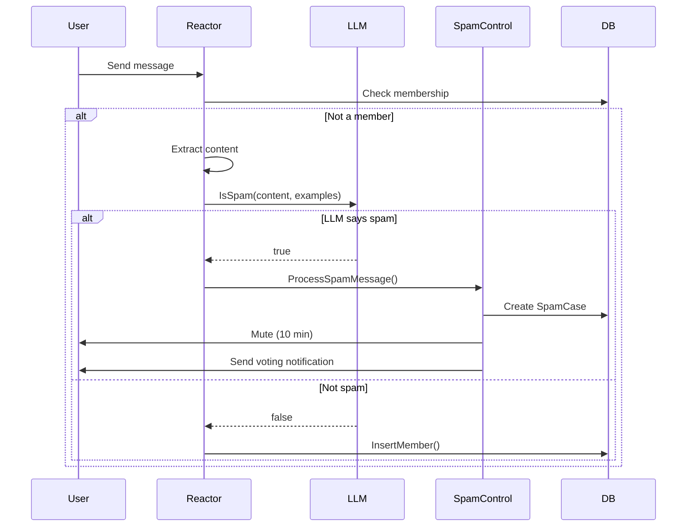

# ngbot Codebase Map

> Auto-generated by Cartographer. Last mapped: 2026-02-18

## System Overview

**ngbot** is a Telegram chat gatekeeper bot that protects groups from spam and automated bot joins. It provides CAPTCHA-based entry verification, LLM-powered spam detection, and community voting moderation.



## Directory Structure

```
ngbot/
├── cmd/ngbot/main.go           # Application entry point
├── internal/
│   ├── bot/                    # Core bot service and update processing
│   │   ├── service.go          # Membership tracking, settings, caching
│   │   ├── update_processor.go # Update dispatch, handler registry
│   │   └── dependencies.go     # Interface definitions
│   ├── config/                 # Configuration loading (env vars)
│   │   ├── config.go           # NG_* environment variables
│   │   └── log_formatter.go    # Custom logrus formatter
│   ├── db/                     # Database layer
│   │   ├── sqlite/client.go    # SQLite implementation
│   │   ├── sqlite/admin_panel.go
│   │   ├── entities.go         # Data structures
│   │   └── dependencies.go     # Client interface
│   ├── adapters/               # External service adapters
│   │   ├── llm.go              # LLM interface
│   │   └── llm/
│   │       ├── entities.go     # Chat completion types
│   │       ├── gemini/         # Google Gemini adapter
│   │       └── openai/         # OpenAI-compatible adapter
│   ├── handlers/               # Update handlers (chain of responsibility)
│   │   ├── admin/              # Admin commands and panel
│   │   ├── chat/               # Gatekeeper, Reactor
│   │   ├── moderation/         # Spam detection, ban service
│   │   └── base/               # Shared handler utilities
│   ├── i18n/                   # Internationalization
│   │   ├── i18n.go             # Translation loading/lookup
│   │   └── languages.go        # Language name lookup
│   └── infra/                  # Infrastructure utilities
│       ├── filesystem.go       # Working directory management
│       └── health_check.go     # Executable monitoring
├── resources/
│   ├── embed.go                # Go embed directive
│   ├── i18n/translations.yml   # 30 language translations
│   ├── gatekeeper/challenges/  # Per-language emoji challenges
│   └── migrations/             # SQL migration files
├── go.mod                      # Dependencies
├── Dockerfile                  # Multi-stage build
├── compose.yaml                # Docker Compose config
└── .env.example                # Configuration template
```

## Module Guide

### Core Bot Module (`internal/bot/`)

**Purpose**: Central bot service and update processing pipeline

| File | Purpose | Key Exports |
|------|---------|-------------|
| `service.go` | Membership/settings management with caching | `NewService()`, `IsMember()`, `GetSettings()` |
| `update_processor.go` | Update dispatch to handlers | `UpdateProcessor`, `RegisterUpdateHandler()` |
| `dependencies.go` | Interface contracts | `Service`, `Handler` |

**Key Patterns**:
- Two-level caching (members: 5-min TTL, settings: no expiry)
- Handler registry with chain of responsibility
- Update timeout: 5 minutes (stale updates dropped)

**Dependencies**: `telegram-bot-api`, `db`, `config`

---

### Handlers Module (`internal/handlers/`)

**Purpose**: Update processing chain with specialized handlers

| Handler | Purpose | Chain Order |
|---------|---------|-------------|
| `Admin` | `/lang`, `/settings`, admin panel | 1 (stops on match) |
| `Gatekeeper` | CAPTCHA challenges for new members | 2 (stops for callbacks) |
| `Reactor` | Spam detection, message processing | 3 (always runs) |

**Key Files**:

| File | Purpose | Lines |
|------|---------|-------|
| `chat/gatekeeper.go` | CAPTCHA challenge flow | 845 |
| `chat/reactor.go` | Message processing pipeline | 822 |
| `admin/panel_handler.go` | Admin panel callbacks | 819 |
| `moderation/ban_service.go` | Ban management, lols.bot API | 401 |
| `moderation/spam_control.go` | Voting system | 397 |
| `moderation/spam_detector.go` | LLM-based detection | 245 |

**Dependencies**: `bot`, `db`, `adapters/llm`, `i18n`, `config`

---

### Database Module (`internal/db/`)

**Purpose**: SQLite persistence with repository pattern

| File | Purpose |
|------|---------|
| `sqlite/client.go` | Thread-safe SQLite client |
| `sqlite/admin_panel.go` | Admin panel session storage |
| `entities.go` | Data structures with `db` tags |
| `dependencies.go` | `Client` interface |

**Key Entities**:
| Entity | Purpose |
|--------|---------|
| `Settings` | Per-chat configuration |
| `Challenge` | CAPTCHA state |
| `SpamCase` | Spam report with voting |
| `AdminPanelSession` | Admin UI state |

**Gotchas**:
- Returns `nil, nil` for "not found" (no error)
- `SpamVote.Vote`: `true` = NOT spam (inverted)
- Connection pool: 42 max open connections

---

### LLM Adapters (`internal/adapters/llm/`)

**Purpose**: Abstraction over OpenAI and Google Gemini APIs

```go
type LLM interface {
    ChatCompletion(ctx, messages) (Response, error)
}
```

| Adapter | Default Model | Notes |
|---------|---------------|-------|
| `gemini.API` | `gemini-2.5-flash-lite` | Uses `google.golang.org/genai` with fixed `BLOCK_NONE` safety thresholds |
| `openai.API` | `gpt-4o-mini` | Supports custom base URL |

**Gotchas**:
- Gemini: roles are mapped explicitly (`assistant` -> `model`) before request
- Gemini: safety policy is always `BLOCK_NONE` for supported text categories

---

### i18n Module (`internal/i18n/`)

**Purpose**: Multi-language support for bot messages

| File | Purpose |
|------|---------|
| `i18n.go` | Translation loading/lookup |
| `languages.go` | ISO code to name mapping |

**Supported Languages**: be, bg, cs, da, de, el, en, es, et, fi, fr, hu, id, it, ja, ko, lt, lv, nb, nl, pl, pt, ro, ru, sk, sl, sv, tr, uk, zh (30 total)

**Pattern**: English keys as source, fallback to key if no translation

---

## Data Flow

### Telegram Update Processing



### Gatekeeper Challenge Flow



### Spam Detection Flow



## Configuration

### Environment Variables (NG_* prefix)

| Variable | Default | Description |
|----------|---------|-------------|
| `NG_TOKEN` | *required* | Telegram bot token |
| `NG_LANG` | `en` | Default language |
| `NG_HANDLERS` | `admin,gatekeeper,reactor` | Enabled handlers |
| `NG_LOG_LEVEL` | `2` | Log verbosity (0-6) |
| `NG_DOT_PATH` | `~/.ngbot` | Data directory |
| `NG_LLM_API_KEY` | *required* | LLM API key |
| `NG_LLM_API_MODEL` | `gpt-4o-mini` | Model name |
| `NG_LLM_API_URL` | `https://api.openai.com/v1` | OpenAI-compatible API endpoint (used when `NG_LLM_API_TYPE=openai`) |
| `NG_LLM_API_TYPE` | `openai` | Provider (openai/gemini) |
| `NG_FLAGGED_EMOJIS` | `👎,💩` | Reaction ban triggers |
| `NG_SPAM_MIN_VOTERS` | `2` | Min votes for action |
| `NG_SPAM_MAX_VOTERS` | `10` | Max voters |
| `NG_SPAM_MIN_VOTERS_PERCENTAGE` | `5` | Vote threshold % |
| `NG_SPAM_VOTING_TIMEOUT` | `5m` | Voting window |

## Conventions

### Go Code Style
- Go 1.25+ with modern tooling
- Self-documenting code (minimal comments)
- `gofumpt` formatting
- `any` instead of `interface{}`
- Context as first parameter

### Architecture
- Hexagonal/DDD structure
- Interface-based dependency injection
- Repository pattern for database
- Handler chain of responsibility

### Database
- SQLite with embedded migrations
- `db:` struct tags for sqlx
- Mutex-protected operations

## Gotchas

1. **Handler chain order matters**: Admin → Gatekeeper → Reactor
2. **SpamVote.Vote is inverted**: `true` = NOT spam, `false` = IS spam
3. **LLM provider initialization failure stops startup**: Bot exits with explicit init error
4. **Update timeout is 5 minutes**: Old updates silently dropped
5. **Cyrillic normalization**: Used to detect homoglyph spam attacks
6. **External banlist**: Uses lols.bot API for known spammer database
7. **Gatekeeper uses lols.bot**: External API for ban checking
8. **Session TTL**: Admin panel sessions expire after 1 hour

## Navigation Guide

### To add a new handler
1. Create package in `internal/handlers/<name>/`
2. Implement `bot.Handler` interface
3. Register in `cmd/ngbot/main.go`: `bot.RegisterUpdateHandler("name", handler)`
4. Add to `NG_HANDLERS` env var

### To add a new LLM provider
1. Create package in `internal/adapters/llm/<provider>/`
2. Implement `adapters.LLM` interface
3. Add factory case in `cmd/ngbot/main.go` `configureLLM()`
4. Add `NG_LLM_API_TYPE` option

### To add new translations
1. Add entries to `resources/i18n/translations.yml`
2. Add challenge file in `resources/gatekeeper/challenges/<lang>.yml`
3. Add language name in `internal/i18n/languages.go`

### To modify spam detection
1. **Examples**: Edit `internal/handlers/moderation/spam_detector.go` few-shot examples
2. **Logic**: Modify `Reactor.handleMessage()` pipeline stages
3. **Voting**: Adjust `internal/handlers/moderation/spam_control.go`

### To add database tables
1. Create migration in `resources/migrations/YYYYMMDDHHMMSS-description.sql`
2. Add entity to `internal/db/entities.go`
3. Add methods to `internal/db/dependencies.go` interface
4. Implement in `internal/db/sqlite/client.go`

## Dependencies

| Package | Purpose |
|---------|---------|
| `github.com/OvyFlash/telegram-bot-api` | Telegram Bot API |
| `github.com/sashabaranov/go-openai` | OpenAI client |
| `google.golang.org/genai` | Gemini client |
| `modernc.org/sqlite` | Pure-Go SQLite |
| `github.com/jmoiron/sqlx` | SQL extensions |
| `github.com/rubenv/sql-migrate` | Migrations |
| `github.com/sirupsen/logrus` | Logging |
| `github.com/sethvargo/go-envconfig` | Env config |
| `gopkg.in/yaml.v2` | YAML parsing |
