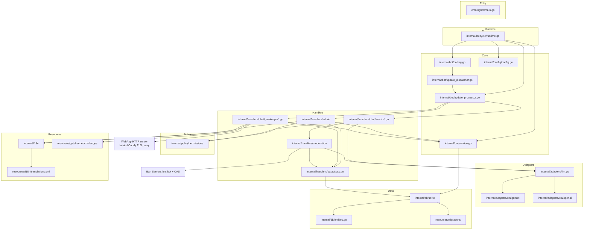
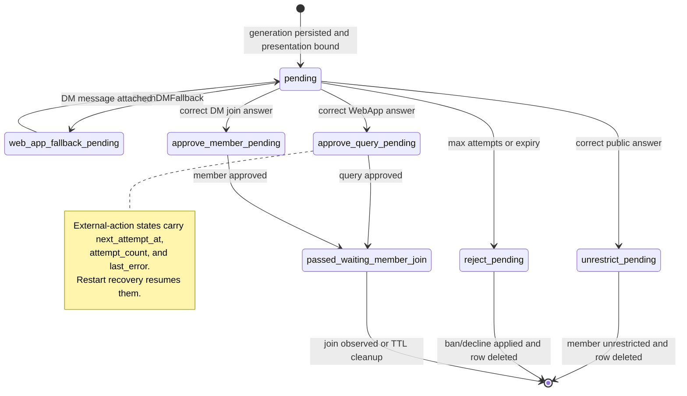
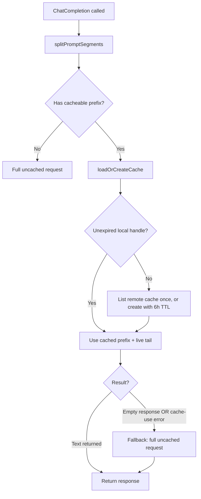
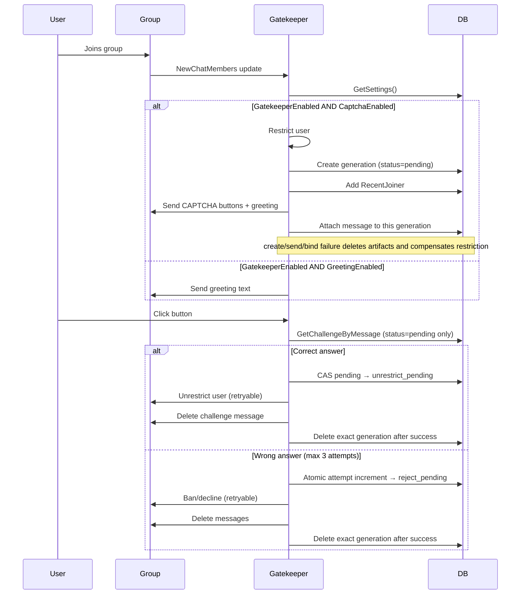
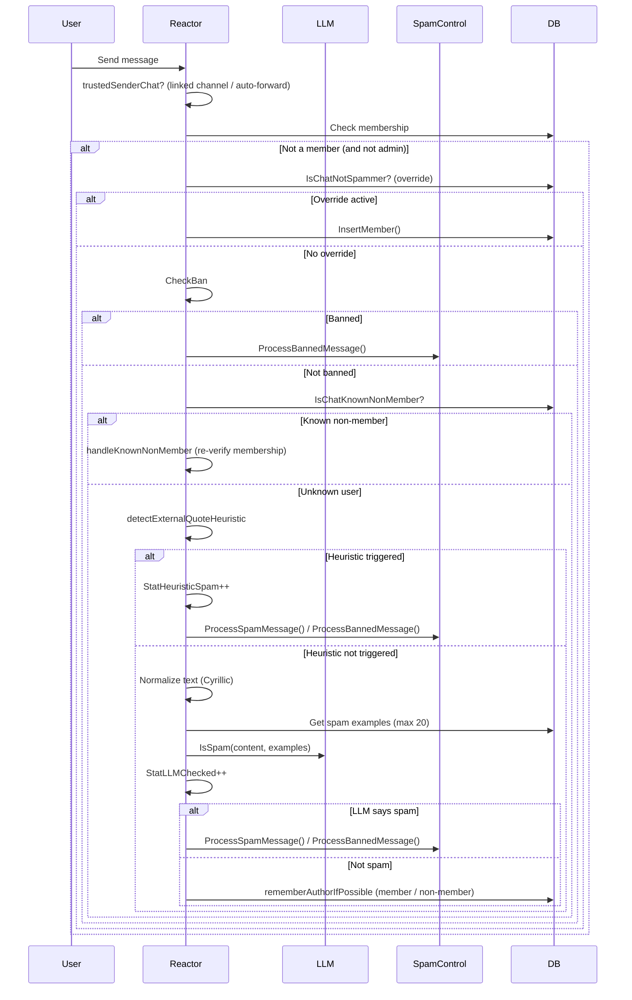
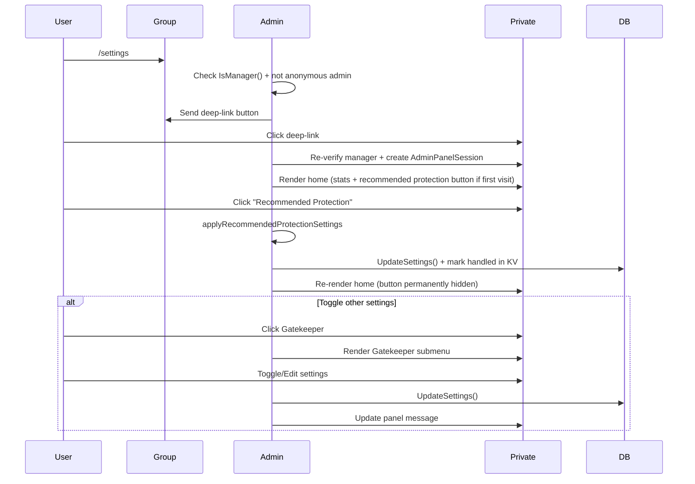
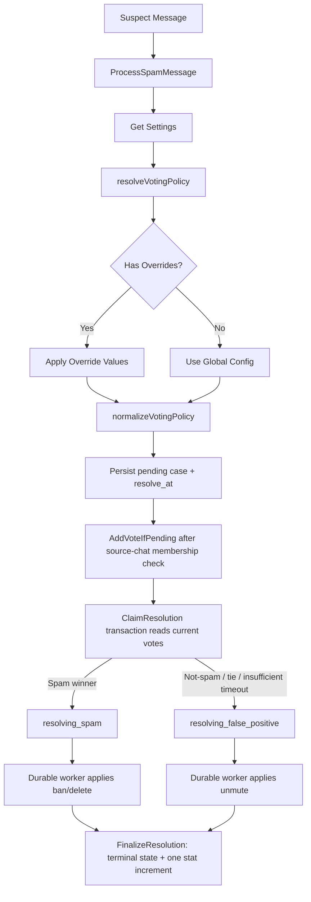
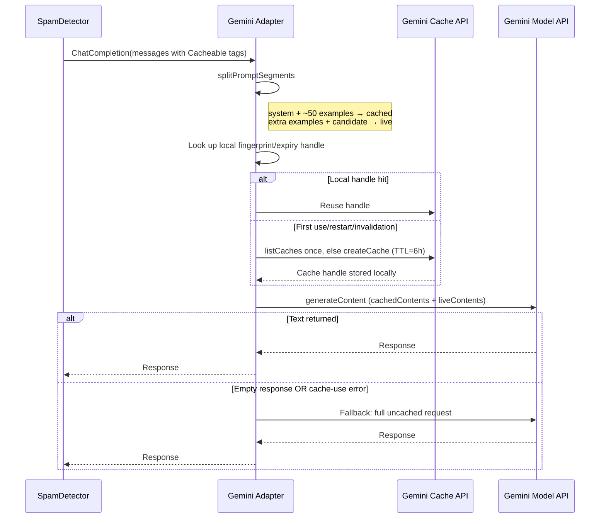

# ngbot Codebase Map

> Originally generated by Cartographer and reconciled with the implementation on 2026-07-14 after the durability refactor. 119 Go files, ~30.5k Go LOC, 33 migrations, 30 challenge locales, 4131-line i18n.

## System Overview

**ngbot** is a Telegram chat gatekeeper bot that protects groups from spam and automated bot joins. It provides CAPTCHA-based entry verification (inline buttons **and** a join-request WebApp Mini App with TLS-terminated fallback), LLM-powered spam detection with Gemini explicit caching, external-quote heuristic fast-path, provenance-aware multi-provider ban checking (lols.bot + CAS), durable community voting moderation, MarkdownV2 greeting templates with entity-based normalization, reaction profile checks, and daily statistics tracking.

## Observed behavior and invariants

| Surface | Current invariant |
|---|---|
| Update processing | `main/buildRuntime` supplies the ordered `admin → gatekeeper → reactor` handler slice. A keyed dispatcher preserves FIFO within a chat, processes different chats in parallel, caps active workers at 8, and applies backpressure at the Telegram buffer budget. |
| Settings | Cached settings have value semantics: clone on ingress/egress, pure timeout getters, publish only after successful persistence, and warmup fills only missing keys. |
| Gatekeeper | Every challenge generation has a unique `challenge_id`. State transitions use expected-state CAS; Telegram effects are retried by a lifecycle worker, and durable rows are deleted only after the external action succeeds or is already applied. Activation failures compensate before returning. After 8 failures the row and last error remain durable but leave automatic polling for operator intervention. |
| Moderation | Spam cases persist `resolve_at` and resolving states. Vote and timeout race through one transactional claim; restart recovery continues both due and partially resolved cases, with exactly one stats increment. Telegram resolution retries stop after 8 failures while retaining the case and error. |
| Voting eligibility | A voter must be a member or administrator of the source chat. Log-channel subscription alone grants no moderation authority. If the log post fails, an in-chat surface must exist and its binding must be persisted before destructive moderation starts. |
| Banlist | `banlist_sources` stores provider/feed provenance and expiry. A successful provider snapshot replaces only that provider; a failed provider retains its prior snapshot. `banlist` remains the compatibility projection of all unexpired sources. |
| SQLite | Every connection enables foreign keys; startup verifies the pragma, performs a ping, and closes the handle on error. Confirmed legacy orphans are removed before enforcement. |
| Security | Secrets are fully redacted, classification logs contain IDs/length/digest rather than message text, diagnostic commands are authorized, and public WebApp URLs require HTTPS except loopback development. |

**Known limitations**: SQLite still has one process-wide `RWMutex`; it should be narrowed only after the concurrent-read/ban-import benchmark demonstrates material contention. Telegram idempotency is inferred from known already-applied responses; an exhausted retry remains durable and is logged for operator intervention. The WebApp listener remains plain HTTP inside the container and therefore requires a TLS-terminating reverse proxy.


```mermaid
graph TB
    subgraph Entry
        Main[cmd/ngbot/main.go]
    end

    subgraph Runtime
        Lifecycle[internal/lifecycle/runtime.go]
    end

    subgraph Core
        Service[internal/bot/service.go]
        Processor[internal/bot/update_processor.go]
        Dispatcher[internal/bot/update_dispatcher.go]
        Polling[internal/bot/polling.go]
        Config[internal/config/config.go]
    end

    subgraph Handlers
        Admin[internal/handlers/admin]
        Gatekeeper[internal/handlers/chat/gatekeeper*.go]
        Reactor[internal/handlers/chat/reactor*.go]
        Moderation[internal/handlers/moderation]
        Stats[internal/handlers/base/stats.go]
    end

    subgraph Adapters
        LLM[internal/adapters/llm.go]
        Gemini[internal/adapters/llm/gemini]
        OpenAI[internal/adapters/llm/openai]
    end

    subgraph Data
        SQLite[internal/db/sqlite]
        Entities[internal/db/entities.go]
        Migrations[resources/migrations]
    end

    subgraph Policy
        Permissions[internal/policy/permissions]
    end

    subgraph Resources
        I18N[internal/i18n]
        Translations[resources/i18n/translations.yml]
        Challenges[resources/gatekeeper/challenges]
    end

    Main --> Lifecycle
    Lifecycle --> Service
    Lifecycle --> Processor
    Lifecycle --> Polling
    Lifecycle --> Config

    Polling --> Dispatcher
    Dispatcher --> Processor
    Processor --> Admin
    Processor --> Gatekeeper
    Processor --> Reactor

    Admin --> Service
    Gatekeeper --> Service
    Reactor --> Moderation
    Reactor --> LLM

    Moderation --> LLM
    Moderation --> BanService[Ban Service: lols.bot + CAS]
    LLM --> Gemini
    LLM --> OpenAI

    Service --> SQLite
    SQLite --> Entities
    SQLite --> Migrations

    Gatekeeper --> WebApp[WebApp HTTP server<br/>behind Caddy TLS proxy]
    Gatekeeper --> I18N
    Admin --> I18N
    I18N --> Translations
    Gatekeeper --> Challenges

    Admin --> Permissions
    Reactor --> Permissions
    Admin --> Stats
    Gatekeeper --> Stats
    Moderation --> Stats
    Stats --> SQLite
```

## Directory Structure

```
ngbot/
├── cmd/ngbot/
│   ├── main.go                    # Application entry point, runtime wiring, signal handling
│   └── main_test.go               # Entrypoint wiring tests
├── internal/
│   ├── bot/                       # Core bot service, polling, update processing
│   │   ├── service.go             # Membership + immutable settings snapshots and warmup
│   │   ├── service_test.go        # Service lifecycle tests
│   │   ├── service_internal_test.go  # White-box warmup cache test
│   │   ├── update_processor.go    # Ordered handler-chain dispatch
│   │   ├── update_processor_ban_test.go  # Ban helper tests
│   │   ├── update_dispatcher.go   # Bounded keyed FIFO dispatcher with backpressure
│   │   ├── update_dispatcher_test.go # Ordering/concurrency/panic/backpressure tests
│   │   ├── telegram.go            # Context-aware Telegram request helpers
│   │   ├── polling.go             # Custom long-polling with exponential backoff + recovery window
│   │   ├── polling_test.go        # Polling recovery/backoff/malformed-update tests
│   │   └── dependencies.go        # Narrow Service and Handler interfaces
│   ├── config/                    # Configuration loading (env vars) + log redaction
│   │   ├── config.go              # NG_* env vars (envconfig), Telegram timing, validation
│   │   ├── config_test.go         # Telegram timing validation tests
│   │   ├── redact.go              # RegisterSecret/Redact — token & secret masking (NEW)
│   │   ├── redact_test.go         # Redaction regex tests (NEW)
│   │   └── log_formatter.go       # Custom logrus formatter (auto-Redact on every line)
│   ├── db/                        # Persistence entities and domain constants
│   │   ├── entities.go            # Data structures (Settings, Challenge, SpamCase, …)
│   │   ├── settings.go            # DefaultSettings(), ErrNotFound, SettingsOverrideInherit
│   │   ├── spam_tracking.go       # SpamReport, UserRestriction
│   │   ├── gatekeeper_greeting.go # MarkdownV2 prefix tagging (mdv2:) for greeting templates
│   │   ├── not_spammer_overrides.go  # Not-spammer override validation/normalization
│   │   ├── settings_test.go       # Defaults/timeout normalization tests
│   │   └── sqlite/                # SQLite implementation (flat sqliteClient + shared RWMutex)
│   │       ├── client.go          # FK-enforced SQLite bootstrap, permissions, migrations
│   │       ├── client_settings_members.go  # Settings snapshots, excluded.* UPSERT, members
│   │       ├── client_challenges.go        # Generation-bound challenge CAS transitions/retries
│   │       ├── client_challenges_test.go   # Parallel join + WebApp race regression tests
│   │       ├── client_spam.go              # Durable moderation + provenance-aware banlist
│   │       ├── client_banlist_test.go      # Snapshot/retry/expiry projection tests
│   │       ├── client_spam_report_test.go  # Report message tests
│   │       ├── client_kv.go                # KV store operations (stats + sessions + flags)
│   │       ├── client_not_spammer_overrides.go  # Override CRUD + scoped/global lookup
│   │       ├── client_not_spammer_overrides_test.go
│   │       ├── client_known_non_members.go  # Known-non-member CRUD + lookup
│   │       ├── client_known_non_members_test.go
│   │       ├── client_recent_joiners_test.go   # Recent-joiner tests (logic lives in client_spam.go)
│   │       ├── admin_panel.go              # Admin sessions, commands, spam examples
│   │       └── migrations_test.go          # Index verification tests
│   ├── adapters/                  # External service adapters
│   │   ├── llm.go                 # LLM port (adapters.LLM interface)
│   │   └── llm/
│   │       ├── entities.go        # Chat completion types (with Cacheable field)
│   │       ├── gemini/            # Google Gemini (explicit caching + empty-cache retry)
│   │       └── openai/            # OpenAI-compatible adapter
│   ├── handlers/                  # Update handlers (chain of responsibility)
│   │   ├── dependencies.go        # Compile-time interface verification (admin/gatekeeper/reactor)
│   │   ├── base/
│   │   │   ├── handler.go         # Shared BaseHandler, GetOrCreateSettings, GetLanguage
│   │   │   ├── stats.go           # Daily stats subsystem (7 metrics, KV-based)
│   │   │   └── stats_test.go      # Stats aggregation tests
│   │   ├── admin/                 # Admin commands and cascading panel
│   │   │   ├── admin.go           # Core struct, lifecycle, Handle() dispatcher
│   │   │   ├── help.go            # /help command + reusable help-text blocks
│   │   │   ├── panel_handler.go   # /settings flow, deep-linking, callback + input routing
│   │   │   ├── panel_access_service.go    # ensureManagerAccess, typing, edit, member lookup
│   │   │   ├── panel_commands.go  # applyPanelCommand switch, toggle/set actions, saveChatSettings
│   │   │   ├── panel_constants.go # Pagination, timeouts, captcha/voting option whitelists
│   │   │   ├── panel_encoding.go  # ChatID/MessageID/uint64-min base64url encoding
│   │   │   ├── panel_lifecycle.go # Session cleanup worker (5-min interval)
│   │   │   ├── panel_render.go    # Per-page render methods + help blocks + stats display
│   │   │   ├── panel_render_helpers.go # Command buttons, labels, paging, greeting preview
│   │   │   ├── panel_renderer.go  # Render dispatch, settings hydration, edit/send fallback
│   │   │   ├── panel_session_service.go    # Session persistence, callback split resolution
│   │   │   ├── panel_recommended.go       # One-click recommended protection (KV-gated visibility)
│   │   │   ├── panel_not_spammer_override.go  # Override parsing + rehabilitation
│   │   │   ├── panel_greeting_markdown.go  # MarkdownV2 normalization from Telegram entities
│   │   │   └── panel_types.go     # Page/action/command types (24 pages, 40+ actions)
│   │   ├── chat/                  # Gatekeeper + Reactor handlers
│   │   │   ├── gatekeeper.go      # Orchestrator, lifecycle, Handle(), update-type dispatcher
│   │   │   ├── gatekeeper_captcha.go       # Inline-button CAPTCHA generation, keyboard layout
│   │   │   ├── gatekeeper_challenge_service.go  # Challenge transitions + external-effect coordinator
│   │   │   ├── gatekeeper_join_processor.go     # Join flow, two-phase handoff, greeting render
│   │   │   ├── gatekeeper_webapp.go        # Join-request WebApp CAPTCHA server + hardening (NEW)
│   │   │   ├── gatekeeper_webapp_security.go # Init-data parsing, CSP, crawler/cross-site guards
│   │   │   ├── gatekeeper_scheduler.go     # Durable retries, sweeps, fallback, restart recovery
│   │   │   ├── gatekeeper_language_test.go # DM language localization tests (NEW)
│   │   │   ├── reactor.go         # Orchestrator, pipeline stages, callback/reaction/command dispatch
│   │   │   ├── reactor_command_router.go     # /voteban, @bot reports, /testspam, /skipreason
│   │   │   ├── reactor_message_pipeline.go   # Spam detection pipeline (10 stages)
│   │   │   ├── reactor_reaction_profile_check.go # Reaction profile LLM checks
│   │   │   └── reactor_text_normalizer.go    # Cyrillic homoglyph normalization
│   │   └── moderation/            # Spam detection, ban service, voting
│   │       ├── ban_service.go     # Interface, lifecycle, multi-provider (lols.bot + CAS)
│   │       ├── ban_service_actions.go     # Restrict/ban/unban actions (10-min durations)
│   │       ├── ban_service_fetch.go       # Per-provider snapshots, retry, expiry projection
│   │       ├── spam_control.go    # Durable voting worker, presentation, policy, stats
│   │       ├── spam_control_vote.go # Eligibility, vote policy, transactional resolution/finalization
│   │       ├── spam_control_worker.go # Restart recovery, retries, durable report cleanup
│   │       └── spam_detector.go   # LLM-based detection (cache-aware prompting)
│   ├── lifecycle/                 # Runtime component orchestration
│   │   ├── runtime.go             # Component interface, ordered start + LIFO stop + rollback
│   │   └── runtime_test.go        # Order verification tests
│   ├── policy/permissions/        # Manager/moderator role predicates
│   │   ├── permissions.go         # IsManager, IsPrivilegedModerator, CanRestrictMembers
│   │   └── permissions_test.go    # Table-driven role tests
│   ├── i18n/                      # Internationalization
│   │   ├── i18n.go                # Translation loading/lookup (keys ARE English text)
│   │   ├── languages.go           # ISO code → name mapping (30 languages)
│   │   └── translations_consistency_test.go  # AST-based key consistency
│   └── infra/                     # Infrastructure utilities
│       ├── filesystem.go          # EnsureDir, GetResourcesPath (embed-FS key builder)
│       └── health_check.go        # MonitorExecutable — binary hot-reload detection
├── resources/
│   ├── embed.go                   # //go:embed * — exposes entire resources/ subtree
│   ├── i18n/translations.yml      # 30 languages, 135+ keys (English-as-key), ~4131 lines
│   ├── gatekeeper/challenges/     # Per-language emoji→word maps (30 files)
│   └── migrations/                # 33 Up/Down SQL migrations (embedded, sql-migrate)
├── docs/
│   ├── CODEBASE_MAP.md            # This file
│   └── superpowers/plans/2026-06-14-webapp-captcha-hardening.md  # WebApp hardening plan
├── deploy/caddy/ngbot-webapp.Caddyfile  # TLS reverse proxy for the WebApp server
├── go.mod / go.sum                # Dependencies (Go 1.25)
├── .golangci.yml                  # Linter policy (production goconst; test fixtures excluded)
├── Dockerfile                     # CGO_ENABLED=0 static → distroless image
├── compose.yaml.dist              # Docker Compose config (WebApp port mapping)
└── .env.example                   # Configuration template
```

## Module Guide

### Core Bot Module (`internal/bot/`)

**Purpose**: Central bot service, custom polling, and update processing pipeline

| File | Purpose | Key Exports |
|------|---------|-------------|
| `service.go` | Membership cache and immutable settings snapshots | `NewService()`, `IsMember()`, `GetSettings()`, `SetSettings()`, `warmupCache()` |
| `update_processor.go` | Ordered chain-of-responsibility dispatch | `UpdateProcessor`, `MessageType` constants, `ExtractContentFromMessage` |
| `update_dispatcher.go` | Keyed scheduling, concurrency cap, backpressure, panic isolation | `KeyedDispatcher`, `NewKeyedDispatcher()`, `Submit()`, `Stop()` |
| `telegram.go` | Context-aware Telegram API calls | `Send()`, `GetChat()`, `GetChatMember()`, `RequestBool()` |
| `polling.go` | Custom long-polling with exponential backoff + recovery window | `GetUpdatesChans()`, `PollingOptions`, `PollingRecoveryError` |
| `dependencies.go` | Interface contracts | Narrow `Service` (settings/membership/language) and `Handler` |

**Key Patterns**:
- Two-level caching: members (5-min TTL with lazy eviction), settings (process-lifetime immutable snapshots, no TTL)
- `cmd/ngbot/buildRuntime` is the composition root and supplies the configured handler slice; there is no global registry or global config singleton
- Chain of responsibility remains `admin → gatekeeper → reactor`; `proceed bool` stops the chain
- Update timeout: 5 minutes (stale updates dropped); `IsMember` re-verifies via Telegram `GetChatMember` on cache miss
- Custom polling: exponential backoff (initial 1s, max 30s), recovery window (default 10m), malformed-update filtering (`isStructurallyEmptyUpdate`)
- Keyed dispatcher: FIFO per chat, concurrent progress across chats, user/global fallback key, at most 8 active workers, pending budget equal to `BotAPI.Buffer`, blocking backpressure, and per-update panic recovery
- Shutdown stops intake, cancels in-flight I/O, and drains workers within the lifecycle deadline

**Dependencies**: `telegram-bot-api`, `db`, `config`, `i18n`, `errgroup`

---

### Lifecycle Module (`internal/lifecycle/`)

**Purpose**: Component lifecycle orchestration with ordered start/stop

**Key Patterns**:
- `Component` interface: `Start(ctx) error`, `Stop(ctx) error`
- Start in registration order; **rollback** on first failure and return `errors.Join(startError, rollbackErrors)`
- Stop in reverse (LIFO) order; all errors collected via `errors.Join`

**Registered components** (in order): `bot.service`, `BanService`, `SpamControl`, `Gatekeeper` (owns the WebApp HTTP server), `Admin`, `updateLoopComponent` (polling).

---

### Handlers Module (`internal/handlers/`)

**Purpose**: Update processing chain with specialized handlers

| Handler | Purpose | Chain Order |
|---------|---------|-------------|
| `Admin` | `/lang`, `/settings`, admin panel with cascading submenus | 1 (stops on match) |
| `Gatekeeper` | CAPTCHA challenges (inline buttons **and** join-request WebApp) for new members | 2 (stops for callbacks/joins) |
| `Reactor` | Spam detection, message/reaction/command processing | 3 (always runs) |

> **Note**: Concrete handlers live in sibling subpackages (`admin/`, `chat/`, `moderation/`) — distinct Go packages by import path but all implement `bot.Handler`. `moderation` is **not** an update handler; it provides `BanService`, `SpamControl`, `SpamDetector` services. `handlers/dependencies.go` asserts conformance at compile time.

#### Admin Handler Files

| File | Purpose |
|------|---------|
| `admin.go` | Core struct, lifecycle, `Handle()` dispatcher, `/lang` `/settings` `/start` |
| `help.go` | `/help` command handler + reusable help-text blocks |
| `panel_handler.go` | `/settings` flow, deep-linking, callback routing, free-text input, `my_chat_member` tracking |
| `panel_access_service.go` | `ensureManagerAccess` (3-gate), typing indicator, edit/callback helpers, group-delete callback |
| `panel_commands.go` | `applyPanelCommand` switch, toggle/set actions, `saveChatSettings` wrapper |
| `panel_constants.go` | Pagination, timeouts, captcha/voting option whitelists |
| `panel_encoding.go` | Base64url encoding for chat/message/uint64 IDs in callbacks + deep links |
| `panel_lifecycle.go` | Background session cleanup worker (5-min interval, 1h TTL) |
| `panel_render.go` | Feature-page render methods and stats display |
| `panel_render_helpers.go` | Command persistence/buttons, navigation, labels, paging, help and greeting preview |
| `panel_renderer.go` | Render dispatch, settings hydration, edit-or-send fallback |
| `panel_session_service.go` | Session persistence, callback brute-force split resolution |
| `panel_recommended.go` | One-click recommended protection, KV-gated one-time visibility |
| `panel_not_spammer_override.go` | Input parsing (username/ID/URL), `rehabilitateNotSpammerUser` |
| `panel_greeting_markdown.go` | MarkdownV2 normalization from Telegram entities (sweep-line, UTF-16 offsets) |
| `panel_types.go` | `panelPage` (24 pages), `panelState`, `panelCommand` types |

**Admin Panel Pages** (Cascading Menu Structure):

```
Home
├── [Recommended Protection] (one-click, auto-hides when applied/customized)
├── [Last 7 days stats summary]
├── LanguageList (paginated, 6/page)
├── Gatekeeper
│   ├── GatekeeperCaptcha
│   │   ├── GatekeeperCaptchaOptions (picker: 3,4,5,6,8,10)
│   │   ├── GatekeeperChallengeTimeout (picker: 30s,1m,2m,3m,5m)
│   │   └── GatekeeperRejectTimeout (picker: 10m only)
│   └── GatekeeperGreeting
│       └── GatekeeperGreetingPrompt (free-text input, MarkdownV2)
├── LLM
│   └── ExamplesList (paginated, 5/page)
│       ├── ExampleDetail → ConfirmDelete
│       └── ExamplePrompt (free-text input)
├── ReactionProfileCheck (leaf: toggle)        # admin surface for reaction moderation
├── Indulgence
│   ├── IndulgenceList (paginated, shows override count badge)
│   │   ├── IndulgenceDetail
│   │   │   └── IndulgenceConfirmDelete
│   │   └── (numbered selection buttons)
│   └── IndulgencePrompt (free-text: username, user ID, or profile URL)
├── Voting
│   ├── VotingTimeout (inherit + 1m..30m)
│   ├── VotingMinVoters (inherit + 1,2,3,5,10)
│   ├── VotingMaxVoters (inherit + 0,5,10,20)
│   └── VotingMinPercent (inherit + 1,3,5,10,20%)
└── ConfirmClose
```

**Access gating (3 layers)**:
1. `/settings` must run **in-group** first (proves caller is a manager + bot is a member); anonymous-admin messages (`msg.SenderChat != nil`) are deleted and ignored.
2. `/start settings_` private deep-link **re-verifies** manager status via `GetChatMember`.
3. Every callback + free-text input re-runs `ensureManagerAccess` — a demoted admin is locked out mid-session.

**Admin Panel Session Lifecycle**:
1. User runs `/settings` in group → deep-link button → private chat
2. Session created with JSON state, 1-hour TTL
3. Each callback → `findPanelSessionCommand` (brute-force split resolution) → `applyPanelCommand` → re-render
4. Background goroutine cleans expired sessions every 5 minutes
5. Buttons carry DB-backed `AdminPanelCommand` rows (callback_data = `<base64 sessionID>_<base64 commandID>`) to bypass Telegram's 64-byte limit; old commands deleted at each render
6. `saveChatSettings` called on every settings mutation → also marks recommended protection as handled in KV

#### Gatekeeper Handler Files

| File | Purpose |
|------|---------|
| `gatekeeper.go` | Orchestrator, lifecycle (3 ticker workers), `Handle()`, `determineUpdateType` dispatcher, port interfaces |
| `gatekeeper_captcha.go` | Inline-button CAPTCHA generation, smart keyboard layout (2 rows for 6+) |
| `gatekeeper_challenge_service.go` | Transition coordinator, Telegram-side effects, retry scheduling, stat finalization |
| `gatekeeper_join_processor.go` | All join entry points, two-phase handoff, dual Markdown/MarkdownV2 greeting rendering, known-banned cleanup |
| `gatekeeper_webapp.go` | Join-request WebApp CAPTCHA HTTP server, init-data validation, atomic claims, security hardening |
| `gatekeeper_webapp_security.go` | Init-data parsing, JSON responses, robots/sitemap, CSP, crawler and cross-site guards |
| `gatekeeper_scheduler.go` | Recent joiners, expiry, unopened-WebApp fallback, due durable actions, restart recovery |
| `gatekeeper_language_test.go` | DM message localization tests |

**Three join paths**:

1. **Direct/public join** — `chat_member`/`new_chat_members` → restrict → persist challenge generation → send and bind the inline keyboard. Activation failures compensate the restriction/message instead of exposing an unsolvable CAPTCHA. Correct answers claim `unrestrict_pending`; wrong×3/expiry atomically claims `reject_pending`.

2. **Join request via DM** (no WebApp, or no QueryID) — `chat_join_request` persists the query binding before external work, then creates a private challenge (`CommChatID`=userDM). Correct → `approve_member_pending`; the worker approves and transitions to `passed_waiting_member_join`. The later `chat_member` event sends the greeting and deletes that exact generation.

3. **Join request via WebApp** (QueryID present, `PublicURL` configured) — the row stores `ChallengeID`, `WebAppToken`, `JoinRequestQueryID`, and options before Telegram presentation. A valid correct POST atomically claims `approve_query_pending`; the worker applies `AnswerJoinRequestQuery(approve)` and transitions to `passed_waiting_member_join`.

**WebApp fallback-on-timeout**: if the WebApp is never opened (`web_app_opened_at IS NULL` for >11s, swept every 3s) or expires while pending, `BeginDMFallback` atomically flips the same generation to `web_app_fallback_pending`. The query binding remains durable while the worker prepares, sends, and binds the DM challenge. A restart continues whichever step is incomplete.

**Challenge Status Lifecycle**:


```mermaid
stateDiagram-v2
    [*] --> pending: generation persisted and presentation bound
    pending --> web_app_fallback_pending: BeginDMFallback
    web_app_fallback_pending --> pending: DM message attached
    pending --> approve_query_pending: correct WebApp answer
    pending --> approve_member_pending: correct DM join answer
    pending --> unrestrict_pending: correct public answer
    pending --> reject_pending: max attempts or expiry
    approve_query_pending --> passed_waiting_member_join: query approved
    approve_member_pending --> passed_waiting_member_join: member approved
    unrestrict_pending --> [*]: member unrestricted and row deleted
    reject_pending --> [*]: ban/decline applied and row deleted
    passed_waiting_member_join --> [*]: join observed or TTL cleanup

    note right of approve_query_pending
        External-action states carry next_attempt_at,
        attempt_count, and last_error.
        Restart recovery resumes them.
    end note
```

**Status Constants** (7): `pending`, `web_app_fallback_pending`, `approve_query_pending`, `approve_member_pending`, `unrestrict_pending`, `reject_pending`, `passed_waiting_member_join`. Terminal completion is row deletion only after the required Telegram effect succeeds or is recognized as already applied; expiry is computed from `expires_at`.

**Gatekeeper Constants**:
- `captchaSize = 5`, `maxChallengeAttempts = 3`
- `approvedJoinRequestChallengeTTL = 5 * time.Minute`
- `webAppOpenDeadline = 11 * time.Second` (unopened-WebApp fallback threshold)
- `joinCaptchaInitDataTTL = 1 * time.Hour` (init-data replay window)
- Allowed options counts: `{3, 4, 5, 6, 8, 10}`
- Process intervals: new joiners = 1m, expired challenges = 1m, **unopened WebApp = 3s**, due durable actions = lifecycle worker sweep
- Greeting placeholders: `{user}`, `{chat_title}`, `{chat_link_titled}`, `{timeout}`
- Greeting template prefix: `mdv2:` tags MarkdownV2 templates; absence = legacy Markdown

**WebApp security hardening** (in `gatekeeper_webapp.go`):
- **init-data HMAC validation**: `api.ValidateWebAppData(bot.Token, initDataRaw)`; then `parseWebAppInitData` extracts `query_id`, `user.id`, `auth_date`.
- **Replay protection**: `auth_date` rejected if older than 1h (`joinCaptchaInitDataTTL`).
- **Binding**: `initData.UserID == challenge.UserID` and (non-test) `initData.QueryID == challenge.JoinRequestQueryID`, else 403.
- **Generation-bound approval claim**: `ClaimForApproval(challengeID)` — atomic `UPDATE … WHERE challenge_id=? AND status='pending'`; `claimed==false` → 409. Stale requests cannot mutate a replacement challenge.
- **Durable approval**: a Telegram failure leaves `approve_query_pending` with retry metadata. It never rolls back to `pending`; the lifecycle worker resumes after restart and deletes no state before the side effect completes.
- **Known-banned re-check**: `banChecker.IsKnownBanned(userID)` re-checked **after** a correct answer but **before** claiming (N2 fix).
- **Cross-site guard**: `isJoinCaptchaCrossSiteMutation` blocks non-GET/HEAD whose `Sec-Fetch-Site: cross-site` or whose `Origin` host ≠ `Host`.
- **Body cap**: `http.MaxBytesReader` at 16 KiB. **Crawler blocklist** (gptbot, claudebot, …) → 403.
- **CSP**: nonce-based `script-src`/`style-src`, `connect-src 'self'`, `frame-ancestors 'none'`. Answer text is XOR-obfuscated in HTML (real gate is the HMAC, not the obfuscation).
- **HTTP server timeouts** (slowloris hardening — N10 fix): `ReadHeaderTimeout` 5s, `Read`/`Write` 15s, `Idle` 60s.
- **Routes**: `/robots.txt` (deny-all), `/sitemap.xml` (empty), `/gatekeeper/join-captcha` (GET), `/gatekeeper/join-captcha/answer` (POST).

#### Reactor Handler Files

| File | Purpose |
|------|---------|
| `reactor.go` | Orchestrator, pipeline stages, callback/reaction/command dispatch, `lastResults` LRU |
| `reactor_command_router.go` | `/testspam`, `/skipreason`, `/voteban`, reply `@bot` reports, UTF-16 entity slicing |
| `reactor_message_pipeline.go` | Spam detection pipeline (10 stages) + external-quote heuristic + stat tracking |
| `reactor_reaction_profile_check.go` | LLM profile checks for unknown reactors (users **and** anonymous channels) |
| `reactor_text_normalizer.go` | Cyrillic homoglyph normalization (~150 confusable chars) |

**Pipeline Stages** (in order — short-circuit, each records `result.Stage`/`SkipReason`):

```
Message arrives
    │
    ▼
[1] trustedSenderChat? (group itself / linked channel / auto-forward) → YES → SKIP
    │
    NO
    ▼
[2] IsMember? → YES → SKIP
    │
    NO
    ▼
[3] isChatAdministrator? (live GetChatMember) → YES → SKIP
    │
    NO
    ▼
[4] IsChatNotSpammer? (manual override) → YES → remember + SKIP
    │
    NO
    ▼
[5] banService.CheckBan → BANNED → ProcessBannedMessage (delete + ban, no voting)
    │
    NOT BANNED
    ▼
[6] IsChatKnownNonMember? → YES → handleKnownNonMember (re-verify, may SKIP)
    │
    NO
    ▼
[7] LLMFirstMessageEnabled? → NO → remember + SKIP
    │
    YES
    ▼
[8] Extract content → EMPTY → SKIP
    │
    HAS CONTENT
    ▼
[9] detectFirstMessageExternalQuoteHeuristic → TRIGGERED → immediate spam + StatHeuristicSpam
    │
    NOT TRIGGERED
    ▼
[10] normalizeCyrillics → load per-chat examples (max 20) → LLM IsSpam + StatLLMChecked
         │
         ├── SPAM → processSpam (voting ON) or processBanned (voting OFF) + rememberAuthorIfPossible
         └── NOT SPAM → rememberAuthorIfPossible (promote to member / remember non-member)
```

> **Ordering note**: members and admins (stages 2–3) never reach the banlist. The known-non-member check (6) comes **after** the ban check (5), so a banned user who is also a remembered non-member is treated as banned first.

**Reaction Profile Check** (`reactor_reaction_profile_check.go`, gated by `settings.ReactionProfileCheckEnabled`): when an unknown user or anonymous channel **reacts** (additions only; removals ignored), builds a text profile (full name, @username, personal-chat bio/pinned/posts up to 10) and runs it through the LLM. Spam → wipe reactions + ban (permanent for actor-chats). Membership is double-checked live before escalating. This catches spammers who only drop a reaction and never text the group. Has an admin-panel toggle (ReactionProfileCheck leaf screen).

**`voteBanCommand`** (report flow): triggered by `/voteban` (replying to a suspect) **or** mentioning the bot in a reply. Sequence: (1) report-specific LLM check → confirmed spam = instant ban; (2) reporter has restrict permission = instant ban; (3) community voting disabled = refuse; (4) otherwise `processReported` starts a message-bound community vote.

#### Moderation Files

| File | Purpose |
|------|---------|
| `ban_service.go` | Interface, lifecycle, synchronous local warmup, in-memory effective cache |
| `ban_service_actions.go` | Mute/Ban/Unmute/Unban actions (all 10-min durations, `UseIndependentChatPermissions`) |
| `ban_service_fetch.go` | Provider-scoped daily snapshots, hourly/online TTL feeds, retry scheduling |
| `spam_control.go` | Lifecycle, suspect/report intake, Telegram voting presentation and shared helpers |
| `spam_control_vote.go` | Source-chat eligibility, vote policy, claim, Telegram effect and transactional finalization |
| `spam_control_worker.go` | Deadline recovery, due-case retries and durable report-message deletion queue |
| `spam_detector.go` | LLM classification (system + ~50 hardcoded examples + per-chat examples) |

**Community Voting Policy Resolution**:

| Step | Description |
|------|-------------|
| 1. Base policy | From `config.SpamControl` global config |
| 2. Per-chat overrides | From `db.Settings` (if not `SettingsOverrideInherit` = -1) |
| 3. Normalization | Timeout min 5m, MinVoters min 1, MaxVoters min 0, MinVoters% min 0 |
| 4. Required voters | `max(MinVoters, len(members) * MinVoters% / 100)`, capped by MaxVoters, min 1; member-list failure defers resolution instead of substituting zero |

**Voting Resolution Logic**:

| Scenario | Result |
|----------|--------|
| Spam majority | `spam` status → user banned + `StatSpamConfirmed` |
| Not-spam majority | `false_positive` status → user unmuted + `StatFalsePositive` |
| Tie + timeout | `false_positive` (user-friendly) |
| Insufficient votes + timeout | `false_positive` (user-friendly) |

Only members/administrators of the **source chat** can vote. `AddVoteIfPending` and `ClaimResolution` serialize vote/timeout races in SQLite. The winner first enters `resolving_spam` or `resolving_false_positive`; the worker applies the Telegram effect, then `FinalizeResolution` writes the terminal state and increments the matching stat once in the same transaction. On startup, due `pending` and unfinished `resolving_*` cases are recovered. There are no process-local per-case timers.

**Voting presentation and retention**: a log-channel post is preferred, but failure creates an in-chat voting surface before the original message is deleted or the suspect is muted. The prompt remains usable through resolution; the chat prompt is deleted afterward and the log-channel keyboard is removed. `/voteban`/mention report messages form a durable cleanup queue: rows older than 10 minutes are deleted from Telegram first and from SQLite only after that idempotent effect succeeds.

---

### Daily Stats Subsystem (`internal/handlers/base/stats.go`)

**Purpose**: KV-based daily counter tracking for moderation metrics

| Metric Constant | Description | Instrumentation Point |
|-----------------|-------------|----------------------|
| `StatChallengeStarted` | CAPTCHA challenge created | `gatekeeper_challenge_service.go` |
| `StatChallengePassed` | CAPTCHA solved correctly | `gatekeeper_challenge_service.go` |
| `StatChallengeFailed` | CAPTCHA failed (max attempts) | `gatekeeper_join_processor.go` |
| `StatLLMChecked` | LLM spam check performed | `reactor_message_pipeline.go` |
| `StatHeuristicSpam` | External-quote heuristic triggered | `reactor_message_pipeline.go` |
| `StatSpamConfirmed` | Spam confirmed (ban or vote) | `spam_control.go` |
| `StatFalsePositive` | False positive (unmuted) | `spam_control.go` |

**Key format**: `stats:<chatID>:<YYYY-MM-DD>:<metric>` · **Functions**: `IncrementDailyStat`, `LoadStatsSummary` (aggregates N days), `FormatStatsSummary` (i18n output)

---

### Database Module (`internal/db/`)

**Purpose**: SQLite persistence (pure-Go `modernc.org/sqlite`) with one flat concrete `sqliteClient`. **No pgx/sqlc/Postgres** — query layer is hand-written SQL through `jmoiron/sqlx`, migrations via `rubenv/sql-migrate` over embedded Up/Down files. Consumer-owned ports live beside `bot.service` and each handler; there is no repository-wide database interface. Caching lives in `bot.service`, not in a storage decorator.

| File | Purpose |
|------|---------|
| `entities.go` | Data structures with `db` tags, pure settings accessors, durable state constants |
| `settings.go` | `DefaultSettings()`, `ErrNotFound`, `SettingsOverrideInherit` |
| `spam_tracking.go` | `SpamReport`, `UserRestriction` |
| `gatekeeper_greeting.go` | `mdv2:` prefix helpers |
| `sqlite/client.go` | `_pragma=foreign_keys(1)`, ping/pragma verification, 0700/0600 permissions, migrations |
| `sqlite/client_settings_members.go` | Settings/member CRUD; local normalization and `excluded.*` snapshot UPSERT |
| `sqlite/client_challenges.go` | Generation-bound CAS transitions, message binding, due/retry queries |
| `sqlite/client_spam.go` | Transactional voting/finalization, durable reports, restriction UPSERT, banlist sources/projection |
| `sqlite/client_kv.go` | KV store operations |
| `sqlite/client_not_spammer_overrides.go` | Override CRUD + scoped/global lookup (dynamic OR clause) |
| `sqlite/client_known_non_members.go` | Known-non-member CRUD + lookup |
| `sqlite/admin_panel.go` | Admin sessions/commands, spam examples, chat managers, bot membership |

**Key Entities**:

| Entity | Purpose | Primary Key |
|--------|---------|-------------|
| `Settings` | Per-chat configuration (~18 columns) | `id` (chat ID) |
| `Challenge` | Generation-bound CAPTCHA state, external-action status, retry metadata | `(comm_chat_id, user_id, chat_id)` plus unique `challenge_id` |
| `SpamCase` | Message-bound durable voting/resolution state | auto-increment `id` |
| `SpamCaseReportMessage` | Voteban report message artifacts | `(case_id, chat_id, message_id)` |
| `AdminPanelSession` | Admin UI state | auto-increment `id` |
| `ChatSpamExample` | Per-chat spam examples for LLM | auto-increment `id` |
| `ChatNotSpammerOverride` | Manual not-spammer override | auto-increment `id` |
| `ChatKnownNonMember` | Remembered non-member | `(chat_id, user_id)` composite |

**Challenge Entity** (WebApp and durability columns added by migrations `20260613/14/15` and `2026071401`):

| Field | Type | Description |
|-------|------|-------------|
| `CommChatID` | int64 | Communication chat (group or private DM) |
| `UserID` | int64 | Target user |
| `ChatID` | int64 | Target group |
| `ChallengeID` | string | Unique generation token used by every mutation/CAS |
| `Status` | string | One of the seven lifecycle states documented above |
| `SuccessUUID` | string | Correct answer identifier |
| `JoinMessageID` / `ChallengeMessageID` | int | Message IDs |
| `Attempts` | int | Wrong answer count |
| `WebAppToken` | string | '' for DM challenges; set for WebApp join-request flow |
| `JoinRequestQueryID` | string | Telegram join-request query marker; preserved across DM fallback |
| `CaptchaPrompt` / `CaptchaOptionsJSON` | string | Serialized WebApp captcha prompt + options |
| `WebAppOpenedAt` | sql.NullTime | NULL = never opened → fast-fallback candidate |
| `UserLanguage` | string | Joiner's locale code |
| `CreatedAt` / `ExpiresAt` | time.Time | Expiry extended on handoff |
| `NextAttemptAt` / `AttemptCount` / `LastError` | retry metadata | Durable scheduling and operator diagnostics |

**Atomic transition methods** (`client_challenges.go`): `RecordWrongAttempt`, `ClaimForApproval`, `BeginDMFallback`, `AttachChallengeMessage`, `CompleteExternalAction`, and `DeleteChallengeInstance` bind mutations to `challenge_id` and expected state, then require `RowsAffected()==1`. Wrong-attempt increment and the `reject_pending` threshold transition occur in one statement. `MarkWebAppChallengeOpened` remains idempotent.

**SpamCase Entity**: `MessageID` binds a case to a specific message; `PreVoteRestricted` distinguishes pre-vote mutes from retrospective reports. Migration `2026071402` adds `ResolveAt`, `NextAttemptAt`, `AttemptCount`, and `LastError`, with states `pending`, `resolving_spam`, `resolving_false_positive`, `spam`, and `false_positive`.

**Settings Entity - Gatekeeper Fields**:

| Field | Type | Default | Description |
|-------|------|---------|-------------|
| `GatekeeperEnabled` | bool | false | Master switch |
| `GatekeeperCaptchaEnabled` | bool | false | CAPTCHA sub-feature |
| `GatekeeperGreetingEnabled` | bool | false | Greeting sub-feature |
| `GatekeeperCaptchaOptionsCount` | int | 5 | Options count (3,4,5,6,8,10) |
| `GatekeeperGreetingText` | string | "" | Custom greeting text (may carry `mdv2:` prefix) |

**Settings Entity - Moderation Fields**:

| Field | Type | Default | Description |
|-------|------|---------|-------------|
| `LLMFirstMessageEnabled` | bool | true | LLM spam check on first message |
| `ReactionProfileCheckEnabled` | bool | true | LLM check on unknown reactors |
| `CommunityVotingEnabled` | bool | true | Community voting for suspects |
| `CommunityVotingTimeoutOverrideNS` | int64 | -1 | Voting timeout override (ns) |
| `CommunityVotingMinVotersOverride` | int | -1 | Min voters override |
| `CommunityVotingMaxVotersOverride` | int | -1 | Max voters override |
| `CommunityVotingMinVotersPercentOverride` | int | -1 | Min voters % override |

> Value `-1` (`SettingsOverrideInherit`) means "use global config". `Settings.Enabled` is normalized to `GatekeeperEnabled` on a local persistence copy. Legacy timeout values in `(0, 1s)` are interpreted as seconds by pure accessors; reads never mutate the `Settings` receiver.

**Database Schema** (33 migrations):

| Table | PK | Notes |
|-------|-----|-------|
| `chats` | `id` (chat ID) | Parent of most tables; ~18 settings columns |
| `chat_members` | `(chat_id, user_id)` | — |
| `gatekeeper_challenges` | `(comm_chat_id, user_id, chat_id)` | Unique generation ID, typed states, due/recovery indexes and retry metadata |
| `spam_cases` | auto `id` | Message binding, `resolve_at`, resolving states, due/retry index |
| `spam_votes` | `(case_id, voter_id)` | FK → spam_cases CASCADE |
| `spam_case_report_messages` | `(case_id, chat_id, message_id)` | FK → spam_cases CASCADE |
| `user_restrictions` | `(chat_id, user_id)` | — |
| `recent_joiners` | auto `id` | Unique: `(chat_id, user_id)` |
| `banlist` | `user_id` | Compatibility projection of unexpired source rows |
| `banlist_sources` | `(user_id, provider, feed_type)` | Provenance, generation, freshness and optional expiry |
| `kv_store` | `key` | Index: `updated_at` |
| `chat_managers` / `chat_bot_membership` | — | FK → chats CASCADE |
| `admin_panel_sessions` / `admin_panel_commands` | auto `id` | FK cascade |
| `chat_spam_examples` | auto `id` | FK → chats CASCADE |
| `chat_not_spammer_overrides` | auto `id` | Unique: `(match_type, match_value, normalized_scope)` |
| `chat_known_non_members` | `(chat_id, user_id)` | — |

**Recent migrations of note**: `2026071400` removes confirmed FK orphans before enforcement; `2026071401` adds challenge generation/retry state; `2026071402` adds durable moderation scheduling; `2026071403` adds banlist provenance while retaining the legacy projection. Every migration has Up/Down sections; applied files are never rewritten.

**Gotchas**:
- `db.ErrNotFound` used for missing settings, but `(nil, nil)` for challenges/admin panel, `("", nil)` for KV — inconsistent not-found signaling
- `SpamVote.Vote` is inverted: `true` = NOT spam, `false` = IS spam
- Connection pool: 42 max open connections; one app-level `sync.RWMutex` serializes all writes across the whole client
- Pure-Go SQLite driver (`modernc.org/sqlite`); migration dialect `"sqlite3"` ≠ sqlx driver name `"sqlite"`
- Vote claiming/finalization and banlist snapshot/projection rebuilds use explicit transactions; CAS statements remain single-statement atomic operations
- `GetActiveRestriction` does NOT special-case `sql.ErrNoRows` (returns it as error); uses SQLite `datetime('now')`

---

### LLM Adapters (`internal/adapters/llm/`)

**Purpose**: Abstraction over OpenAI and Google Gemini APIs

| Adapter | Default Model | Key Features |
|---------|---------------|--------------|
| `gemini.API` | `gemini-2.5-flash-lite` | Explicit context caching (6h TTL), local fingerprint→handle cache, `BLOCK_NONE` safety, **empty-cache retry** |
| `openai.API` | `gpt-4o-mini` | Custom base URL; cache-unaware (`Cacheable` ignored); logger discarded |

**Shared Config**: Temperature 0, TopP 1, MaxTokens 4 (binary spam classification output)

**Gemini Explicit Caching Architecture**:


```mermaid
flowchart TD
    A[ChatCompletion called] --> B[splitPromptSegments]
    B --> C{Has cacheable prefix?}
    C -->|No| D[Full uncached request]
    C -->|Yes| E[loadOrCreateCache]
    E --> F{Unexpired local handle?}
    F -->|Yes| G[Use cached prefix + live tail]
    F -->|No| H[List remote cache once, or create with 6h TTL]
    H --> G
    G --> I{Result?}
    I -->|Text returned| J[Return response]
    I -->|Empty response OR cache-use error| K[Fallback: full uncached request]
    K --> J
```

**Cacheable Message Contract** (`ChatCompletionMessage.Cacheable bool`): system prompt + built-in few-shot examples (~50) → `Cacheable: true`; per-chat extra examples + candidate → `Cacheable: false`.

**Gemini Cache Key**: SHA-256 of (model + system instruction + cacheable prefix), first 12 hex chars as display name `ngbot-spam-<hash>`.

**Gotchas**:
- **Empty-cached-response retry** (commit `4cdc500`): when a cached request succeeds but yields no text, the adapter discards it and re-runs the full prompt uncached — the classifier must always get a real verdict. Cache-use errors (expired/not-found) trigger the same fallback.
- Remote cache listing occurs only on first use/restart or after local-handle invalidation; steady-state requests use the local fingerprint/expiry map.
- Gemini: roles mapped (`assistant` → `model`), system messages extracted as `SystemInstruction` (must precede all conversation messages or it errors)
- Gemini: all four safety categories `BlockNone`; `splitPromptSegments` caches only the contiguous cacheable prefix
- OpenAI: system messages collapsed + prepended; `Cacheable` field ignored
- Both adapters: `MaxOutputTokens=4`, temperature 0 — a deterministic binary verdict generator, not a text producer

---

### Policy Module (`internal/policy/permissions/`)

| Function | Description |
|----------|-------------|
| `IsManager(member)` | Creator OR admin with `CanManageChat` OR `CanPromoteMembers` |
| `IsPrivilegedModerator(member)` | Manager OR admin with `CanRestrictMembers` |
| `CanRestrictMembers(member)` | Creator OR admin with `CanRestrictMembers` |

**Hierarchy**: Managers > Privileged Moderators (can restrict) > Regular Admins > Users. All nil-safe.

---

### i18n Module (`internal/i18n/`)

| File | Purpose |
|------|---------|
| `i18n.go` | Translation loading/lookup (keys ARE the English text; `Get("…","en")` returns the key) |
| `languages.go` | ISO code → name mapping |
| `translations_consistency_test.go` | AST-based key consistency verification |

**Supported Languages** (30 total): be, bg, cs, da, de, el, en, es, et, fi, fr, hu, id, it, ja, ko, lt, lv, nb, nl, pl, pt, ro, ru, sk, sl, sv, tr, uk, zh. ~135 top-level keys, ~4131 lines.

**Fallback**: exact match → return key (which is English text). Locale lookup uppercases the code; the available-languages scan lowercases — stored YAML keys must be uppercase to match.

---

### Infra Module (`internal/infra/`)

| File | Purpose |
|------|---------|
| `filesystem.go` | `EnsureDir` (homedir-expand + MkdirAll), `GetResourcesPath` (embed-FS key builder, **not** an OS path) |
| `health_check.go` | `MonitorExecutable` — reports initialization errors distinctly, then polls binary mtime every 5s and emits once on change |

---

## Data Flow

### Telegram Update Processing

```mermaid
sequenceDiagram
    participant TG as Telegram
    participant Poll as Polling (backoff/recovery)
    participant Dispatch as Keyed Dispatcher
    participant UP as UpdateProcessor
    participant Admin as Admin Handler
    participant GK as Gatekeeper
    participant Reactor as Reactor

    TG->>Poll: Long-poll (configurable timeout)
    Poll->>Dispatch: Submit update (blocking backpressure)
    Dispatch->>Dispatch: Key by chat, else user, else global
    Dispatch->>UP: FIFO within key; max 8 active workers
    UP->>UP: Check age (< 5 min)

    alt Update too old
        UP->>UP: Drop update
    else Valid update
        UP->>Admin: Handle()

        alt Admin handled
            Admin-->>UP: proceed=false
        else No admin action
            Admin-->>UP: proceed=true
            UP->>GK: Handle()

            alt Gatekeeper handled
                GK-->>UP: proceed=false
            else No gatekeeper action
                GK-->>UP: proceed=true
                UP->>Reactor: Handle()
                Reactor-->>UP: proceed=true
            end
        end
    end
```

### Gatekeeper Challenge Flow — WebApp Join Request (with fallback)

```mermaid
sequenceDiagram
    participant User
    participant TG as Telegram
    participant GK as Gatekeeper
    participant WebApp as WebApp HTTP server
    participant DB
    participant BanService

    User->>TG: Request to join
    TG->>GK: ChatJoinRequest (query_id)
    GK->>BanService: CheckBan (pre-check)
    GK->>DB: Persist generation (pending, token, QueryID, options)
    GK->>TG: sendChatJoinRequestWebApp (open Mini App)
    GK->>WebApp: server listening on ListenAddr

    alt User opens WebApp within 11s
        User->>WebApp: GET /gatekeeper/join-captcha?token=…
        WebApp->>DB: MarkWebAppChallengeOpened (idempotent)
        User->>WebApp: POST /answer (init-data HMAC)
        WebApp->>WebApp: validate init-data + replay (1h) + binding
        WebApp->>BanService: IsKnownBanned (re-check before approve)
        WebApp->>DB: ClaimForApproval(challenge_id) → approve_query_pending
        alt claim won (rowsAffected==1)
            WebApp->>TG: AnswerJoinRequestQuery(approve)
            WebApp->>DB: status → passed_waiting_member_join
            Note over WebApp,DB: failure stores retry metadata; lifecycle worker resumes
        else claim lost (409)
            WebApp-->>User: 409 (concurrent solve)
        end
    else WebApp never opened (>11s) OR expired pending
        GK->>DB: BeginDMFallback(challenge_id), expected pending
        alt claim won
            GK->>DB: status → web_app_fallback_pending
            GK->>GK: prepare/send/bind DM challenge on the same generation
            Note over GK: later chat_member join → greeting + delete row
        else claim lost
            Note over GK: HTTP path already approved; back off
        end
    end
```

> **Crash recovery**: all external-action states are selected by the durable worker using `next_attempt_at`. The row survives process death and is removed only after the required approve/unrestrict/ban/decline action succeeds or Telegram reports it already applied. Exhausted attempts remain durable and are logged.

### Gatekeeper Challenge Flow — DM Join Request (Two-Phase)

```mermaid
sequenceDiagram
    participant User
    participant Group
    participant DM as Private Chat
    participant Gatekeeper
    participant DB

    rect rgb(230, 245, 255)
        Note over User,Group: Phase 1: Join Request (DM Captcha)
        User->>Group: Request to join
        Group->>Gatekeeper: ChatJoinRequest (no WebApp)
        Gatekeeper->>DB: Create challenge (status=pending, CommChatID=userDM)
        Gatekeeper->>DM: Send CAPTCHA buttons
        User->>DM: Click button
        DM->>Gatekeeper: Callback
        Gatekeeper->>DB: CAS pending → approve_member_pending
        Gatekeeper->>Group: Approve join request (retryable)
        Gatekeeper->>DB: status → passed_waiting_member_join; expiry +5min
        Gatekeeper->>DM: Send success message
    end

    rect rgb(230, 255, 230)
        Note over User,Group: Phase 2: User Joins Group
        User->>Group: Appears as new member
        Group->>Gatekeeper: NewChatMembers update
        Gatekeeper->>DB: GetPassedJoinRequestChallengeByChatUser
        DB-->>Gatekeeper: Challenge (status=passed_waiting_member_join)
        Gatekeeper->>Group: Send greeting text
        Gatekeeper->>DB: Delete challenge
    end

    rect rgb(255, 230, 230)
        Note over User,Group: Expired (no show)
        Gatekeeper->>DB: GetExpiredChallenges
        DB-->>Gatekeeper: Expired challenge (passed_waiting_member_join)
        Gatekeeper->>Gatekeeper: cleanupChallengeWithoutPenalty (no ban)
        Gatekeeper->>DB: Delete challenge
    end
```

### Public Group Join (Single-Phase)


```mermaid
sequenceDiagram
    participant User
    participant Group
    participant Gatekeeper
    participant DB

    User->>Group: Joins group
    Group->>Gatekeeper: NewChatMembers update
    Gatekeeper->>DB: GetSettings()

    alt GatekeeperEnabled AND CaptchaEnabled
        Gatekeeper->>Gatekeeper: Restrict user
        Gatekeeper->>DB: Create generation (status=pending)
        Gatekeeper->>DB: Add RecentJoiner
        Gatekeeper->>Group: Send CAPTCHA buttons + greeting
        Gatekeeper->>DB: Attach message to this generation
        Note over Gatekeeper,DB: create/send/bind failure deletes artifacts and compensates restriction
    else GatekeeperEnabled AND GreetingEnabled
        Gatekeeper->>Group: Send greeting text
    end

    User->>Gatekeeper: Click button
    Gatekeeper->>DB: GetChallengeByMessage (status=pending only)

    alt Correct answer
        Gatekeeper->>DB: CAS pending → unrestrict_pending
        Gatekeeper->>Group: Unrestrict user (retryable)
        Gatekeeper->>Group: Delete challenge message
        Gatekeeper->>DB: Delete exact generation after success
    else Wrong answer (max 3 attempts)
        Gatekeeper->>DB: Atomic attempt increment → reject_pending
        Gatekeeper->>Group: Ban/decline (retryable)
        Gatekeeper->>Group: Delete messages
        Gatekeeper->>DB: Delete exact generation after success
    end
```

### Spam Detection Flow


```mermaid
sequenceDiagram
    participant User
    participant Reactor
    participant LLM
    participant SpamControl
    participant DB

    User->>Reactor: Send message
    Reactor->>Reactor: trustedSenderChat? (linked channel / auto-forward)
    Reactor->>DB: Check membership

    alt Not a member (and not admin)
        Reactor->>DB: IsChatNotSpammer? (override)

        alt Override active
            Reactor->>DB: InsertMember()
        else No override
            Reactor->>Reactor: CheckBan

            alt Banned
                Reactor->>SpamControl: ProcessBannedMessage()
            else Not banned
                Reactor->>DB: IsChatKnownNonMember?

                alt Known non-member
                    Reactor->>Reactor: handleKnownNonMember (re-verify membership)
                else Unknown user
                    Reactor->>Reactor: detectExternalQuoteHeuristic

                    alt Heuristic triggered
                        Reactor->>Reactor: StatHeuristicSpam++
                        Reactor->>SpamControl: ProcessSpamMessage() / ProcessBannedMessage()
                    else Heuristic not triggered
                        Reactor->>Reactor: Normalize text (Cyrillic)
                        Reactor->>DB: Get spam examples (max 20)
                        Reactor->>LLM: IsSpam(content, examples)
                        Reactor->>Reactor: StatLLMChecked++

                        alt LLM says spam
                            Reactor->>SpamControl: ProcessSpamMessage() / ProcessBannedMessage()
                        else Not spam
                            Reactor->>DB: rememberAuthorIfPossible (member / non-member)
                        end
                    end
                end
            end
        end
    end
```

### Admin Panel Flow


```mermaid
sequenceDiagram
    participant User
    participant Group
    participant Admin
    participant Private
    participant DB

    User->>Group: /settings
    Admin->>Admin: Check IsManager() + not anonymous admin
    Admin->>Group: Send deep-link button
    User->>Private: Click deep-link
    Admin->>Private: Re-verify manager + create AdminPanelSession
    Admin->>Private: Render home (stats + recommended protection button if first visit)

    User->>Private: Click "Recommended Protection"
    Admin->>Admin: applyRecommendedProtectionSettings
    Admin->>DB: UpdateSettings() + mark handled in KV
    Admin->>Private: Re-render home (button permanently hidden)

    alt Toggle other settings
        User->>Private: Click Gatekeeper
        Admin->>Private: Render Gatekeeper submenu
        User->>Private: Toggle/Edit settings
        Admin->>DB: UpdateSettings()
        Admin->>Private: Update panel message
    end
```

### Community Voting Resolution Flow


```mermaid
flowchart TD
    A[Suspect Message] --> B[ProcessSpamMessage]
    B --> C[Get Settings]
    C --> D[resolveVotingPolicy]
    D --> E{Has Overrides?}
    E -->|Yes| F[Apply Override Values]
    E -->|No| G[Use Global Config]
    F --> H[normalizeVotingPolicy]
    G --> H
    H --> I[Persist pending case + resolve_at]
    I --> J[AddVoteIfPending after source-chat membership check]
    J --> K[ClaimResolution transaction reads current votes]
    K -->|Spam winner| L[resolving_spam]
    K -->|Not-spam / tie / insufficient timeout| M[resolving_false_positive]
    L --> N[Durable worker applies ban/delete]
    M --> O[Durable worker applies unmute]
    N --> P[FinalizeResolution: terminal state + one stat increment]
    O --> P
```

### Gemini Caching Flow


```mermaid
sequenceDiagram
    participant Detector as SpamDetector
    participant Adapter as Gemini Adapter
    participant Cache as Gemini Cache API
    participant Model as Gemini Model API

    Detector->>Adapter: ChatCompletion(messages with Cacheable tags)
    Adapter->>Adapter: splitPromptSegments
    Note right of Adapter: system + ~50 examples → cached<br/>extra examples + candidate → live

    Adapter->>Adapter: Look up local fingerprint/expiry handle
    alt Local handle hit
        Adapter->>Cache: Reuse handle
    else First use/restart/invalidation
        Adapter->>Cache: listCaches once, else createCache (TTL=6h)
        Cache-->>Adapter: Cache handle stored locally
    end

    Adapter->>Model: generateContent (cachedContents + liveContents)
    alt Text returned
        Model-->>Adapter: Response
        Adapter-->>Detector: Response
    else Empty response OR cache-use error
        Adapter->>Model: Fallback: full uncached request
        Model-->>Adapter: Response
        Adapter-->>Detector: Response
    end
```

## Configuration

Loading is **env-only** via `sethvargo/go-envconfig` (no flags, no config file). `config.Load()` returns an explicit value to `cmd/ngbot`, the sole composition root; there is no global `config.Get()` singleton.

### Environment Variables (NG_* prefix)

| Variable | Default | Description |
|----------|---------|-------------|
| `NG_TOKEN` | *required* | Telegram bot token (registered as redaction secret) |
| `NG_LANG` | `en` | Default language |
| `NG_HANDLERS` | `admin,gatekeeper,reactor` | Enabled handlers (comma list) |
| `NG_LOG_LEVEL` | `2` | Log verbosity (0-6, logrus numeric) |
| `NG_DOT_PATH` | `~/.ngbot` | Data directory (`~` expanded) |
| `NG_TELEGRAM_POLL_TIMEOUT` | `60s` | Long-poll timeout |
| `NG_TELEGRAM_REQUEST_TIMEOUT` | `75s` | HTTP client timeout (must be > poll timeout) |
| `NG_TELEGRAM_RECOVERY_WINDOW` | `10m` | Polling recovery window (must be > request timeout) |
| `NG_GATEKEEPER_WEBAPP_PUBLIC_URL` | empty | Public absolute HTTPS origin for the join-CAPTCHA WebApp; HTTP is accepted only for loopback development. Empty disables the server and join requests fall back to DM. |
| `NG_GATEKEEPER_WEBAPP_LISTEN_ADDR` | `:8080` | TCP bind for the WebApp HTTP server. **In Docker the default must stay `0.0.0.0:8080`** (host-mapped to `127.0.0.1:18080`); changing to loopback breaks the container port mapping. Server sits behind a TLS-terminating reverse proxy. |
| `NG_GATEKEEPER_WEBAPP_HOST_PORT` | `18080` | Compose-only host loopback port for the Caddy reverse proxy |
| `NG_LLM_API_KEY` | *required* | LLM API key (registered as redaction secret) |
| `NG_LLM_API_MODEL` | provider-specific | Optional override; OpenAI defaults to `gpt-4o-mini`, Gemini to `gemini-2.5-flash-lite` |
| `NG_LLM_API_URL` | `https://api.openai.com/v1` | OpenAI-compatible endpoint |
| `NG_LLM_API_TYPE` | `openai` | Provider (`openai` or `gemini`) |
| `NG_LLM_REQUEST_TIMEOUT` | `45s` | Deadline for every classification request |
| `NG_SPAM_LOG_CHANNEL_USERNAME` | empty | Spam-log channel for voting posts |
| `NG_SPAM_DEBUG_USER_ID` | `0` | Optional debug DM recipient for LLM verdicts |
| `NG_SPAM_MIN_VOTERS` | `2` | Min votes for action |
| `NG_SPAM_MAX_VOTERS` | `10` | Max voters |
| `NG_SPAM_MIN_VOTERS_PERCENTAGE` | `5` | Vote threshold % |
| `NG_SPAM_VOTING_TIMEOUT` | `5m` | Voting window |
| `NG_SPAM_SUSPECT_NOTIFICATION_TIMEOUT` | `2m` | Suspect notification TTL |

### Config Validation Rules

| Constraint | Reason |
|------------|--------|
| `PollTimeout > 0` | Long-poll must wait for updates |
| `RequestTimeout > PollTimeout` | HTTP timeout must exceed poll wait |
| `RecoveryWindow > RequestTimeout` | Recovery must span multiple retry cycles |
| `GatekeeperWebApp.PublicURL` absolute HTTPS when public; HTTP only for loopback | Telegram Mini App traffic must be encrypted outside local development |
| `LLM.RequestTimeout > 0` | Classification calls must have a bounded deadline |

### Log Redaction

`config.RegisterSecret(secret)` + `config.Redact(s)` mask registered literals and Telegram token forms. `NbFormatter` converts `error` and `fmt.Stringer` fields to readable text before a final whole-line redaction pass. Startup configuration exposes only `[REDACTED]`/configured state—never a prefix or suffix. Classification logs contain chat/message IDs, length and SHA digest instead of full user content.

## Conventions

### Go Code Style
- Go 1.25+ with modern tooling (`tool` directive for dev tools)
- Self-documenting code (minimal comments); `gofumpt` formatting
- `any` instead of `interface{}`; context as first parameter

### Architecture
- Hexagonal/DDD structure; interface-based DI
- Consumer-local storage ports (`adminStore`, `gatekeeperStore`, `reactorStore`, `spamStore`, `banStore`, `statsStore`)
- One concrete SQLite adapter (no repository-per-table layer); handler chain of responsibility; `lifecycle.Component`

### Database
- SQLite (pure-Go `modernc.org/sqlite`) with embedded migrations (`rubenv/sql-migrate`)
- `db:` struct tags for `sqlx`; one app-level `sync.RWMutex` serializes writes
- Composite primary keys for parallel operations; upsert pattern (`ON CONFLICT … DO UPDATE`)
- Concurrency control via atomic compare-and-set (`UPDATE … WHERE status=…` + `RowsAffected()==1`)

### Testing
- Table-driven tests beside code (`*_test.go`); `t.Parallel()`
- Integration tests with real SQLite (`t.TempDir()`); HTTP test servers for API tests
- AST parsing for static analysis (i18n consistency)

## Gotchas

| # | Issue | Details |
|---|-------|---------|
| 1 | Handler chain order matters | Admin → Gatekeeper → Reactor |
| 2 | Vote polarity inverted across 3 layers | Buttons `spam_vote:{id}:0`=NotSpam / `:1`=Spam; Reactor maps `'0'`→`vote=true`; `db.SpamVote.Vote==true` = NOT spam. Misreading any layer flips the outcome |
| 3 | Tie votes resolve as false-positive | Timeout + tie → false-positive (user-friendly) |
| 4 | Update timeout is 5 minutes | Old updates silently dropped |
| 5 | Cyrillic normalization is lossy | LLM sees normalized text, not original |
| 6 | External banlist | A failed provider retains its prior snapshot and retry timestamp; effective membership is the union of unexpired provider rows |
| 7 | Gatekeeper fallback | `lang → en → built-in defaults` |
| 8 | Admin panel session TTL | 1 hour, background cleanup every 5 min |
| 9 | CAPTCHA max attempts | 3 wrong answers = temp ban |
| 10 | Reaction profile check | LLM checks unknown reactors (users **and** anonymous channels) before their first chat message; gated by `ReactionProfileCheckEnabled` (admin-panel toggle); removals ignored |
| 11 | Polling recovery window | Default 10m; exceeded → `PollingRecoveryError` → shutdown (exit 1) |
| 12 | Malformed update filtering | `isStructurallyEmptyUpdate` must stay in sync with `api.Update` struct |
| 13 | Polling error channel | The producer emits one terminal error; the channel buffer is intentionally sized for that contract |
| 14 | Command targeting | `commandTargetsCurrentBot` rejects `/voteban@otherbot`; empty bot username rejects all named commands |
| 15 | External quote heuristic | Bypasses LLM entirely — treated as spam immediately |
| 16 | Auto-forward detection | `IsAutomaticForward + IsChannel` → skips entire spam pipeline |
| 17 | Ban durations are temporary | All bans/mutes = 10 minutes (bot issues no permanent bans via this path) |
| 18 | Banlist freshness | Daily snapshots are authoritative only per successfully refreshed provider; hourly rows expire after 26h and positive online checks after 24h |
| 19 | Not-found inconsistency | `ErrNotFound` for settings, `(nil,nil)` for challenges/admin, `("",nil)` for KV |
| 20 | `Settings.Enabled` coupling | Always forced to equal `GatekeeperEnabled` on save |
| 21 | Diagnostic result cache | Capped at 1000 entries, keyed by `{ChatID, MessageID}` and protected by a mutex |
| 22 | Worker group pattern | Uses `wg.Go()` (Go 1.25 `sync.WaitGroup.Go`), not `wg.Add(1)` + `go` |
| 23 | Log formatter depth | `runtime.Caller(6)` assumes specific logrus call stack |
| 24 | i18n key design | Keys ARE English text (not symbolic identifiers) |
| 25 | Callback data size limit | 64 bytes; admin panel sidesteps it via DB-backed `AdminPanelCommand` rows |
| 26 | Not-spammer override scoping | Global overrides (`chat_id IS NULL` or `0`) can only be inserted directly into DB, not via admin panel |
| 27 | Not-spammer rehabilitation | `rehabilitateNotSpammerUser` silently swallows all errors (fire-and-forget) |
| 28 | Not-spammer bypasses ban check | Override checked *before* ban check — overridden users skip ban DB lookup entirely |
| 29 | Override idempotency | Creating same override twice returns existing row (no error, no duplicate) |
| 30 | Negative chat IDs | Telegram supergroup/channel IDs are negative; override system explicitly supports them |
| 31 | i18n key count | ~135 top-level keys; consistency test checks admin panel keys |
| 32 | Known non-member upsert mutates input | `UpsertChatKnownNonMember` modifies `CreatedAt`/`UpdatedAt` on the passed struct in-place |
| 33 | Known non-member not-found | `getChatKnownNonMember` returns `(nil, nil)` on no rows |
| 34 | Known non-member is optimization, not gate | Remembered users still get re-verified via `GetChatMember` on each message; it's a short-circuit, not a bypass |
| 35 | Challenge status invisibility | `GetChallengeByMessage` filters `status=pending` only; handed-off challenges become invisible to callback handler |
| 36 | Join-request handoff TTL | `approvedJoinRequestChallengeTTL = 5min`; user must appear in group within this window after captcha |
| 37 | Join-request expiry = no penalty | Expired challenges with `CommChatID != ChatID` are cleaned without ban (user changed mind) |
| 38 | Gemini cache contiguous prefix | `splitPromptSegments` only caches until first non-cacheable message; everything after is live |
| 39 | Gemini cache fallback | On cache API failure **or empty cached response**, retries with full uncached content |
| 40 | Gemini cache fingerprint | SHA-256 of (model + system + cacheable prefix); changing any prefix message invalidates cache |
| 41 | Gemini cache TTL | 6 hours; stale caches are replaced on next request |
| 42 | OpenAI ignores Cacheable | `Cacheable` field on messages is a no-op for OpenAI adapter |
| 43 | Stats key pattern | `stats:<chatID>:<YYYY-MM-DD>:<metric>`; stats accumulate indefinitely until KV store cleanup |
| 44 | Recommended protection one-time visibility | Shows only on first `/settings` per chat (pristine defaults); hidden permanently via `admin_panel:recommended_protection_handled:<chatID>` KV flag |
| 45 | `saveChatSettings` side effect | Every settings save via admin panel also writes the recommended-protection-handled KV flag |
| 46 | Challenge status auto-set | `CreateChallenge` auto-sets `status=pending` if empty; callers need not set it |
| 47 | Greeting `mdv2:` prefix stored in DB | `GatekeeperGreetingText` column contains the `mdv2:` prefix; consumers must strip before sending to Telegram API |
| 48 | MarkdownV2 parse-mode upgrade is whole-message | `mdv2:` greeting upgrades the entire combined message (greeting + challenge) to MarkdownV2 |
| 49 | Greeting placeholder restrictions | Placeholders inside `code`/`pre`/`text_link`/`text_mention`/`url`/`mention` entities are rejected — only formatting entities may wrap placeholders |
| 50 | Greeting entity normalization uses UTF-16 offsets | Telegram uses UTF-16 for entity positions; `buildGreetingEntitySpans` converts to rune indices |
| 51 | Empty greeting treated as legacy Markdown | Empty `GatekeeperGreetingText` fails the `mdv2:` check → `greetingParseMode()` falls back to `ModeMarkdown` |
| 52 | Vote-ban report flow | `/voteban` and reply `@bot` re-run a report-specific LLM check; report artifacts are a durable delete-after-10m queue independent of case resolution |
| 53 | CAS provider | Second banlist provider (Combot Anti-Spam) with real-time check API + CSV export; races concurrently with lols.bot |
| 54 | Ban service concurrent checking | `CheckBan` races all providers concurrently; first positive wins; remaining cancelled via child context |
| 55 | Provider fail-open | All provider errors are treated as "not banned" — resilience over false positives |
| 56 | Ban service daily+hourly refresh | Daily replaces only a successful provider snapshot; hourly entries live 26h; bootstrap synchronously loads the effective local snapshot |
| 57 | Ban notification quote fallback | `sendNotificationWithQuoteFallback` retries without quote if Telegram rejects the quote parameter |
| 58 | WebApp server starts conditionally | Only started when `GatekeeperWebApp.PublicURL` is non-empty; the listen addr may be set but the server stays down without a public URL. The server has **no dedicated lifecycle component** — it is owned by `Gatekeeper` (started in `Gatekeeper.Start`, stopped in `Gatekeeper.Stop`) |
| 59 | WebApp atomic approval claim | `ClaimForApproval(challengeID)` transitions `pending → approve_query_pending`; a failure stays durable for retry and never resurrects `pending` |
| 60 | WebApp atomic fallback claim | `BeginDMFallback(challengeID)` wins only for the matching generation in `pending`; a concurrent correct answer prevents fallback |
| 61 | WebApp init-data replay window | `auth_date` validated against `joinCaptchaInitDataTTL = 1h`; `UserID`/`QueryID` bound to the challenge (N1 replay fix) |
| 62 | WebApp known-banned re-check | `IsKnownBanned(userID)` is re-checked **after** a correct answer but **before** claiming — a banned user is declined even with the right choice (N2 fix) |
| 63 | WebApp fast fallback timing | Unopened WebApp challenges fall back to DM captcha ~14s after creation (`webAppOpenDeadline` 11s + 3s sweep), worst case — was ~3min before hardening |
| 64 | WebApp crash recovery | The lifecycle worker resumes fallback/approve/reject states using retry metadata; rows remain after exhausted retries for operator intervention |
| 65 | Gemini empty-cached-response retry | A cached request that succeeds but yields no text is discarded and re-run uncached — the classifier always gets a real verdict (`4cdc500`) |
| 66 | Admin messages protected | Anonymous-admin messages (`msg.SenderChat != nil`) in a group `/settings` invocation are deleted and ignored; prevents spoofed settings triggers (`974d5f2`) |
| 67 | WebApp HTTP server timeouts | `ReadHeaderTimeout` 5s, `Read`/`Write` 15s, `Idle` 60s — slowloris hardening (N10); body capped at 16 KiB |
| 68 | WebApp listen addr must not change to loopback | In Docker the server binds `0.0.0.0:8080` (container) mapped to `127.0.0.1:18080` (host); loopback inside the container is unreachable from the host-side publish proxy. Caddy is the only public TLS entry (N7 deliberately deferred) |
| 69 | Voteban report retention | Rows become due at 10m; Telegram deletion happens first, then the exact artifact row is removed |
| 70 | LLM is a verdict generator | Both providers use temperature 0 + `MaxOutputTokens=4` — deterministic binary output, not prose |
| 71 | Secret redaction thresholds | Token regexes require secret ≥30 chars and numeric id ≥6 digits; shorter `id:value` pairs are only masked via explicit `RegisterSecret` |
| 72 | Explicit configuration | `config.Load()` has no global singleton; runtime constructors receive the validated config value from `cmd/ngbot` |
| 73 | Dependency boundaries | `bot.Service` is settings/membership/language only; handlers receive Telegram and consumer-owned store ports directly |
| 74 | Disabling LLM check does not disable gating | With `LLMFirstMessageEnabled=false` the pipeline returns early into `rememberAuthorIfPossible` (`reactor_message_pipeline.go:149-154`), which still promotes the non-member to member/known-non-member on first sight |
| 75 | `@bot` mention short-circuits the normal pipeline | A reply mentioning the bot routes to `voteBanCommand` (`reactor.go:134-141`) and returns before `handleMessage` — it runs a report-specific `IsReportedSpam` check, NOT the standard `IsSpam` pipeline |
| 76 | `UnmuteUser` restores ALL permissions | Unmute sends `unrestrictedChatPermissions()` (`ban_service_actions.go:50,124-141`) — the full set incl. CanPinMessages/CanManageTopics/CanInviteUsers; no prior-permission snapshot is stored |
| 77 | Gemini cache-error detection is fragile | `isCacheUseError` (`gemini.go:306-313`) is a lowercase substring match (`"cached content"`, `"not found"`, `"expired"`, …) — broad substrings can match unrelated errors |
| 78 | `service.Shutdown()` nils the caches | After shutdown `memberCache`/`settingsCache` are nil (`service.go:352-353`); a subsequent cache-miss **write-back** panics on nil-map assignment (reads are safe) |
| 79 | Handler chain is fail-fast | `UpdateProcessor.Process` returns on the first handler error and short-circuits on `proceed=false`; `selectUpdateHandlers` preserves configured `admin → gatekeeper → reactor` order |
| 80 | Dispatcher key fallback | Chat ID is preferred; updates without a chat use user ID, then one global key. FIFO is guaranteed only within the selected key |
| 81 | Voting authority | Log-channel membership is presentation-only; every vote rechecks source-chat member/admin status |
| 82 | Diagnostic authorization | `/testspam` and `/skipreason` allow `DebugUserID`; group usage also allows source-chat admins, while private usage is debug-user only |
| 83 | Foreign-key enforcement | `_pragma=foreign_keys(1)` is part of the DSN and startup validates it; a connection opened outside `NewSQLiteClient` must set the pragma itself |

## Navigation Guide

### To add a new handler
1. Create package in `internal/handlers/<name>/`
2. Implement `bot.Handler` interface
3. Add compile-time check in `internal/handlers/dependencies.go`
4. Construct it in `cmd/ngbot/buildRuntime` and add it to the `selectUpdateHandlers` availability map
5. Add to `NG_HANDLERS` env var

### To add a new LLM provider
1. Create package in `internal/adapters/llm/<provider>/`
2. Implement `adapters.LLM` interface
3. Add factory case in `cmd/ngbot/main.go` (`configureLLM`)
4. Add `NG_LLM_API_TYPE` option

### To add new translations
1. Add entries to `resources/i18n/translations.yml` (key = English text; uppercase locale codes)
2. Add challenge file in `resources/gatekeeper/challenges/<lang>.yml`
3. Add language name in `internal/i18n/languages.go`
4. Run tests: `go test ./internal/i18n/...` (consistency check)
5. Per AGENTS.md: any new admin UI key must be added for **all** locales

### To modify spam detection
1. **Heuristics**: Add fast-path checks in `reactor_message_pipeline.go` (before LLM)
2. **LLM prompt**: Edit few-shot examples in `spam_detector.go`
3. **Caching**: Mark new stable messages as `Cacheable: true` in `spam_detector.go`
4. **Pipeline stages**: Modify `reactor_message_pipeline.go` stage constants
5. **Voting**: Adjust `spam_control.go` policy resolution

### To add database tables
1. Create migration in `resources/migrations/YYYYMMDDHHMMSS-description.sql`
2. Add entity to `internal/db/entities.go`
3. Add the narrow consumer-owned port method beside the service or handler that uses it
4. Implement the method on `sqliteClient` in the appropriate `internal/db/sqlite/client_*.go`
5. Add tests in `internal/db/sqlite/*_test.go`

### To modify the WebApp CAPTCHA
1. **Transport/security**: `gatekeeper_webapp.go` (routes, init-data validation, rendering, middleware)
2. **Transitions/effects**: `gatekeeper_challenge_service.go` (`processChallengeAction`, retry classification)
3. **Fallback/recovery**: `gatekeeper_scheduler.go` (`processDueChallengeActions`, `attemptWebAppFallback`, `fallbackClaimedWebAppChallenge`)
4. **CAS/storage**: `client_challenges.go` (`ClaimForApproval`, `BeginDMFallback`, `RecordWrongAttempt`, binding/finalization methods)
5. **Schema**: migrations `20260613`/`20260614`/`20260615` plus `2026071401`
6. **Config**: `GatekeeperWebApp.PublicURL` / `ListenAddr`; Caddy proxy `deploy/caddy/ngbot-webapp.Caddyfile`
7. **Tests**: `gatekeeper_webapp_test.go`, `gatekeeper_join_flow_test.go`, `client_challenges_test.go`

### To modify gatekeeper settings
1. **UI**: `panel_render.go` (Gatekeeper submenu)
2. **Commands**: `panel_commands.go` (toggle/set actions)
3. **Types**: `panel_types.go` (pages, actions, state)
4. **Defaults**: `db/settings.go` (`DefaultSettings`)
5. **Logic**: `gatekeeper*.go` (CAPTCHA, greeting, status lifecycle)

### To modify community voting settings
1. **UI**: `panel_render.go` (Voting submenu pages)
2. **Commands**: `panel_commands.go` (`setVotingTimeoutOverride`, etc.)
3. **Types**: `panel_types.go` (voting pages, actions)
4. **Constants**: `panel_constants.go` (voting options)
5. **Policy resolution**: `spam_control.go` (`resolveVotingPolicy`, `normalizeVotingPolicy`)
6. **Database**: `entities.go` (override fields), `client_settings_members.go`

### To modify polling behavior
1. **Config**: `config.go` (`Telegram` struct, validation)
2. **Polling**: `polling.go` (backoff, recovery, malformed filtering)
3. **Tests**: `polling_test.go` (all failure modes)
4. **Wiring**: `main.go` (`updateLoopComponent`, `PollingOptions`)

### To modify ban checking
1. **Providers**: `ban_service.go` (provider pattern, concurrent checking)
2. **Fetch**: `ban_service_fetch.go` (daily/hourly refresh, retry logic)
3. **Actions**: `ban_service_actions.go` (mute/ban/unban/unmute)
4. **Permissions**: `permissions.go` (`CanRestrictMembers` check)
5. **Report command**: `reactor_command_router.go` (`voteBanCommand` routing logic)
6. **Tests**: `ban_service_test.go` (concurrent access), `ban_service_actions_test.go` (action tests)

### To modify permissions
1. **Predicates**: `permissions.go` (`IsManager`, `IsPrivilegedModerator`, `CanRestrictMembers`)
2. **Tests**: `permissions_test.go` (table-driven for all role combinations)
3. **Usage**: `reactor_command_router.go` (ban command), `admin.go` (panel access)

### To modify recommended protection behavior
1. **Visibility logic**: `panel_recommended.go` (`shouldShowRecommendedProtection`, `hasCustomizedSettings`)
2. **KV tracking**: `panel_recommended.go` (`markRecommendedProtectionHandled`, key prefix `admin_panel:recommended_protection_handled:`)
3. **Save wrapper**: `panel_commands.go` (`saveChatSettings` — called on every settings mutation)
4. **Preset values**: `panel_recommended.go` (`applyRecommendedProtectionSettings`)
5. **Render**: `panel_render.go` (`renderHome`)
6. **Tests**: `panel_recommended_test.go`

### To modify not-spammer overrides
1. **UI**: `panel_render.go` (Indulgence submenu), `panel_renderer.go` (home button with count badge)
2. **Commands**: `panel_commands.go` (CRUD actions)
3. **Types**: `panel_types.go` (pages, actions, `SelectedIndulgenceID`)
4. **Parsing**: `panel_not_spammer_override.go` (input normalization, `rehabilitateNotSpammerUser`)
5. **Pipeline**: `reactor_message_pipeline.go` (`StageOverrideCheck`), `gatekeeper_join_processor.go`, `gatekeeper_scheduler.go`
6. **DB**: `not_spammer_overrides.go` (validation), `client_not_spammer_overrides.go` (CRUD + `IsChatNotSpammer`)
7. **Migration**: `resources/migrations/20260415000000-add-chat-not-spammer-overrides.sql`

### To modify known non-member behavior
1. **Pipeline**: `reactor_message_pipeline.go` (`handleKnownNonMember`, `rememberAuthorIfPossible`)
2. **DB**: `client_known_non_members.go` (CRUD)
3. **Clearing**: `spam_control.go` (`clearKnownNonMember`)
4. **Entity**: `entities.go` (`ChatKnownNonMember`)
5. **Migration**: `resources/migrations/20260416000000-add-chat-known-non-members.sql`

### To modify challenge status behavior
1. **Entity**: `entities.go` (seven status constants + retry fields)
2. **DB**: `client_challenges.go` (generation-bound CAS, binding and due queries)
3. **Join processor**: `gatekeeper_join_processor.go` (activation and compensation)
4. **Coordinator**: `gatekeeper_challenge_service.go` (external-action execution and finalization)
5. **Scheduler**: `gatekeeper_scheduler.go` (expiry, fallback, retry, restart recovery)
6. **Migrations**: `20260417000000-add-gatekeeper-challenge-status.sql` and `20260714010000-add-durable-gatekeeper-state.sql`

### To add new daily stats
1. **Constants**: `base/stats.go` (new `Stat*` constant)
2. **Instrumentation**: Add `IncrementDailyStat` call at the relevant handler point
3. **Display**: `panel_render.go` (home page stats formatting)
4. **i18n**: `translations.yml` (format string for the new metric)

### To modify greeting template system
1. **Prefix convention**: `gatekeeper_greeting.go` (`mdv2:` prefix, strip/wrap helpers)
2. **Normalization**: `panel_greeting_markdown.go` (entity → MarkdownV2 conversion, placeholder validation)
3. **Input handling**: `panel_handler.go` (`handlePanelInput` → `normalizeGreetingTemplateInput`)
4. **Preview**: `panel_render.go` (`renderGreetingPreviewQuote`)
5. **Runtime rendering**: `gatekeeper_join_processor.go` (`renderGreetingText`, `greetingParseMode`)
6. **Tests**: `panel_greeting_markdown_test.go`, `gatekeeper_join_flow_test.go`

### To modify Gemini caching
1. **Splitting**: `gemini.go` (`splitPromptSegments` — controls what gets cached)
2. **Cache management**: `gemini.go` (`loadOrCreateCache`, local handle map, `cacheFingerprint`)
3. **Fallback**: `gemini.go` (empty-response + cache-use-error → uncached retry)
4. **Contract**: `llm/entities.go` (`Cacheable` field), `spam_detector.go` (which messages are cacheable)
5. **Tests**: `gemini_test.go`

## Dependencies

| Package | Purpose |
|---------|---------|
| `github.com/OvyFlash/telegram-bot-api` | Telegram Bot API (fork; provides `ValidateWebAppData`, `sendChatJoinRequestWebApp`) |
| `github.com/sashabaranov/go-openai` | OpenAI client |
| `google.golang.org/genai` | Gemini client |
| `modernc.org/sqlite` | Pure-Go SQLite driver (CGO-free) |
| `github.com/jmoiron/sqlx` | SQL extensions (hand-written queries) |
| `github.com/rubenv/sql-migrate` | Embedded migrations |
| `github.com/sirupsen/logrus` | Logging |
| `github.com/sethvargo/go-envconfig` | Env config |
| `github.com/iamwavecut/tool` | Internal utilities (`WaitGroup.Go`, `In`, `Strtr`, `Ptr`) |
| `gopkg.in/yaml.v2` | YAML parsing |
| `github.com/pborman/uuid` | UUID generation |
| `golang.org/x/sync` | Errgroup for concurrent tasks |
| `github.com/mitchellh/go-homedir` | Home directory resolution |
| `github.com/pkg/errors` | Error wrapping |

## Recent Changes (since 2026-05-08)

### Durable Gatekeeper State Machine
- **Files**: `gatekeeper_challenge_service.go`, `gatekeeper_scheduler.go`, `gatekeeper_join_processor.go`, `gatekeeper_webapp.go`, `client_challenges.go`; migration `20260714010000-add-durable-gatekeeper-state.sql`.
- **Change**: every generation receives a unique `challenge_id`; wrong attempts and all lifecycle transitions are expected-state CAS operations. Telegram approve/unrestrict/ban/decline effects run from durable `*_pending` states with bounded exponential retry and restart recovery. Activation failures compensate restrictions and visible messages.
- **Compatibility**: the embedded WebApp, DM fallback, callback payloads and public UI remain unchanged. The internal listener still uses HTTP behind a required TLS proxy; public URLs require HTTPS except loopback development.

### Voteban Report Retention
- **Files**: `spam_control.go`, `client_spam.go`; migrations `20260513` and `2026071402`.
- **Change**: voting resolution and report cleanup are durable. A report artifact becomes eligible after 10 minutes; Telegram deletion precedes deletion of that exact DB row. Case resolution no longer destroys cleanup artifacts early.

### Gemini Empty-Cache Retry
- **Files**: `gemini.go`
- **Change** (`4cdc500`): when a cached Gemini request succeeds but returns empty text, the adapter discards it and re-runs the full prompt uncached. An empty cached response is treated as a stale/invalid cache hit, not a legitimate "no output" — the spam classifier always gets a real verdict.

### Admin Message Protection
- **Files**: `panel_handler.go`, `admin.go`
- **Change** (`974d5f2`): anonymous-admin messages (`SenderChat != nil`) in a group `/settings` invocation are deleted and ignored, preventing spoofed settings triggers. Manager access is re-verified on every callback and free-text input.

### Reaction-Profile-Check i18n
- **Files**: `panel_render.go`, `resources/i18n/translations.yml`
- **Change** (`829e726`): the reaction-profile-check admin description translated into all locales; admin-panel leaf screen for the toggle.

### Localized DM Messages by Client Language
- **Files**: `gatekeeper_join_processor.go`, `gatekeeper_webapp.go`; migration `20260615` (`user_language`)
- **Change** (`a2a720c`): gatekeeper DM messages are localized by the joiner's client language (`user_language` captured on the challenge).

### Earlier entries (still relevant)

#### Multi-Provider Ban Checking (CAS + lols.bot)
- Provider checks still race concurrently, while persistence now tracks provider/feed provenance. Successful daily snapshots replace only their provider, failed providers retain prior data, hourly entries expire after 26 hours, positive online checks after 24 hours, and the legacy `banlist` table is rebuilt as the effective union.

#### Vote-Ban Report Flow
- `/voteban` and reply `@bot` report missed spam; report-specific LLM check first; confirmed spam = instant ban; non-restrict reporters start a message-bound community vote. (See retention change above.)

#### Challenge Status Management
- Seven explicit states separate user input from fallback/approve/unrestrict/reject effects. `GetChallengeByMessage` exposes only `pending`; the worker owns all external-action states and the approved handoff retains its 5-minute member-join TTL.

#### Gemini Explicit Caching
- `splitPromptSegments` cacheable prefix + live tail; SHA-256 fingerprint; 6h TTL; find-or-create; fallback to uncached on cache failure; `Cacheable` field contract.

#### Recommended Protection / Daily Stats / Greeting MarkdownV2 / Known Non-Member Tracking / Manual Not-Spammer Override ("Indulgence") / Custom Polling / External-Quote Heuristic / Command Targeting / Auto-Forward Detection / Worker Management (`wg.Go`) / Admin Panel Help Blocks / Bot Command Management
- (Unchanged since update 6 — see git history and the Navigation Guide for file pointers.)

---

If cartographer helped you, consider starring: https://github.com/kingbootoshi/cartographer - please!
