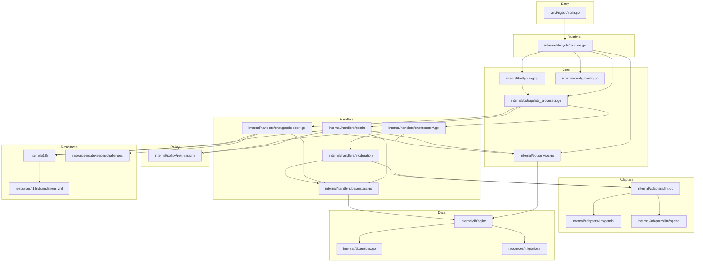
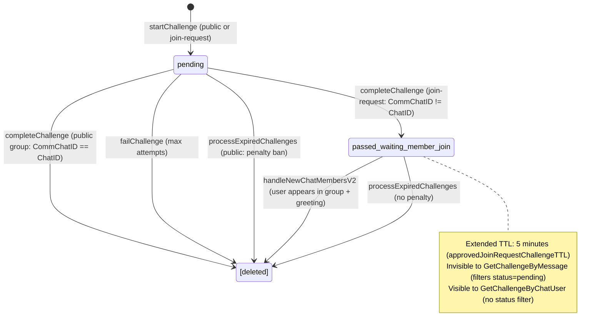
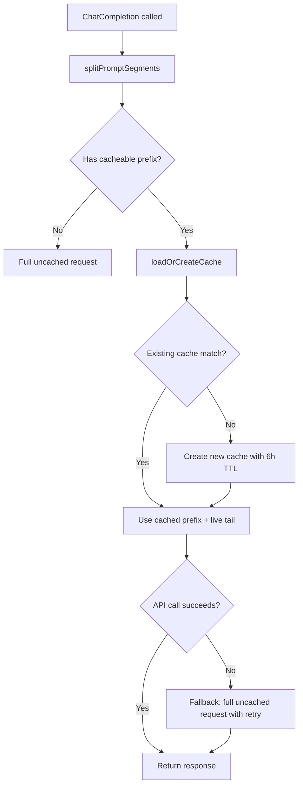
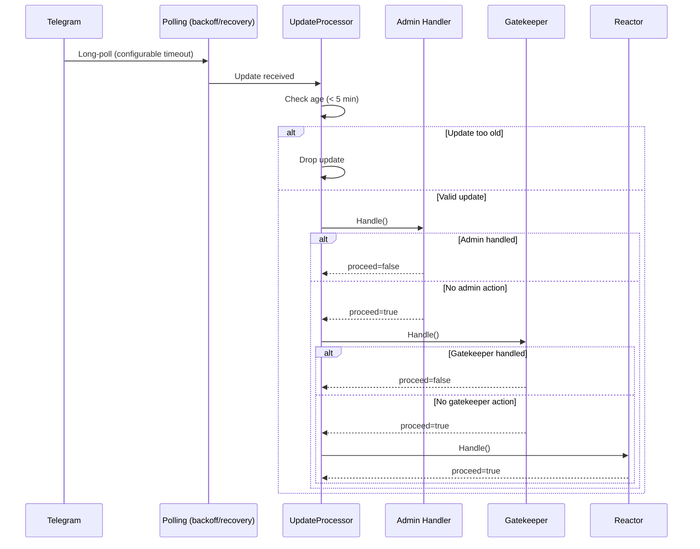
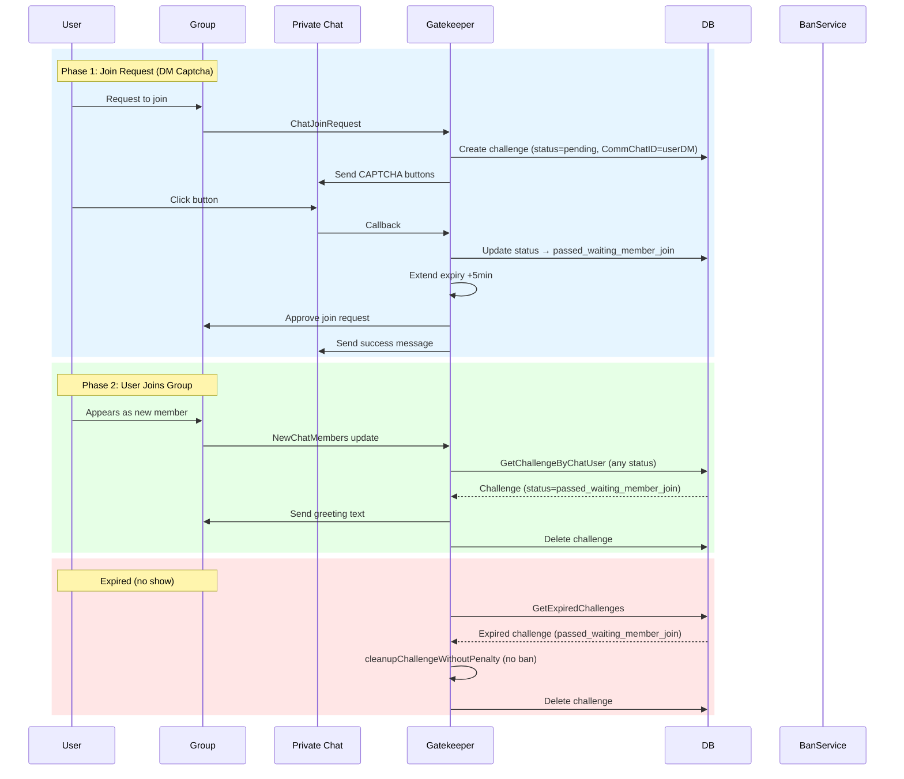
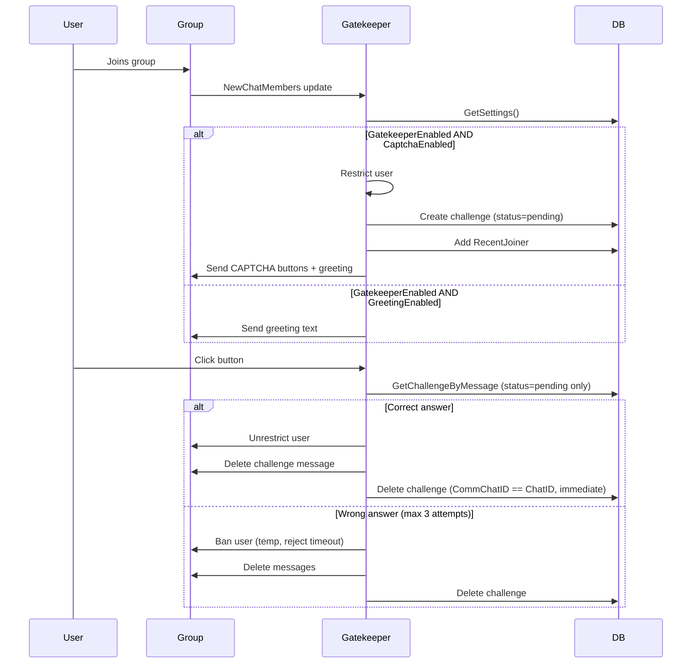
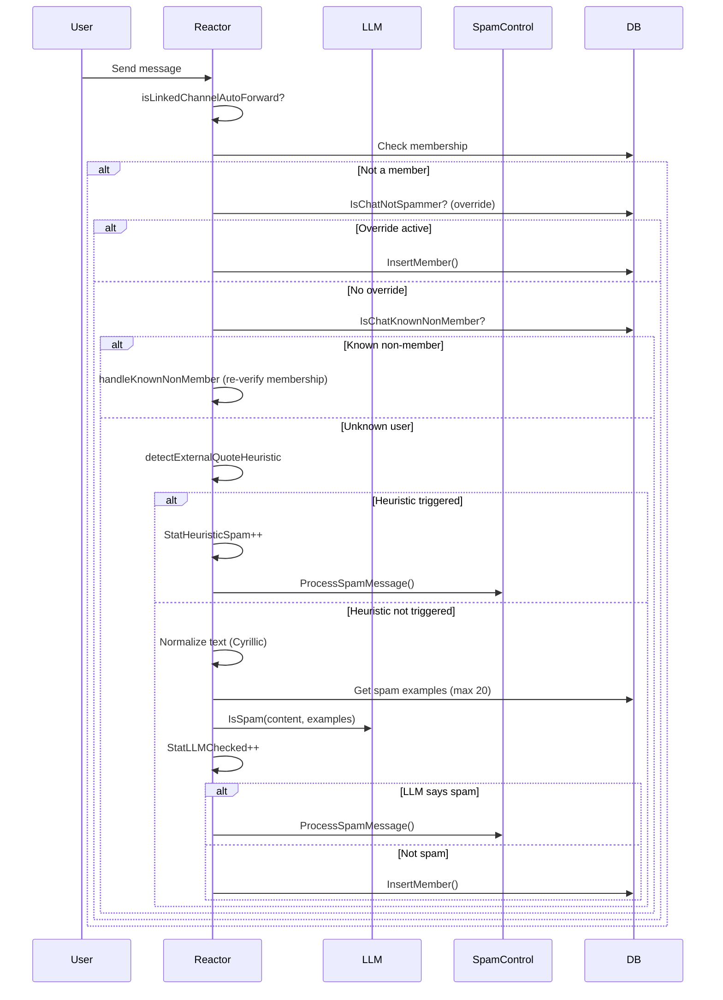
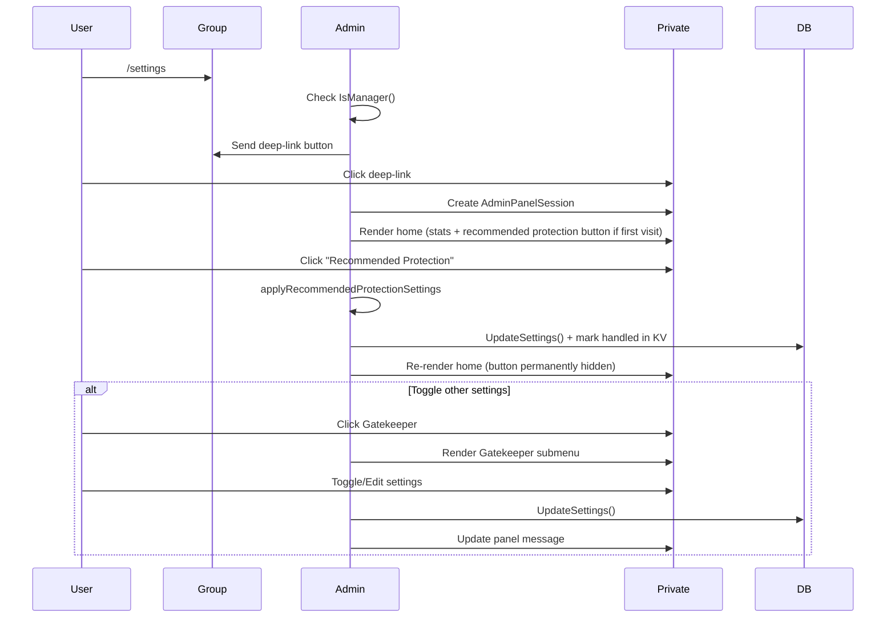
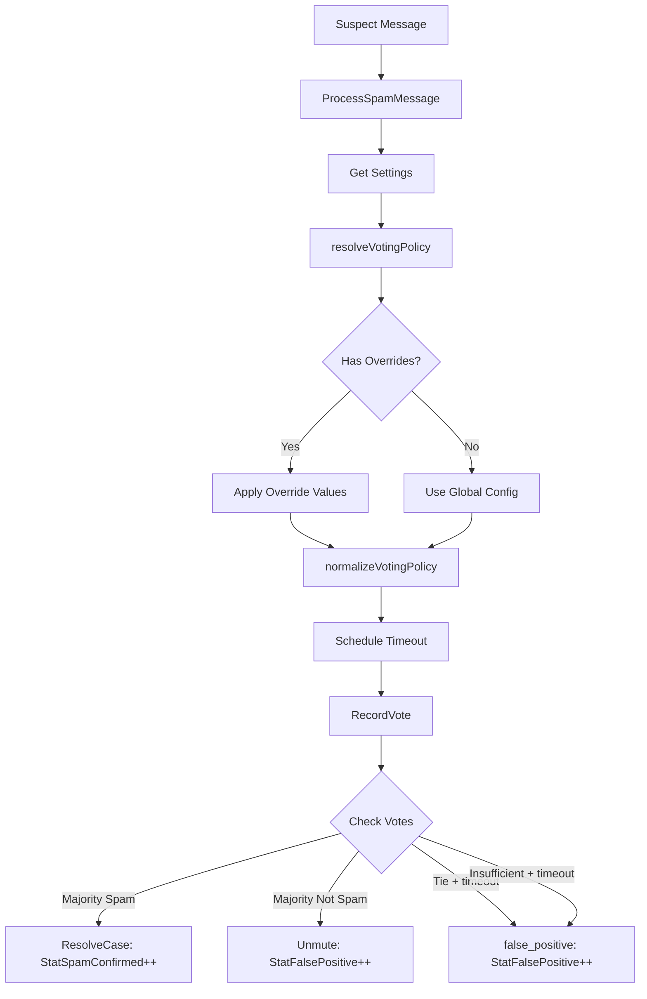
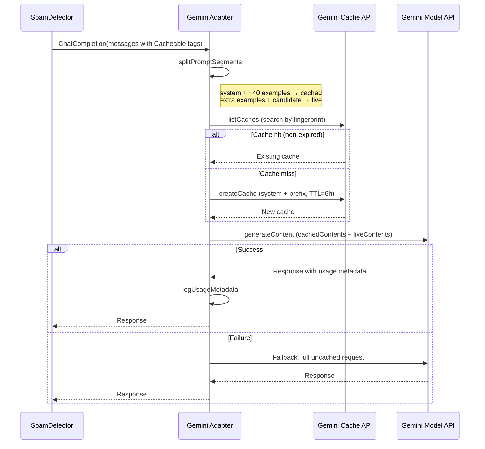

# ngbot Codebase Map

> Auto-generated by Cartographer. Last mapped: 2026-04-16 (update 5)

## System Overview

**ngbot** is a Telegram chat gatekeeper bot that protects groups from spam and automated bot joins. It provides CAPTCHA-based entry verification with configurable options, LLM-powered spam detection with Gemini explicit caching, external-quote heuristic fast-path, community voting moderation, MarkdownV2 greeting templates with entity-based normalization, and daily statistics tracking.


```mermaid
graph TB
    subgraph Entry
        Main[cmd/ngbot/main.go]
    end

    subgraph Runtime
        Lifecycle[internal/lifecycle/runtime.go]
    end

    subgraph Core
        Service[internal/bot/service.go]
        Processor[internal/bot/update_processor.go]
        Polling[internal/bot/polling.go]
        Config[internal/config/config.go]
    end

    subgraph Handlers
        Admin[internal/handlers/admin]
        Gatekeeper[internal/handlers/chat/gatekeeper*.go]
        Reactor[internal/handlers/chat/reactor*.go]
        Moderation[internal/handlers/moderation]
        Stats[internal/handlers/base/stats.go]
    end

    subgraph Adapters
        LLM[internal/adapters/llm.go]
        Gemini[internal/adapters/llm/gemini]
        OpenAI[internal/adapters/llm/openai]
    end

    subgraph Data
        SQLite[internal/db/sqlite]
        Entities[internal/db/entities.go]
        Migrations[resources/migrations]
    end

    subgraph Policy
        Permissions[internal/policy/permissions]
    end

    subgraph Resources
        I18N[internal/i18n]
        Translations[resources/i18n/translations.yml]
        Challenges[resources/gatekeeper/challenges]
    end

    Main --> Lifecycle
    Lifecycle --> Service
    Lifecycle --> Processor
    Lifecycle --> Polling
    Lifecycle --> Config

    Polling --> Processor
    Processor --> Admin
    Processor --> Gatekeeper
    Processor --> Reactor

    Admin --> Service
    Gatekeeper --> Service
    Reactor --> Moderation
    Reactor --> LLM

    Moderation --> LLM
    LLM --> Gemini
    LLM --> OpenAI

    Service --> SQLite
    SQLite --> Entities
    SQLite --> Migrations

    Gatekeeper --> I18N
    Admin --> I18N
    I18N --> Translations
    Gatekeeper --> Challenges

    Admin --> Permissions
    Reactor --> Permissions
    Admin --> Stats
    Gatekeeper --> Stats
    Moderation --> Stats
    Stats --> SQLite
```

## Directory Structure

```
ngbot/
├── cmd/ngbot/main.go              # Application entry point, runtime wiring
├── internal/
│   ├── bot/                       # Core bot service, polling, and update processing
│   │   ├── service.go             # Membership tracking, settings, caching
│   │   ├── service_test.go        # Service lifecycle tests
│   │   ├── update_processor.go    # Update dispatch, handler registry
│   │   ├── polling.go             # Custom long-polling with exponential backoff
│   │   ├── polling_test.go        # Polling recovery/backoff tests
│   │   └── dependencies.go        # Interface definitions (Service, Handler)
│   ├── config/                    # Configuration loading (env vars)
│   │   ├── config.go              # NG_* environment variables, Telegram timing config
│   │   ├── config_test.go         # Telegram timing validation tests
│   │   └── log_formatter.go       # Custom logrus formatter
│   ├── db/                        # Database layer (hexagonal)
│   │   ├── dependencies.go        # Client interface (41+ methods)
│   │   ├── entities.go            # Data structures (Settings, Challenge, etc.)
│   │   ├── settings.go            # DefaultSettings(), ErrNotFound
│   │   ├── spam_tracking.go       # SpamReport, UserRestriction
│   │   ├── gatekeeper_greeting.go # MarkdownV2 prefix tagging (mdv2:) for greeting templates
│   │   ├── not_spammer_overrides.go  # Not-spammer override validation/normalization
│   │   └── sqlite/                # SQLite implementation
│   │       ├── client.go          # SQLite bootstrap (conn+migrations)
│   │       ├── client_settings_members.go  # Settings & members CRUD
│   │       ├── client_challenges.go        # Gatekeeper challenges (status-aware)
│   │       ├── client_challenges_test.go   # Parallel join + status lifecycle tests
│   │       ├── client_spam.go              # Spam/restrictions/banlist
│   │       ├── client_kv.go                # KV store operations (stats + sessions)
│   │       ├── client_not_spammer_overrides.go  # Not-spammer override CRUD + lookup
│   │       ├── client_not_spammer_overrides_test.go  # Override CRUD + global scope tests
│   │       ├── client_known_non_members.go  # Known-non-member CRUD + lookup
│   │       ├── client_known_non_members_test.go  # Known-non-member CRUD lifecycle tests
│   │       ├── admin_panel.go              # Admin sessions, spam examples
│   │       └── migrations_test.go          # Index verification tests
│   ├── adapters/                  # External service adapters
│   │   ├── llm.go                 # LLM interface
│   │   └── llm/
│   │       ├── entities.go        # Chat completion types (with Cacheable field)
│   │       ├── gemini/            # Google Gemini adapter (with explicit caching)
│   │       └── openai/            # OpenAI-compatible adapter
│   ├── handlers/                  # Update handlers (chain of responsibility)
│   │   ├── dependencies.go        # Compile-time interface verification
│   │   ├── base/
│   │   │   ├── handler.go         # Shared handler utilities, default settings
│   │   │   ├── stats.go           # Daily stats subsystem (7 metrics, KV-based)
│   │   │   └── stats_test.go      # Stats aggregation tests
│   │   ├── admin/                 # Admin commands and panel
│   │   │   ├── admin.go           # Core struct, lifecycle, Handle()
│   │   │   ├── panel_handler.go   # /settings flow, callback routing
│   │   │   ├── panel_access_service.go    # Permission checks
│   │   │   ├── panel_commands.go  # State machine actions (gatekeeper, recommended)
│   │   │   ├── panel_constants.go # Pagination, timeouts, captcha options
│   │   │   ├── panel_encoding.go  # ChatID/MessageID encoding
│   │   │   ├── panel_encoding_test.go     # Encoding round-trip tests
│   │   │   ├── panel_lifecycle.go # Session cleanup worker
│   │   │   ├── panel_render.go    # Render orchestration, stats display
│   │   │   ├── panel_renderer.go  # UI rendering
│   │   │   ├── panel_session_service.go    # Session persistence
│   │   │   ├── panel_recommended.go       # One-click recommended protection (NEW)
│   │   │   ├── panel_recommended_test.go  # Recommended protection tests (NEW)
│   │   │   ├── panel_not_spammer_override.go  # Not-spammer override parsing, rehab
│   │   │   ├── panel_not_spammer_override_test.go  # Reference parsing tests
│   │   │   ├── panel_greeting_markdown.go  # MarkdownV2 greeting template normalization from Telegram entities (NEW)
│   │   │   ├── panel_greeting_markdown_test.go  # Greeting normalization unit tests (NEW)
│   │   │   └── panel_types.go     # Page/action/command types (24 pages)
│   │   ├── chat/                  # Gatekeeper/Reactor use-cases
│   │   │   ├── gatekeeper.go      # Orchestrator, lifecycle
│   │   │   ├── gatekeeper_captcha.go       # Button generation, keyboard layout
│   │   │   ├── gatekeeper_captcha_test.go  # Button generation tests
│   │   │   ├── gatekeeper_challenge_service.go  # Challenge lifecycle (status-aware)
│   │   │   ├── gatekeeper_join_processor.go     # Join flow, two-phase status handling
│   │   │   ├── gatekeeper_join_flow_test.go     # Join flow integration tests (NEW)
│   │   │   ├── gatekeeper_scheduler.go          # Background workers (status-aware expiry)
│   │   │   ├── gatekeeper_scheduler_test.go     # Scheduler tests
│   │   │   ├── reactor.go         # Orchestrator, pipeline stages
│   │   │   ├── reactor_command_router.go     # /ban, /testspam, /skipreason
│   │   │   ├── reactor_command_router_test.go  # Command targeting tests
│   │   │   ├── reactor_message_pipeline.go   # Spam detection pipeline
│   │   │   ├── reactor_message_pipeline_test.go  # External quote + override bypass tests
│   │   │   ├── reactor_reaction_moderator.go # Reaction-based moderation
│   │   │   ├── reactor_text_normalizer.go    # Cyrillic homoglyph normalization
│   │   │   └── test_bot_api_test.go          # Shared test BotAPI with httptest.Server
│   │   └── moderation/            # Spam detection, ban service
│   │       ├── ban_service.go     # Interface, lifecycle, public API
│   │       ├── ban_service_actions.go     # Restrict/ban/unban actions
│   │       ├── ban_service_fetch.go       # Banlist fetch/retry/cache
│   │       ├── ban_service_test.go        # Concurrent access tests
│   │       ├── spam_control.go    # Voting system, per-chat policy, stats integration
│   │       ├── spam_control_policy_test.go  # Voting policy tests
│   │       ├── spam_detector.go   # LLM-based detection (cache-aware prompting)
│   │       ├── spam_detector_test.go   # LLM prompt + caching contract tests
│   │       └── spam_control_known_non_member_test.go  # Known-non-member clearing tests
│   ├── lifecycle/                 # Runtime component orchestration
│   │   ├── runtime.go             # Component interface, LIFO stop
│   │   └── runtime_test.go        # Order verification tests
│   ├── policy/                    # Shared policy packages
│   │   └── permissions/           # Manager/moderator role checks
│   │       └── permissions.go     # IsManager, IsPrivilegedModerator
│   ├── i18n/                      # Internationalization
│   │   ├── i18n.go                # Translation loading/lookup
│   │   ├── languages.go           # Language name lookup
│   │   └── translations_consistency_test.go  # AST-based key consistency
│   └── infra/                     # Infrastructure utilities
│       ├── filesystem.go          # Working directory management
│       └── health_check.go        # Executable modification monitor
├── resources/
│   ├── embed.go                   # Go embed directive
│   ├── i18n/translations.yml      # 30 language translations, 108+ keys
│   ├── gatekeeper/challenges/     # Per-language emoji challenges (30 files)
│   └── migrations/                # 22 SQL migration files
├── go.mod                         # Dependencies (Go 1.25)
├── Dockerfile                     # Multi-stage build
├── compose.yaml.dist              # Docker Compose config
└── .env.example                   # Configuration template
```

## Module Guide

### Core Bot Module (`internal/bot/`)

**Purpose**: Central bot service, custom polling, and update processing pipeline

| File | Purpose | Key Exports |
|------|---------|-------------|
| `service.go` | Membership/settings management with TTL caching | `NewService()`, `IsMember()`, `GetSettings()`, worker group for background tasks |
| `service_test.go` | Service initialization and lifecycle tests | Integration tests with real SQLite |
| `update_processor.go` | Update dispatch to handlers (chain of responsibility) | `UpdateProcessor`, `RegisterUpdateHandler()`, 19 `MessageType` constants, `StageOverrideCheck`, `StageKnownNonMember` |
| `polling.go` | Custom long-polling with exponential backoff and recovery window | `GetUpdatesChans()`, `PollingOptions`, `PollingRecoveryError` |
| `polling_test.go` | Polling recovery, backoff, malformed update tests | Tests for all polling failure modes |
| `dependencies.go` | Interface contracts | `Service`, `Handler`, `Client` interfaces |

**Key Patterns**:
- Two-level caching: members (5-min TTL with lazy eviction), settings (process-lifetime)
- Handler registry with chain of responsibility (`proceed bool` stops chain)
- Update timeout: 5 minutes (stale updates dropped)
- Custom polling replaces library polling: exponential backoff (initial 1s, max 30s), recovery window (default 10m), malformed update filtering
- Worker group (`sync.WaitGroup.Go()`) replaces raw goroutines

**Dependencies**: `telegram-bot-api`, `db`, `config`, `errgroup`

---

### Lifecycle Module (`internal/lifecycle/`)

**Purpose**: Component lifecycle orchestration with ordered start/stop

| File | Purpose | Key Exports |
|------|---------|-------------|
| `runtime.go` | Component orchestration | `Component` interface, `Runtime`, `NewRuntime()` |
| `runtime_test.go` | Order verification tests | LIFO stop order validation |

**Key Patterns**:
- `Component` interface: `Start(ctx) error`, `Stop(ctx) error`
- LIFO stop order (last started = first stopped)
- Rollback on start failure (stops already-started components)
- `errors.Join` collects all stop errors

---

### Handlers Module (`internal/handlers/`)

**Purpose**: Update processing chain with specialized handlers

| Handler | Purpose | Chain Order |
|---------|---------|-------------|
| `Admin` | `/lang`, `/settings`, admin panel with cascading submenus | 1 (stops on match) |
| `Gatekeeper` | CAPTCHA challenges (configurable options) for new members | 2 (stops for callbacks) |
| `Reactor` | Spam detection, message processing, commands | 3 (always runs) |

> **Note**: All handler files share package `handlers` regardless of subdirectory — `admin/`, `chat/`, `moderation/` are organizational only.

#### Admin Handler Files

| File | Purpose |
|------|---------|
| `admin.go` | Core struct, lifecycle, `Handle()` dispatcher |
| `panel_handler.go` | `/settings` flow, deep-linking, callback routing, free-text input |
| `panel_access_service.go` | Permission checks, typing indicator, messaging utilities |
| `panel_commands.go` | State machine actions (gatekeeper, voting, recommended protection, greeting edit) + `saveChatSettings` wrapper |
| `panel_constants.go` | Pagination, timeouts, captcha options, voting options |
| `panel_encoding.go` | Binary encoding for chat/message IDs in callbacks (base64url) |
| `panel_encoding_test.go` | Encoding round-trip tests including legacy backward compatibility |
| `panel_lifecycle.go` | Background session cleanup worker (5-min interval) |
| `panel_render.go` | Per-page render methods, stats display on home page |
| `panel_renderer.go` | Render dispatch, settings hydration, message edit/send fallback |
| `panel_session_service.go` | Session persistence, callback parsing, brute-force split resolution |
| `panel_recommended.go` | One-click recommended protection preset, one-time visibility via KV tracking, customized-settings detection |
| `panel_recommended_test.go` | Recommended protection application, detection, and one-time visibility tests |
| `panel_not_spammer_override.go` | Input parsing (username/ID/URL), rehabilitation side-effects |
| `panel_not_spammer_override_test.go` | Reference parsing table-driven tests |
| `panel_greeting_markdown.go` | MarkdownV2 greeting template normalization from Telegram message entities (sweep-line algorithm, UTF-16 offset conversion, placeholder safety validation) |
| `panel_greeting_markdown_test.go` | Greeting normalization tests (plain text, entity-based, placeholder-in-link rejection) |
| `panel_types.go` | `panelPage` (24 pages), `panelState`, `panelCommand` types |

**Admin Panel Pages** (Cascading Menu Structure):

```
Home
├── [Recommended Protection] (one-click, auto-hides when applied)
├── [Last 7 days stats summary]
├── LanguageList (paginated, 6/page)
├── Gatekeeper
│   ├── GatekeeperCaptcha
│   │   ├── GatekeeperCaptchaOptions (picker: 3,4,5,6,8,10)
│   │   ├── GatekeeperChallengeTimeout (picker: 30s,1m,2m,3m,5m)
│   │   └── GatekeeperRejectTimeout (picker: 10m)
│   └── GatekeeperGreeting
│       └── GatekeeperGreetingPrompt (free-text input)
├── LLM
│   └── ExamplesList (paginated, 5/page)
│       ├── ExampleDetail → ConfirmDelete
│       └── ExamplePrompt (free-text input)
├── Indulgence
│   ├── IndulgenceList (paginated, shows override count badge)
│   │   ├── IndulgenceDetail
│   │   │   └── IndulgenceConfirmDelete
│   │   └── (numbered selection buttons)
│   └── IndulgencePrompt (free-text: username, user ID, or profile URL)
├── Voting
│   ├── VotingTimeout (inherit + 1m..30m)
│   ├── VotingMinVoters (inherit + 1,2,3,5,10)
│   ├── VotingMaxVoters (inherit + 0,5,10,20)
│   └── VotingMinPercent (inherit + 1,3,5,10,20%)
└── ConfirmClose
```

**Recommended Protection Preset**:
Applies these values in one click:
- Gatekeeper ON, CAPTCHA ON, Greeting OFF
- Challenge timeout: 3m, Reject timeout: 10m
- LLM first-message check: ON
- Community voting: OFF
- Button appears only once per chat (first `/settings` with pristine defaults), then permanently hidden via KV flag
- `saveChatSettings` wrapper marks `admin_panel:recommended_protection_handled:<chatID>` in KV store on every settings save
- `hasCustomizedSettings` detects any deviation from defaults across 13 fields

**Daily Stats Display** (Home Page):
- Aggregates 7 metrics over last 7 days from KV store
- Key format: `stats:<chatID>:<YYYY-MM-DD>:<metric>`
- Four i18n-formatted lines: header, challenges, spam checks, outcomes

**Admin Panel Session Lifecycle**:
1. User runs `/settings` in group → deep-link button → private chat
2. Session created with JSON state, 1-hour TTL
3. Each callback → `findPanelSessionCommand` (brute-force split resolution) → `applyPanelCommand` → re-render
4. Background goroutine cleans expired sessions every 5 minutes
5. Every render creates O(N) command records, old ones deleted at re-render start
6. `saveChatSettings` called on every settings mutation → also marks recommended protection as handled in KV

#### Gatekeeper Handler Files

| File | Purpose |
|------|---------|
| `gatekeeper.go` | Orchestrator, lifecycle, `Handle()`, `determineUpdateType` dispatcher |
| `gatekeeper_captcha.go` | CAPTCHA button generation, smart keyboard layout (2 rows for 6+) |
| `gatekeeper_challenge_service.go` | Challenge lifecycle with status management, stat instrumentation |
| `gatekeeper_join_processor.go` | Two-phase join flow with `passed_waiting_member_join` handoff, dual Markdown/MarkdownV2 greeting rendering, placeholder substitution |
| `gatekeeper_join_flow_test.go` | Full integration tests for join-request handoff + MarkdownV2 greeting rendering |
| `gatekeeper_scheduler.go` | Background workers (status-aware expiry, joiners check, not-spammer bypass) |
| `gatekeeper_scheduler_test.go` | Scheduler override bypass + expired join-request tests |
| `gatekeeper_captcha_test.go` | Button generation and keyboard layout tests |

**Challenge Status Lifecycle**:


```mermaid
stateDiagram-v2
    [*] --> pending: startChallenge (public or join-request)

    pending --> [deleted]: completeChallenge (public group: CommChatID == ChatID)
    pending --> passed_waiting_member_join: completeChallenge (join-request: CommChatID != ChatID)
    pending --> [deleted]: failChallenge (max attempts)
    pending --> [deleted]: processExpiredChallenges (public: penalty ban)

    passed_waiting_member_join --> [deleted]: handleNewChatMembersV2 (user appears in group + greeting)
    passed_waiting_member_join --> [deleted]: processExpiredChallenges (no penalty)

    note right of passed_waiting_member_join
        Extended TTL: 5 minutes (approvedJoinRequestChallengeTTL)
        Invisible to GetChallengeByMessage (filters status=pending)
        Visible to GetChallengeByChatUser (no status filter)
    end note
```

**Status Constants**:
- `ChallengeStatusPending = "pending"` — Initial state, visible to callback handler
- `ChallengeStatusPassedWaitingMemberJoin = "passed_waiting_member_join"` — Handoff state for join-request flow

**Gatekeeper Constants**:
- `captchaSize = 5`, `maxChallengeAttempts = 3`
- `approvedJoinRequestChallengeTTL = 5 * time.Minute`
- Allowed options counts: `{3, 4, 5, 6, 8, 10}`
- Process intervals: new joiners = 1m, expired challenges = 1m
- Greeting placeholders: `{user}`, `{chat_title}`, `{chat_link_titled}`, `{timeout}`
- Greeting template prefix: `mdv2:` tags MarkdownV2-formatted templates; absence = legacy Markdown
- MarkdownV2 greeting causes parse-mode upgrade for the entire combined message (greeting + challenge)

#### Reactor Handler Files

| File | Purpose |
|------|---------|
| `reactor.go` | Orchestrator, pipeline stages, callback/reaction/command dispatch |
| `reactor_command_router.go` | `/testspam`, `/skipreason`, `/ban` with `commandTargetsCurrentBot` |
| `reactor_command_router_test.go` | Command targeting tests |
| `reactor_message_pipeline.go` | Spam detection pipeline with external quote heuristic + stat tracking |
| `reactor_message_pipeline_test.go` | External quote heuristic tests |
| `reactor_reaction_moderator.go` | Reaction-based moderation (5 flagged emojis = auto-ban) |
| `reactor_text_normalizer.go` | Cyrillic homoglyph normalization (100+ confusable chars) |
| `test_bot_api_test.go` | Shared test BotAPI with httptest.Server |

**Pipeline Stages** (in order):

```
Message arrives
    │
    ▼
[1] isLinkedChannelAutoForward? → YES → SKIP
    │
    NO
    ▼
[2] IsMember? → YES → SKIP
    │
    NO
    ▼
[3] IsChatNotSpammer? → YES → Insert member, SKIP (override)
    │
    NO
    ▼
[4] IsChatKnownNonMember? → YES → handleKnownNonMember (re-verify, may SKIP)
    │
    NO
    ▼
[5] CheckBan → BANNED → ProcessBannedMessage (no voting)
    │
    NOT BANNED
    ▼
[6] LLMFirstMessageEnabled? → NO → Insert member, SKIP
    │
    YES
    ▼
[7] Extract content → EMPTY → SKIP
    │
    HAS CONTENT
    ▼
[8] detectFirstMessageExternalQuoteHeuristic → TRIGGERED → immediate spam + StatHeuristicSpam
    │
    NOT TRIGGERED
    ▼
[9] normalizeCyrillics (if cyrillic detected)
    │
    ▼
[10] Load per-chat spam examples (max 20)
    │
    ▼
[11] LLM IsSpam (few-shot: system + ~40 examples + extra + candidate) + StatLLMChecked
    │
    ├── SPAM → processSpam (with voting) or processBanned (without)
    │         + rememberAuthorIfPossible (remember non-member or promote)
    └── NOT SPAM → insertMemberIfPresent
                    + rememberAuthorIfPossible
```

#### Moderation Files

| File | Purpose |
|------|---------|
| `ban_service.go` | Interface, lifecycle, known-banned-user management, lols.bot API |
| `ban_service_actions.go` | Mute/Ban/Unmute/Unban actions (all 10-min durations) |
| `ban_service_fetch.go` | External banlist fetch with linear retry (daily + hourly) |
| `ban_service_test.go` | Concurrent map access tests |
| `spam_control.go` | Community voting system, per-chat policy resolution, stat integration |
| `spam_control_policy_test.go` | Voting policy and resolution tests |
| `spam_detector.go` | LLM-powered classification (cache-aware prompting) |
| `spam_detector_test.go` | LLM prompt construction + caching contract tests |
| `spam_control_known_non_member_test.go` | Known-non-member clearing on spam verdict tests |

**Community Voting Policy Resolution**:

| Step | Description |
|------|-------------|
| 1. Base policy | From `config.SpamControl` global config |
| 2. Per-chat overrides | From `db.Settings` (if not `SettingsOverrideInherit` = -1) |
| 3. Normalization | Timeout min 5m, MinVoters min 1, MaxVoters min 0, MinVoters% min 0 |
| 4. Required voters | `max(MinVoters, len(members) * MinVoters% / 100)`, capped by MaxVoters |

**Voting Resolution Logic**:

| Scenario | Result |
|----------|--------|
| Spam majority | `spam` status → user banned + `StatSpamConfirmed` |
| Not-spam majority | `false_positive` status → user unmuted + `StatFalsePositive` |
| Tie + timeout | `false_positive` (user-friendly) |
| Insufficient votes + timeout | `false_positive` (user-friendly) |

---

### Daily Stats Subsystem (`internal/handlers/base/stats.go`)

**Purpose**: KV-based daily counter tracking for moderation metrics

| Metric Constant | Description | Instrumentation Point |
|-----------------|-------------|----------------------|
| `StatChallengeStarted` | CAPTCHA challenge created | `gatekeeper_challenge_service.go` startChallenge |
| `StatChallengePassed` | CAPTCHA solved correctly | `gatekeeper_challenge_service.go` completeChallenge |
| `StatChallengeFailed` | CAPTCHA failed (max attempts) | `gatekeeper_join_processor.go` failChallenge |
| `StatLLMChecked` | LLM spam check performed | `reactor_message_pipeline.go` after LLM call |
| `StatHeuristicSpam` | External-quote heuristic triggered | `reactor_message_pipeline.go` heuristic path |
| `StatSpamConfirmed` | Spam confirmed (ban or vote) | `spam_control.go` direct ban + vote resolution |
| `StatFalsePositive` | False positive (unmuted) | `spam_control.go` vote resolution |

**Key format**: `stats:<chatID>:<YYYY-MM-DD>:<metric>`

**Functions**: `IncrementDailyStat`, `LoadStatsSummary` (aggregates N days), `FormatStatsSummary` (i18n output)

---

### Database Module (`internal/db/`)

**Purpose**: SQLite persistence with repository pattern

| File | Purpose |
|------|---------|
| `dependencies.go` | `Client` interface (41+ methods) |
| `entities.go` | Data structures with `db` tags |
| `settings.go` | `DefaultSettings()`, `ErrNotFound`, `SettingsOverrideInherit` |
| `spam_tracking.go` | `SpamReport`, `UserRestriction` |
| `gatekeeper_greeting.go` | `GatekeeperGreetingTemplateMarkdownV2Prefix`, `IsGatekeeperGreetingMarkdownV2Template`, `StripGatekeeperGreetingTemplateSyntax`, `WrapGatekeeperGreetingMarkdownV2Template` |
| `sqlite/client.go` | SQLite bootstrap, pool (42 max conns), embedded migrations |
| `sqlite/client_settings_members.go` | Settings & members CRUD (upsert pattern) |
| `sqlite/client_challenges.go` | Challenge CRUD (composite PK, status-aware queries) |
| `sqlite/client_challenges_test.go` | Parallel join + status lifecycle tests |
| `sqlite/client_spam.go` | Spam/restrictions/banlist CRUD |
| `sqlite/client_kv.go` | KV store operations (stats + sessions) |
| `sqlite/client_not_spammer_overrides.go` | Not-spammer override CRUD + scoped/global lookup |
| `sqlite/client_not_spammer_overrides_test.go` | Override CRUD + global scope tests |
| `sqlite/client_known_non_members.go` | Known-non-member CRUD + lookup |
| `sqlite/client_known_non_members_test.go` | Known-non-member CRUD lifecycle tests |
| `sqlite/admin_panel.go` | Admin sessions, spam examples |

**Key Entities**:

| Entity | Purpose | Primary Key |
|--------|---------|-------------|
| `Settings` | Per-chat configuration | `id` (chat ID) |
| `Challenge` | CAPTCHA state with status tracking | `(comm_chat_id, user_id, chat_id)` composite |
| `SpamCase` | Spam report with voting | auto-increment `id` |
| `AdminPanelSession` | Admin UI state | auto-increment `id` |
| `ChatSpamExample` | Per-chat spam examples for LLM | auto-increment `id` |
| `ChatNotSpammerOverride` | Manual not-spammer override (user_id or username) | auto-increment `id` |
| `ChatKnownNonMember` | Remembered non-member (user left or not joined) | `(chat_id, user_id)` composite |

**Challenge Entity**:

| Field | Type | Description |
|-------|------|-------------|
| `CommChatID` | int64 | Communication chat (group or private DM) |
| `UserID` | int64 | Target user |
| `ChatID` | int64 | Target group |
| `Status` | string | `pending` or `passed_waiting_member_join` |
| `SuccessUUID` | string | Correct answer identifier |
| `JoinMessageID` | int | Join event message ID |
| `ChallengeMessageID` | int | CAPTCHA message ID |
| `Attempts` | int | Wrong answer count |
| `CreatedAt` | time.Time | Creation timestamp |
| `ExpiresAt` | time.Time | Expiry timestamp (extended on handoff) |

**Settings Entity - Gatekeeper Fields**:

| Field | Type | Default | Description |
|-------|------|---------|-------------|
| `GatekeeperEnabled` | bool | false | Master switch |
| `GatekeeperCaptchaEnabled` | bool | false | CAPTCHA sub-feature |
| `GatekeeperGreetingEnabled` | bool | false | Greeting sub-feature |
| `GatekeeperCaptchaOptionsCount` | int | 5 | Options count (3,4,5,6,8,10) |
| `GatekeeperGreetingText` | string | "" | Custom greeting text |

**Settings Entity - Community Voting Override Fields**:

| Field | Type | Default | Description |
|-------|------|---------|-------------|
| `CommunityVotingTimeoutOverrideNS` | int64 | -1 | Voting timeout override (nanoseconds) |
| `CommunityVotingMinVotersOverride` | int | -1 | Minimum voters override |
| `CommunityVotingMaxVotersOverride` | int | -1 | Maximum voters override |
| `CommunityVotingMinVotersPercentOverride` | int | -1 | Minimum voters percentage override |

> **Note**: Value `-1` (`SettingsOverrideInherit`) means "use global config". `Settings.Enabled` is always forced to equal `GatekeeperEnabled` on save.

**Not-Spammer Override Entity**:

| Field | Type | Description |
|-------|------|-------------|
| `ID` | int64 | Auto-increment PK |
| `ChatID` | int64 | Chat scope (`0` = global, rejected by public API) |
| `MatchType` | string | `"user_id"` or `"username"` |
| `MatchValue` | string | Normalized: lowercase username (no `@`) or positive int64 string |
| `CreatedByUserID` | int64 | Admin who created the override |
| `CreatedAt` | time.Time | Creation timestamp |

**Two-Tier Scoping**: Chat-scoped overrides (`chat_id = <specific>`) take priority over global overrides (`chat_id IS NULL` or `0`). Global overrides can only be inserted directly into DB. Lookup query `IsChatNotSpammer` checks both scopes with `ORDER BY` prioritizing chat-scoped.

**Normalization Functions** (`not_spammer_overrides.go`):
- `NormalizeChatNotSpammerMatch(matchType, matchValue)` — validates and canonicalises
- `NormalizeChatNotSpammerUsername(username)` — trims, strips `@`, lowercases

**Admin Panel Input Parsing** (`panel_not_spammer_override.go`):
- Accepts: bare `@username`, numeric ID, `t.me/user`, `tg://resolve?domain=user`, `tg://user?id=123456`
- Rejects: empty, private channel links (`t.me/c/...`), invalid formats
- Side effect: `rehabilitateNotSpammerUser` resolves active spam case + unmutes + unbans (fire-and-forget)

**Known Non-Member Entity**:

| Field | Type | Description |
|-------|------|-------------|
| `ChatID` | int64 | Chat ID (composite PK part 1) |
| `UserID` | int64 | User ID (composite PK part 2) |
| `CreatedAt` | time.Time | First time remembered (preserved on upsert) |
| `UpdatedAt` | time.Time | Last upsert time (always refreshed) |

**Known Non-Member Lifecycle**:
- **Written by**: Reactor (`rememberAuthorIfPossible`) after spam check — re-checks `GetChatMember` to decide remember/promote/clean
- **Read by**: Reactor (`handleKnownNonMember`) at pipeline stage 4 — short-circuits spam pipeline for remembered users
- **Deleted by**: Reactor (on promotion to member or kick), SpamControl (on confirmed spam via `clearKnownNonMember`)
- **Upsert preserves `CreatedAt`**: On conflict, only `updated_at` is bumped

**Database Schema** (22 migrations):

| Table | PK | Key Relationships |
|-------|-----|-------------------|
| `chats` | `id` (chat ID) | Parent of most tables |
| `chat_members` | `(chat_id, user_id)` | FK → chats CASCADE |
| `gatekeeper_challenges` | `(comm_chat_id, user_id, chat_id)` | Indexes: `expires_at`, `(comm_chat_id, user_id, challenge_message_id)`, `(chat_id, user_id)`; Column: `status` |
| `spam_cases` | auto `id` | Indexes: `(chat_id, user_id)`, `(status)` |
| `spam_votes` | `(case_id, voter_id)` | FK → spam_cases CASCADE |
| `user_restrictions` | `(chat_id, user_id)` | — |
| `recent_joiners` | auto `id` | Unique: `(chat_id, user_id)` |
| `banlist` | `user_id` | — |
| `kv_store` | `key` | Index: `updated_at` |
| `chat_managers` | `(chat_id, user_id)` | FK → chats CASCADE |
| `chat_bot_membership` | `chat_id` | FK → chats CASCADE |
| `admin_panel_sessions` | auto `id` | FK → chats CASCADE |
| `admin_panel_commands` | auto `id` | FK → admin_panel_sessions CASCADE |
| `chat_spam_examples` | auto `id` | FK → chats CASCADE |
| `chat_not_spammer_overrides` | auto `id` | Unique: `(match_type, match_value, normalized_scope)`, Index: `(match_type, match_value, normalized_scope, id DESC)` |
| `chat_known_non_members` | `(chat_id, user_id)` | — |

**Gotchas**:
- `db.ErrNotFound` used for missing settings, but `(nil, nil)` for challenges/admin panel, `("", nil)` for KV — inconsistent not-found signaling
- `SpamVote.Vote` is inverted: `true` = NOT spam, `false` = IS spam
- Connection pool: 42 max open connections
- Pure-Go SQLite driver (`modernc.org/sqlite`)
- `sync.RWMutex` protects all operations (application-level, not WAL-only)
- Receiver naming inconsistency: `c *sqliteClient` in most files, `s *sqliteClient` in `client_kv.go` and `client_spam.go`

---

### LLM Adapters (`internal/adapters/llm/`)

**Purpose**: Abstraction over OpenAI and Google Gemini APIs

```go
type LLM interface {
    ChatCompletion(ctx, messages) (Response, error)
}
```

| Adapter | Default Model | Key Features |
|---------|---------------|--------------|
| `gemini.API` | `gemini-2.5-flash-lite` | Explicit context caching (6h TTL), SHA-256 fingerprinting, `BLOCK_NONE` safety |
| `openai.API` | `gpt-4o-mini` | Supports custom base URL; cache-unaware (`Cacheable` field ignored) |

**Shared Config**: Temperature 0.9, TopP 0.9, MaxTokens 8192 (both adapters)

**Gemini Explicit Caching Architecture**:


```mermaid
flowchart TD
    A[ChatCompletion called] --> B[splitPromptSegments]
    B --> C{Has cacheable prefix?}
    C -->|No| D[Full uncached request]
    C -->|Yes| E[loadOrCreateCache]
    E --> F{Existing cache match?}
    F -->|Yes| G[Use cached prefix + live tail]
    F -->|No| H[Create new cache with 6h TTL]
    H --> G
    G --> I{API call succeeds?}
    I -->|Yes| J[Return response]
    I -->|No| K[Fallback: full uncached request with retry]
    K --> J
```

**Cacheable Message Contract** (`ChatCompletionMessage.Cacheable bool`):
- System prompt: `Cacheable: true` (stable across requests)
- Built-in few-shot examples (~40): `Cacheable: true` (rarely changes)
- Per-chat extra examples: `Cacheable: false` (varies per chat)
- Candidate message: `Cacheable: false` (unique per request)

**Gemini Cache Key**: SHA-256 of (model + system instruction + cacheable prefix), first 12 hex chars as display name prefix `ngbot-spam-<hash>`

**Gotchas**:
- Gemini: roles mapped (`assistant` → `model`), system messages extracted as `SystemInstruction`
- Gemini: all four safety categories set to `BlockNone`
- Gemini: `splitPromptSegments` only caches contiguous cacheable prefix — once a non-cacheable message appears, everything after is "live"
- Gemini: fallback on cache failure retries with full content including system instruction
- OpenAI: system messages reordered to front of slice; `Cacheable` field ignored
- Both adapters discard the `logger` parameter (`_ = logger`)

---

### Policy Module (`internal/policy/permissions/`)

**Purpose**: Permission checking utilities

| Function | Description |
|----------|-------------|
| `IsManager(member)` | Creator OR admin with `CanManageChat` OR `CanPromoteMembers` |
| `IsPrivilegedModerator(member)` | Manager OR admin with `CanRestrictMembers` |

**Hierarchy**: Managers > Privileged Moderators > Regular Admins > Users

---

### i18n Module (`internal/i18n/`)

**Purpose**: Multi-language support for bot messages

| File | Purpose |
|------|---------|
| `i18n.go` | Translation loading/lookup (keys ARE the English text) |
| `languages.go` | ISO code to name mapping |
| `translations_consistency_test.go` | AST-based key consistency verification (108+ keys) |

**Supported Languages** (30 total): be, bg, cs, da, de, el, en, es, et, fi, fr, hu, id, it, ja, ko, lt, lv, nb, nl, pl, pt, ro, ru, sk, sl, sv, tr, uk, zh

**Fallback**: exact match → return key (which is English text)

---

### Infra Module (`internal/infra/`)

**Purpose**: Infrastructure utilities

| File | Purpose |
|------|---------|
| `filesystem.go` | Working directory management (`EnsureDir`, `GetResourcesPath`) |
| `health_check.go` | Binary hot-reload detection (polls mtime every 5s, single-shot channel) |

---

## Data Flow

### Telegram Update Processing


```mermaid
sequenceDiagram
    participant TG as Telegram
    participant Poll as Polling (backoff/recovery)
    participant UP as UpdateProcessor
    participant Admin as Admin Handler
    participant GK as Gatekeeper
    participant Reactor as Reactor

    TG->>Poll: Long-poll (configurable timeout)
    Poll->>UP: Update received
    UP->>UP: Check age (< 5 min)

    alt Update too old
        UP->>UP: Drop update
    else Valid update
        UP->>Admin: Handle()

        alt Admin handled
            Admin-->>UP: proceed=false
        else No admin action
            Admin-->>UP: proceed=true
            UP->>GK: Handle()

            alt Gatekeeper handled
                GK-->>UP: proceed=false
            else No gatekeeper action
                GK-->>UP: proceed=true
                UP->>Reactor: Handle()
                Reactor-->>UP: proceed=true
            end
        end
    end
```

### Gatekeeper Challenge Flow (Two-Phase for Join Requests)


```mermaid
sequenceDiagram
    participant User
    participant Group
    participant DM as Private Chat
    participant Gatekeeper
    participant DB
    participant BanService

    rect rgb(230, 245, 255)
        Note over User,Group: Phase 1: Join Request (DM Captcha)
        User->>Group: Request to join
        Group->>Gatekeeper: ChatJoinRequest
        Gatekeeper->>DB: Create challenge (status=pending, CommChatID=userDM)
        Gatekeeper->>DM: Send CAPTCHA buttons
        User->>DM: Click button
        DM->>Gatekeeper: Callback
        Gatekeeper->>DB: Update status → passed_waiting_member_join
        Gatekeeper->>Gatekeeper: Extend expiry +5min
        Gatekeeper->>Group: Approve join request
        Gatekeeper->>DM: Send success message
    end

    rect rgb(230, 255, 230)
        Note over User,Group: Phase 2: User Joins Group
        User->>Group: Appears as new member
        Group->>Gatekeeper: NewChatMembers update
        Gatekeeper->>DB: GetChallengeByChatUser (any status)
        DB-->>Gatekeeper: Challenge (status=passed_waiting_member_join)
        Gatekeeper->>Group: Send greeting text
        Gatekeeper->>DB: Delete challenge
    end

    rect rgb(255, 230, 230)
        Note over User,Group: Expired (no show)
        Gatekeeper->>DB: GetExpiredChallenges
        DB-->>Gatekeeper: Expired challenge (passed_waiting_member_join)
        Gatekeeper->>Gatekeeper: cleanupChallengeWithoutPenalty (no ban)
        Gatekeeper->>DB: Delete challenge
    end
```

### Public Group Join (Single-Phase)


```mermaid
sequenceDiagram
    participant User
    participant Group
    participant Gatekeeper
    participant DB

    User->>Group: Joins group
    Group->>Gatekeeper: NewChatMembers update
    Gatekeeper->>DB: GetSettings()

    alt GatekeeperEnabled AND CaptchaEnabled
        Gatekeeper->>Gatekeeper: Restrict user
        Gatekeeper->>DB: Create challenge (status=pending)
        Gatekeeper->>DB: Add RecentJoiner
        Gatekeeper->>Group: Send CAPTCHA buttons + greeting
    else GatekeeperEnabled AND GreetingEnabled
        Gatekeeper->>Group: Send greeting text
    end

    User->>Gatekeeper: Click button
    Gatekeeper->>DB: GetChallengeByMessage (status=pending only)

    alt Correct answer
        Gatekeeper->>Group: Unrestrict user
        Gatekeeper->>Group: Delete challenge message
        Gatekeeper->>DB: Delete challenge (CommChatID == ChatID, immediate)
    else Wrong answer (max 3 attempts)
        Gatekeeper->>Group: Ban user (temp, reject timeout)
        Gatekeeper->>Group: Delete messages
        Gatekeeper->>DB: Delete challenge
    end
```

### Spam Detection Flow


```mermaid
sequenceDiagram
    participant User
    participant Reactor
    participant LLM
    participant SpamControl
    participant DB

    User->>Reactor: Send message
    Reactor->>Reactor: isLinkedChannelAutoForward?
    Reactor->>DB: Check membership

    alt Not a member
        Reactor->>DB: IsChatNotSpammer? (override)

        alt Override active
            Reactor->>DB: InsertMember()
        else No override
            Reactor->>DB: IsChatKnownNonMember?

            alt Known non-member
                Reactor->>Reactor: handleKnownNonMember (re-verify membership)
            else Unknown user
                Reactor->>Reactor: detectExternalQuoteHeuristic

                alt Heuristic triggered
                    Reactor->>Reactor: StatHeuristicSpam++
                    Reactor->>SpamControl: ProcessSpamMessage()
                else Heuristic not triggered
                    Reactor->>Reactor: Normalize text (Cyrillic)
                    Reactor->>DB: Get spam examples (max 20)
                    Reactor->>LLM: IsSpam(content, examples)
                    Reactor->>Reactor: StatLLMChecked++

                    alt LLM says spam
                        Reactor->>SpamControl: ProcessSpamMessage()
                    else Not spam
                        Reactor->>DB: InsertMember()
                    end
                end
            end
        end
    end
```

### Admin Panel Flow


```mermaid
sequenceDiagram
    participant User
    participant Group
    participant Admin
    participant Private
    participant DB

    User->>Group: /settings
    Admin->>Admin: Check IsManager()
    Admin->>Group: Send deep-link button
    User->>Private: Click deep-link
    Admin->>Private: Create AdminPanelSession
    Admin->>Private: Render home (stats + recommended protection button if first visit)

    User->>Private: Click "Recommended Protection"
    Admin->>Admin: applyRecommendedProtectionSettings
    Admin->>DB: UpdateSettings() + mark handled in KV
    Admin->>Private: Re-render home (button permanently hidden)

    alt Toggle other settings
        User->>Private: Click Gatekeeper
        Admin->>Private: Render Gatekeeper submenu
        User->>Private: Toggle/Edit settings
        Admin->>DB: UpdateSettings()
        Admin->>Private: Update panel message
    end
```

### Community Voting Resolution Flow


```mermaid
flowchart TD
    A[Suspect Message] --> B[ProcessSpamMessage]
    B --> C[Get Settings]
    C --> D[resolveVotingPolicy]
    D --> E{Has Overrides?}
    E -->|Yes| F[Apply Override Values]
    E -->|No| G[Use Global Config]
    F --> H[normalizeVotingPolicy]
    G --> H
    H --> I[Schedule Timeout]
    I --> J[RecordVote]
    J --> K{Check Votes}
    K -->|Majority Spam| L[ResolveCase: StatSpamConfirmed++]
    K -->|Majority Not Spam| M[Unmute: StatFalsePositive++]
    K -->|Tie + timeout| R[false_positive: StatFalsePositive++]
    K -->|Insufficient + timeout| R
```

### Gemini Caching Flow


```mermaid
sequenceDiagram
    participant Detector as SpamDetector
    participant Adapter as Gemini Adapter
    participant Cache as Gemini Cache API
    participant Model as Gemini Model API

    Detector->>Adapter: ChatCompletion(messages with Cacheable tags)
    Adapter->>Adapter: splitPromptSegments
    Note right of Adapter: system + ~40 examples → cached<br/>extra examples + candidate → live

    Adapter->>Cache: listCaches (search by fingerprint)
    alt Cache hit (non-expired)
        Cache-->>Adapter: Existing cache
    else Cache miss
        Adapter->>Cache: createCache (system + prefix, TTL=6h)
        Cache-->>Adapter: New cache
    end

    Adapter->>Model: generateContent (cachedContents + liveContents)
    alt Success
        Model-->>Adapter: Response with usage metadata
        Adapter->>Adapter: logUsageMetadata
        Adapter-->>Detector: Response
    else Failure
        Adapter->>Model: Fallback: full uncached request
        Model-->>Adapter: Response
        Adapter-->>Detector: Response
    end
```

## Configuration

### Environment Variables (NG_* prefix)

| Variable | Default | Description |
|----------|---------|-------------|
| `NG_TOKEN` | *required* | Telegram bot token |
| `NG_LANG` | `en` | Default language |
| `NG_HANDLERS` | `admin,gatekeeper,reactor` | Enabled handlers |
| `NG_LOG_LEVEL` | `2` | Log verbosity (0-6) |
| `NG_DOT_PATH` | `~/.ngbot` | Data directory |
| `NG_TELEGRAM_POLL_TIMEOUT` | `30s` | Long-poll timeout |
| `NG_TELEGRAM_REQUEST_TIMEOUT` | `35s` | HTTP client timeout (must be > poll timeout) |
| `NG_TELEGRAM_RECOVERY_WINDOW` | `10m` | Polling recovery window (must be > request timeout) |
| `NG_LLM_API_KEY` | *required* | LLM API key |
| `NG_LLM_API_MODEL` | `gpt-4o-mini` | Model name |
| `NG_LLM_API_URL` | `https://api.openai.com/v1` | OpenAI-compatible endpoint |
| `NG_LLM_API_TYPE` | `openai` | Provider (openai/gemini) |
| `NG_FLAGGED_EMOJIS` | `👎,💩` | Reaction ban triggers |
| `NG_SPAM_MIN_VOTERS` | `2` | Min votes for action |
| `NG_SPAM_MAX_VOTERS` | `10` | Max voters |
| `NG_SPAM_MIN_VOTERS_PERCENTAGE` | `5` | Vote threshold % |
| `NG_SPAM_VOTING_TIMEOUT` | `5m` | Voting window |

### Config Validation Rules

| Constraint | Reason |
|------------|--------|
| `PollTimeout > 0` | Long-poll must wait for updates |
| `RequestTimeout > PollTimeout` | HTTP timeout must exceed poll wait |
| `RecoveryWindow > RequestTimeout` | Recovery must span multiple retry cycles |

## Conventions

### Go Code Style
- Go 1.25+ with modern tooling
- Self-documenting code (minimal comments)
- `gofumpt` formatting
- `any` instead of `interface{}`
- Context as first parameter
- `tool` directive in `go.mod` for dev tools

### Architecture
- Hexagonal/DDD structure
- Interface-based dependency injection
- Consumer-local storage ports (`adminStore`, `gatekeeperStore`, `reactorStore`, `spamStore`, `banStore`, `statsStore`)
- Repository pattern for database
- Handler chain of responsibility
- Component lifecycle (`lifecycle.Component`)

### Database
- SQLite with embedded migrations
- `db:` struct tags for sqlx
- `sync.RWMutex` for thread safety
- Composite primary keys for parallel operations
- Upsert pattern (`ON CONFLICT ... DO UPDATE`)

### Testing
- Table-driven tests beside code (`*_test.go`)
- Stub/mock interfaces for isolation
- `t.Parallel()` for concurrent execution
- AST parsing for static analysis (i18n consistency)
- Integration tests with real SQLite (`t.TempDir()`)
- HTTP test servers for API interaction tests

## Gotchas

| # | Issue | Details |
|---|-------|---------|
| 1 | Handler chain order matters | Admin → Gatekeeper → Reactor |
| 2 | SpamVote.Vote is inverted | `true` = NOT spam, `false` = IS spam |
| 3 | Tie votes resolve as false-positive | Timeout + tie → false-positive (user-friendly) |
| 4 | Update timeout is 5 minutes | Old updates silently dropped |
| 5 | Cyrillic normalization is lossy | LLM sees normalized text, not original |
| 6 | External banlist | Uses lols.bot API with retry/timeout |
| 7 | Gatekeeper fallback | `lang → en → built-in defaults` |
| 8 | Admin panel session TTL | 1 hour, background cleanup every 5 min |
| 9 | CAPTCHA max attempts | 3 wrong answers = temp ban |
| 10 | Reaction threshold | 5 flagged emojis = auto-ban (hardcoded) |
| 11 | Polling recovery window | Default 10m; exceeded → `PollingRecoveryError` → shutdown |
| 12 | Malformed update filtering | `isStructurallyEmptyUpdate` must stay in sync with `api.Update` struct |
| 13 | Polling error channel | Buffer size 1; second error silently dropped |
| 14 | Command targeting | `commandTargetsCurrentBot` rejects `/ban@otherbot`; empty bot username rejects all named commands |
| 15 | External quote heuristic | Bypasses LLM entirely — treated as spam immediately |
| 16 | Auto-forward detection | `IsAutomaticForward + IsChannel` → skips entire spam pipeline |
| 17 | Ban durations are temporary | All bans/mutes = 10 minutes |
| 18 | `knownBanned` map replaced | Each daily/hourly fetch replaces the entire map |
| 19 | Not-found inconsistency | `ErrNotFound` for settings, `(nil,nil)` for challenges/admin, `("",nil)` for KV |
| 20 | `Settings.Enabled` coupling | Always forced to equal `GatekeeperEnabled` on save |
| 21 | `lastResults` LRU | Capped at 1000 entries, keyed by message ID (scoped per-chat by Telegram) |
| 22 | Worker group pattern | Uses `wg.Go()` (custom WaitGroup extension), not standard `wg.Add(1)` + `go` |
| 23 | Log formatter depth | `runtime.Caller(6)` assumes specific logrus call stack |
| 24 | i18n key design | Keys ARE English text (not symbolic identifiers) |
| 25 | Callback data size limit | 64 bytes; `encodeUint64Min` strips leading zero bytes |
| 26 | Not-spammer override scoping | Global overrides (`chat_id IS NULL` or `0`) can only be inserted directly into DB, not via admin panel |
| 27 | Not-spammer rehabilitation | `rehabilitateNotSpammerUser` silently swallows all errors (fire-and-forget) |
| 28 | Not-spammer bypasses ban check | Override checked *before* ban check — overridden users skip ban DB lookup entirely |
| 29 | Override idempotency | Creating same override twice returns existing row (no error, no duplicate) |
| 30 | Negative chat IDs | Telegram supergroup/channel IDs are negative; override system explicitly supports them |
| 31 | i18n key count | 108+ top-level keys; consistency test checks admin panel keys |
| 32 | Known non-member upsert mutates input | `UpsertChatKnownNonMember` modifies `CreatedAt`/`UpdatedAt` on the passed struct in-place |
| 33 | Known non-member not-found | `getChatKnownNonMember` returns `(nil, nil)` on no rows — consistent with challenges/admin panel convention |
| 34 | Known non-member is optimization, not gate | Remembered users still get re-verified via `GetChatMember` on each message; it's a short-circuit, not a bypass |
| 35 | Challenge status invisibility | `GetChallengeByMessage` filters `status=pending` only; handed-off challenges become invisible to callback handler |
| 36 | Join-request handoff TTL | `approvedJoinRequestChallengeTTL = 5min`; user must appear in group within this window after DM captcha |
| 37 | Join-request expiry = no penalty | Expired challenges with `CommChatID != ChatID` are cleaned without ban (user changed mind) |
| 38 | Gemini cache contiguous prefix | `splitPromptSegments` only caches until first non-cacheable message; everything after is live |
| 39 | Gemini cache fallback | On cache API failure, retries with full uncached content (includes system instruction in live content) |
| 40 | Gemini cache fingerprint | SHA-256 of (model + system + cacheable prefix); changing any prefix message invalidates cache |
| 41 | Gemini cache TTL | 6 hours; stale caches are replaced on next request |
| 42 | OpenAI ignores Cacheable | `Cacheable` field on messages is a no-op for OpenAI adapter |
| 43 | Stats key pattern | `stats:<chatID>:<YYYY-MM-DD>:<metric>`; stats accumulate indefinitely until KV store cleanup |
| 44 | Recommended protection one-time visibility | Button shows only on first `/settings` per chat (pristine defaults); hidden permanently via `admin_panel:recommended_protection_handled:<chatID>` KV flag |
| 45 | `saveChatSettings` side effect | Every settings save via admin panel also writes the recommended-protection-handled KV flag — not just the recommended protection action itself |
| 46 | Challenge status auto-set | `CreateChallenge` auto-sets `status=pending` if empty; callers need not set it |
| 47 | Greeting `mdv2:` prefix stored in DB | `GatekeeperGreetingText` column contains the `mdv2:` prefix for MarkdownV2 templates; raw SQL/debugging will show it — consumers must strip before sending to Telegram API |
| 48 | MarkdownV2 parse-mode upgrade is whole-message | When greeting template has `mdv2:` prefix, the entire combined message (greeting + challenge text) is sent as MarkdownV2; challenge text is re-rendered via `renderChallengeTextMarkdownV2` |
| 49 | Greeting placeholder restrictions | Placeholders inside `code`, `pre`, `text_link`, `text_mention`, `url`, `mention` entities are rejected during normalization — only formatting entities (bold, italic, underline, strikethrough, spoiler) can wrap placeholders |
| 50 | Greeting entity normalization uses UTF-16 offsets | Telegram uses UTF-16 for entity positions; `buildGreetingEntitySpans` converts to rune indices — any change to offset handling must account for multi-byte characters |
| 51 | Empty greeting treated as legacy Markdown | Empty `GatekeeperGreetingText` fails the `mdv2:` prefix check, so `greetingParseMode()` falls back to `ModeMarkdown` — safe because gate checks for empty template and returns early |

## Navigation Guide

### To add a new handler
1. Create package in `internal/handlers/<name>/`
2. Implement `bot.Handler` interface
3. Add compile-time check in `internal/handlers/dependencies.go`
4. Register in `cmd/ngbot/main.go`: `bot.RegisterUpdateHandler("name", handler)`
5. Add to `NG_HANDLERS` env var

### To add a new LLM provider
1. Create package in `internal/adapters/llm/<provider>/`
2. Implement `adapters.LLM` interface
3. Add factory case in `cmd/ngbot/main.go`
4. Add `NG_LLM_API_TYPE` option

### To add new translations
1. Add entries to `resources/i18n/translations.yml`
2. Add challenge file in `resources/gatekeeper/challenges/<lang>.yml`
3. Add language name in `internal/i18n/languages.go`
4. Run tests: `go test ./internal/i18n/...` (consistency check)

### To modify spam detection
1. **Heuristics**: Add fast-path checks in `reactor_message_pipeline.go` (before LLM)
2. **LLM prompt**: Edit few-shot examples in `spam_detector.go`
3. **Caching**: Mark new stable messages as `Cacheable: true` in `spam_detector.go`
4. **Pipeline stages**: Modify `reactor_message_pipeline.go` stage constants
5. **Voting**: Adjust `spam_control.go` policy resolution

### To add database tables
1. Create migration in `resources/migrations/YYYYMMDDHHMMSS-description.sql`
2. Add entity to `internal/db/entities.go`
3. Add methods to `internal/db/dependencies.go` interface
4. Implement in appropriate `internal/db/sqlite/client_*.go`
5. Add tests in `internal/db/sqlite/*_test.go`

### To modify gatekeeper settings
1. **UI**: `panel_render.go` (Gatekeeper submenu)
2. **Commands**: `panel_commands.go` (toggle/set actions)
3. **Types**: `panel_types.go` (pages, actions, state)
4. **Defaults**: `base/handler.go` (DefaultSettings)
5. **Logic**: `gatekeeper*.go` (CAPTCHA, greeting, status lifecycle)

### To modify community voting settings
1. **UI**: `panel_render.go` (Voting submenu pages)
2. **Commands**: `panel_commands.go` (`setVotingTimeoutOverride`, etc.)
3. **Types**: `panel_types.go` (voting pages, actions)
4. **Constants**: `panel_constants.go` (voting options)
5. **Policy resolution**: `spam_control.go` (`resolveVotingPolicy`, `normalizeVotingPolicy`)
6. **Database**: `entities.go` (override fields), `client_settings_members.go`

### To modify polling behavior
1. **Config**: `config.go` (`Telegram` struct, validation)
2. **Polling**: `polling.go` (backoff, recovery, malformed filtering)
3. **Tests**: `polling_test.go` (all failure modes)
4. **Wiring**: `main.go` (`newUpdateLoopComponent`, `PollingOptions`)

### To modify recommended protection behavior
1. **Visibility logic**: `panel_recommended.go` (`shouldShowRecommendedProtection`, `hasCustomizedSettings`)
2. **KV tracking**: `panel_recommended.go` (`markRecommendedProtectionHandled`, key prefix `admin_panel:recommended_protection_handled:`)
3. **Save wrapper**: `panel_commands.go` (`saveChatSettings` — called on every settings mutation)
4. **Preset values**: `panel_recommended.go` (`applyRecommendedProtectionSettings`)
5. **Render**: `panel_render.go` (`renderHome` — calls `shouldShowRecommendedProtection`)
6. **Tests**: `panel_recommended_test.go` (preset application, detection, one-time visibility)

### To modify not-spammer overrides
1. **UI**: `panel_render.go` (Indulgence submenu pages), `panel_renderer.go` (home button with count badge)
2. **Commands**: `panel_commands.go` (CRUD actions: add, select, delete, pagination)
3. **Types**: `panel_types.go` (4 pages, 8 actions, `SelectedIndulgenceID` state)
4. **Parsing**: `panel_not_spammer_override.go` (input normalization, `rehabilitateNotSpammerUser`)
5. **Pipeline**: `reactor_message_pipeline.go` (`StageOverrideCheck`), `gatekeeper_join_processor.go`, `gatekeeper_scheduler.go`
6. **DB**: `not_spammer_overrides.go` (validation), `client_not_spammer_overrides.go` (CRUD + `IsChatNotSpammer` lookup)
7. **Migration**: `resources/migrations/20260415000000-add-chat-not-spammer-overrides.sql`
8. **i18n**: `translations.yml` (8 keys: Indulgence, Add/Delete/Help texts)

### To modify known non-member behavior
1. **Pipeline**: `reactor_message_pipeline.go` (`handleKnownNonMember`, `rememberAuthorIfPossible`, `StageKnownNonMember`)
2. **DB**: `client_known_non_members.go` (CRUD: `IsChatKnownNonMember`, `UpsertChatKnownNonMember`, `DeleteChatKnownNonMember`)
3. **Clearing**: `spam_control.go` (`clearKnownNonMember` called from `preprocessMessage` and `ResolveCase`)
4. **Entity**: `entities.go` (`ChatKnownNonMember` struct)
5. **Interface**: `dependencies.go` (3 methods on `Client`)
6. **Migration**: `resources/migrations/20260416000000-add-chat-known-non-members.sql`
7. **Tests**: `client_known_non_members_test.go` (CRUD lifecycle), `spam_control_known_non_member_test.go` (spam verdict clearing)

### To modify challenge status behavior
1. **Entity**: `entities.go` (`Status` field, `ChallengeStatusPending`, `ChallengeStatusPassedWaitingMemberJoin`)
2. **DB**: `client_challenges.go` (`GetChallengeByChatUser`, status-aware `GetChallengeByMessage`)
3. **Join processor**: `gatekeeper_join_processor.go` (`completeChallenge` handoff logic, `failChallenge`)
4. **Challenge service**: `gatekeeper_challenge_service.go` (`handleNewChatMembersV2` handoff detection)
5. **Scheduler**: `gatekeeper_scheduler.go` (`processExpiredChallenges` status-aware penalty logic)
6. **Migration**: `resources/migrations/20260417000000-add-gatekeeper-challenge-status.sql`
7. **Tests**: `gatekeeper_join_flow_test.go` (integration), `client_challenges_test.go` (status lifecycle)

### To add new daily stats
1. **Constants**: `base/stats.go` (new `Stat*` constant)
2. **Instrumentation**: Add `IncrementDailyStat` call at the relevant handler point
3. **Display**: `panel_render.go` (home page stats formatting)
4. **i18n**: `translations.yml` (format string for the new metric)

### To modify greeting template system
1. **Prefix convention**: `gatekeeper_greeting.go` (`mdv2:` prefix, strip/wrap helpers)
2. **Normalization**: `panel_greeting_markdown.go` (entity → MarkdownV2 conversion, placeholder validation)
3. **Input handling**: `panel_handler.go` (`handlePanelInput` → `normalizeGreetingTemplateInput`)
4. **Preview**: `panel_render.go` (`renderGreetingPreviewQuote` — strips prefix)
5. **Runtime rendering**: `gatekeeper_join_processor.go` (`renderGreetingText`, `greetingParseMode`, `renderChallengeTextMarkdownV2`)
6. **Tests**: `panel_greeting_markdown_test.go` (normalization), `gatekeeper_join_flow_test.go` (MarkdownV2 rendering)

### To modify Gemini caching
1. **Splitting**: `gemini.go` (`splitPromptSegments` — controls what gets cached)
2. **Cache management**: `gemini.go` (`loadOrCreateCache`, `cacheFingerprint`)
3. **Contract**: `llm/entities.go` (`Cacheable` field), `spam_detector.go` (which messages are cacheable)
4. **Tests**: `gemini_test.go` (prefix splitting, fingerprint, cache reuse, fallback)

## Dependencies

| Package | Version | Purpose |
|---------|---------|---------|
| `github.com/OvyFlash/telegram-bot-api` | v0.0.0-20260320 | Telegram Bot API (fork) |
| `github.com/sashabaranov/go-openai` | v1.41.2 | OpenAI client |
| `google.golang.org/genai` | v1.51.0 | Gemini client |
| `modernc.org/sqlite` | v1.47.0 | Pure-Go SQLite |
| `github.com/jmoiron/sqlx` | v1.4.0 | SQL extensions |
| `github.com/rubenv/sql-migrate` | v1.8.1 | Migrations |
| `github.com/sirupsen/logrus` | v1.9.4 | Logging |
| `github.com/sethvargo/go-envconfig` | v1.3.0 | Env config |
| `github.com/iamwavecut/tool` | v1.4.1 | Internal utilities (WaitGroup.Go, In, Strtr, Ptr) |
| `gopkg.in/yaml.v2` | v2.4.0 | YAML parsing |
| `github.com/pborman/uuid` | v1.2.1 | UUID generation |
| `golang.org/x/sync` | v0.20.0 | Errgroup for concurrent tasks |
| `github.com/mitchellh/go-homedir` | v1.1.0 | Home directory resolution |
| `github.com/pkg/errors` | v0.9.1 | Error wrapping |

### Recommended Protection One-Time Visibility
- **Files**: `panel_recommended.go`, `panel_recommended_test.go`, `panel_commands.go`, `panel_render.go`, `admin.go`, `panel_handler.go`
- **Purpose**: Show recommended protection button only once per chat instead of whenever settings don't match
- **Changes**:
  - `shouldShowRecommendedProtection` checks KV flag `admin_panel:recommended_protection_handled:<chatID>` first, then `hasCustomizedSettings`
  - `markRecommendedProtectionHandled` writes KV flag to permanently remember the recommendation was shown
  - `saveChatSettings` wraps `SetSettings` + `markRecommendedProtectionHandled` — all 15 settings save call sites updated
  - `hasCustomizedSettings` compares 13 fields against `DefaultSettings` to detect any admin customization
  - Button auto-hides after first render even if user doesn't click it
  - Settings changes also mark the flag, so customizing any setting hides the recommendation
- **Tests**: 3 new test functions (`TestHasCustomizedSettings`, `TestRecommendedProtectionShowsOnlyOnFirstSettingsLaunch`, `TestRecommendedProtectionStaysHiddenAfterSettingsUpdate`) + `testAdminService` stub

## Recent Changes (since 2026-04-15)

### Greeting MarkdownV2 Template Support
- **Files**: `gatekeeper_greeting.go` (NEW), `panel_greeting_markdown.go` (NEW), `panel_greeting_markdown_test.go` (NEW), `panel_handler.go`, `panel_render.go`, `gatekeeper_join_processor.go`, `gatekeeper_join_flow_test.go`
- **Purpose**: Rich formatting for gatekeeper greeting messages using Telegram MarkdownV2
- **Features**:
  - `mdv2:` prefix convention discriminates MarkdownV2 vs legacy Markdown templates in DB
  - Admin panel normalizes Telegram message entities into MarkdownV2 template (sweep-line algorithm)
  - UTF-16 → rune offset conversion for Telegram entity positions
  - Placeholder safety validation (rejects placeholders inside links/code)
  - Dual parse mode in join processor: MarkdownV2 greeting upgrades entire combined message
  - Preview in admin panel strips `mdv2:` prefix for clean display
  - `normalizeGreetingTemplateInput` processes rich text input from Telegram messages
  - 3 new unit tests for normalization (plain text, entity-based, placeholder rejection)
  - 1 new integration test for MarkdownV2 greeting rendering at join time

### Challenge Status Management
- **Files**: `entities.go` (Status field + 2 constants), `dependencies.go` (GetChallengeByChatUser), `client_challenges.go`, `gatekeeper_join_processor.go`, `gatekeeper_challenge_service.go`, `gatekeeper_scheduler.go`, `gatekeeper_join_flow_test.go` (NEW, 501 lines)
- **Purpose**: Two-phase challenge lifecycle for Telegram join-request flow (DM captcha → group greeting)
- **Features**:
  - `ChallengeStatusPending` → `ChallengeStatusPassedWaitingMemberJoin` state machine
  - `GetChallengeByChatUser` finds challenges regardless of status (for handoff detection)
  - `GetChallengeByMessage` filters `status=pending` only (prevents double-processing)
  - `completeChallenge` transitions to handoff state instead of deleting for join-requests
  - `approvedJoinRequestChallengeTTL = 5min` extension for user to appear in group
  - `processExpiredChallenges` applies penalty-free cleanup for join-request challenges
  - `handleNewChatMembersV2` detects handoff and sends greeting without second captcha
- **DB**: Migration 22 adds `status` column + new index `idx_gatekeeper_challenges_chat_user`
- **Tests**: 7 test functions across 2 files covering parallel challenges, status lifecycle, join-request handoff, direct-join flow, greeting-only, and expired join-request cleanup

### Recommended Protection Settings
- **Files**: `panel_recommended.go` (NEW), `panel_recommended_test.go` (NEW), `panel_commands.go`, `panel_render.go`, `panel_types.go`
- **Purpose**: One-click "apply best practices" button on admin home page
- **Features**:
  - Sets gatekeeper+captcha+LLM on, greeting+voting off, 3m challenge, 10m reject
  - Button auto-hides when all 7 conditions match (`hasRecommendedProtection`)
  - Single action `panelActionApplyRecommendedProtection` in state machine

### Daily Stats Subsystem
- **Files**: `base/stats.go` (NEW), `base/stats_test.go` (NEW)
- **Purpose**: KV-based daily counter tracking for 7 moderation metrics
- **Features**:
  - `StatsStore` interface for KV-based persistence
  - Key format: `stats:<chatID>:<YYYY-MM-DD>:<metric>`
  - `LoadStatsSummary` aggregates N days into `ChatStatsSummary` struct
  - `FormatStatsSummary` outputs i18n-formatted 4-line summary
  - Displayed on admin home page (last 7 days)
  - Instrumentation points in gatekeeper (3 metrics), reactor (2 metrics), moderation (2 metrics)

### Gemini Explicit Caching
- **Files**: `gemini.go` (major overhaul), `gemini_test.go` (NEW, 233 lines), `entities.go`
- **Purpose**: Reduce Gemini API costs by caching stable LLM prompt prefix
- **Features**:
  - `splitPromptSegments` splits messages into cacheable prefix + live tail
  - SHA-256 fingerprinting for cache identity (model + system + prefix)
  - 6-hour TTL with automatic cache creation/reuse
  - Fallback to uncached request on cache API failure
  - `Cacheable bool` field on `ChatCompletionMessage` for explicit marking
  - Spam detector marks stable prefix (system + ~40 built-in examples) as cacheable
  - OpenAI adapter ignores `Cacheable` field (no-op)

### Voting Policy Refinements
- **Change**: Tie + timeout now resolves as `false_positive` (user-friendly, not deadlock)
- **File**: `spam_control.go` (`resolveStatusFromVotes`)

### Updated i18n
- **Change**: 6 new translation keys in 26+ languages for stats display and recommended protection
- **File**: `resources/i18n/translations.yml` (108+ total keys)

### Known Non-Member Tracking
- **Files**: `client_known_non_members.go`, `client_known_non_members_test.go`, `spam_control_known_non_member_test.go`, migration
- **Purpose**: Remember users who left a chat (or never joined) to short-circuit spam pipeline on their next message
- **Features**:
  - Composite PK `(chat_id, user_id)` with upsert (preserves `CreatedAt`, bumps `UpdatedAt`)
  - Reactor produces records via `rememberAuthorIfPossible`
  - Reactor reads via `handleKnownNonMember`
  - SpamControl clears records via `clearKnownNonMember` on confirmed spam
  - Three lifecycle outcomes: promoted to member (deleted), kicked (deleted), confirmed spammer (deleted)
- **DB**: New `chat_known_non_members` table
- **Pipeline**: New `StageKnownNonMember` stage
- **Gotcha**: `UpsertChatKnownNonMember` mutates input struct in-place

### Manual Not-Spammer Override ("Indulgence")
- **Files**: `not_spammer_overrides.go`, `client_not_spammer_overrides.go`, `panel_not_spammer_override.go`, migration
- **Purpose**: Allow admins to mark users as trusted (not-spammer) via admin panel
- **Features**:
  - Admin panel "Indulgence" submenu with CRUD
  - Two-tier scoping: chat-specific overrides override global overrides
  - Automatic rehabilitation: resolves active spam cases, unmutes and unbans
  - Three checkpoint locations: join-time, scheduler, message pipeline
  - Idempotent upsert
  - Input parsing supports `@username`, numeric ID, `t.me/`, `tg://` URL formats

### Custom Polling with Recovery
- **File**: `internal/bot/polling.go`, `polling_test.go`
- **Purpose**: Replaces library polling with custom long-polling
- **Features**: Exponential backoff (1s initial, 30s max), recovery window (10m default), malformed update filtering

### First-Message External Quote Heuristic
- **File**: `reactor_message_pipeline.go`, `reactor_message_pipeline_test.go`
- **Purpose**: Fast-path spam detection without LLM call
- **Trigger**: First message with `ExternalReply` from a different chat
- **Bypasses**: LLM entirely, immediately treated as spam

### Command Targeting
- **File**: `reactor_command_router.go`, `reactor_command_router_test.go`
- **Function**: `commandTargetsCurrentBot(msg, botUserName) bool`
- **Behavior**: Ignores `/ban@otherbot`, accepts `/ban` and `/ban@thisbot`

### Auto-Forward Detection
- **File**: `reactor_message_pipeline.go`
- **Function**: `isLinkedChannelAutoForward(msg) bool`
- **Trigger**: `msg.IsAutomaticForward && msg.SenderChat.IsChannel()`
- **Effect**: Skips entire spam pipeline for linked channel forwards

### Worker Management Refactor
- **Change**: Raw goroutines replaced with `wg.Go()` (custom WaitGroup extension)
- **Affected**: `service.go`, `gatekeeper_scheduler.go`, `panel_lifecycle.go`, `spam_control.go`

### Admin Panel Help Descriptions
- **Change**: Contextual help added to every panel page
- **Format**: "What this is / Where used / Value meaning"
- **File**: `panel_render.go` (`panelHelpBlock` / `appendPanelHelp`)

### Group Admin Command Management
- **Change**: Deletes all bot commands globally before setting group-admin-scoped commands
- **File**: `cmd/ngbot/main.go` (`announceGroupAdminCommands`)
