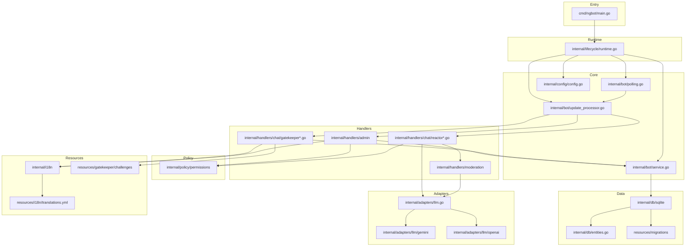
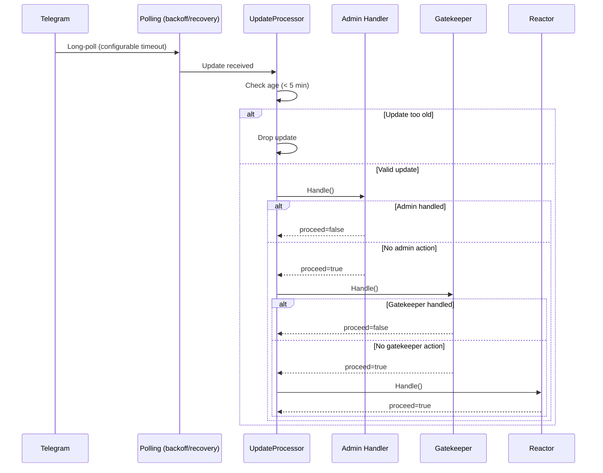
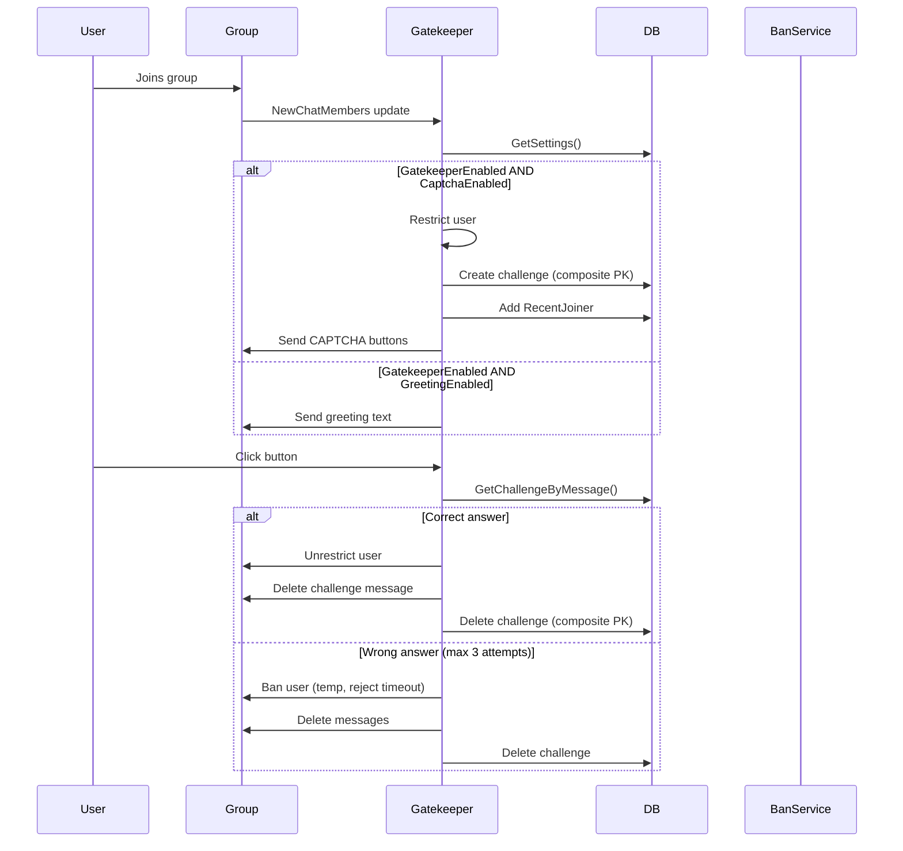
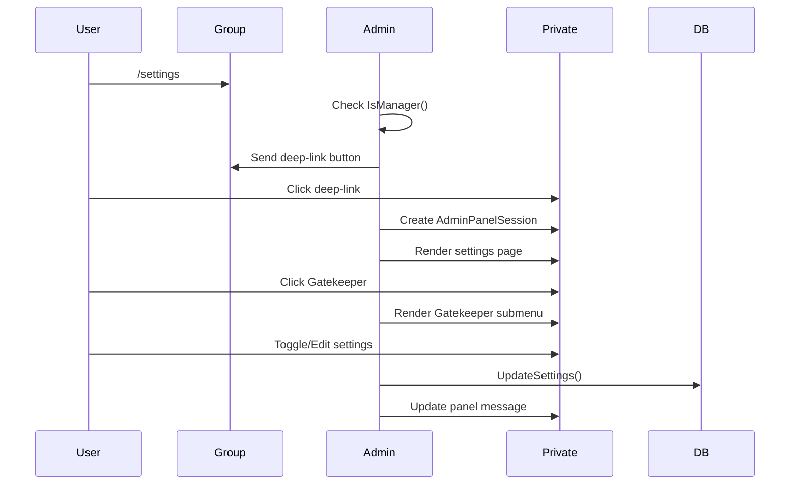
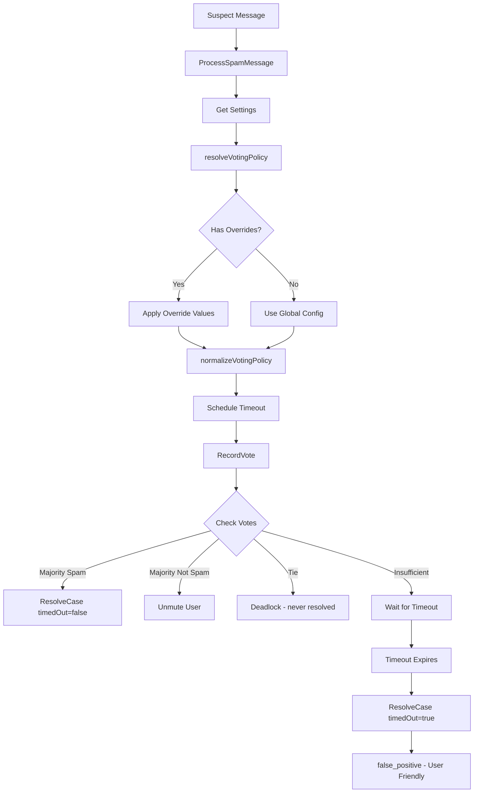

# ngbot Codebase Map

> Auto-generated by Cartographer. Last mapped: 2026-04-15

## System Overview

**ngbot** is a Telegram chat gatekeeper bot that protects groups from spam and automated bot joins. It provides CAPTCHA-based entry verification with configurable options, LLM-powered spam detection, external-quote heuristic fast-path, and community voting moderation.


```mermaid
graph TB
    subgraph Entry
        Main[cmd/ngbot/main.go]
    end

    subgraph Runtime
        Lifecycle[internal/lifecycle/runtime.go]
    end

    subgraph Core
        Service[internal/bot/service.go]
        Processor[internal/bot/update_processor.go]
        Polling[internal/bot/polling.go]
        Config[internal/config/config.go]
    end

    subgraph Handlers
        Admin[internal/handlers/admin]
        Gatekeeper[internal/handlers/chat/gatekeeper*.go]
        Reactor[internal/handlers/chat/reactor*.go]
        Moderation[internal/handlers/moderation]
    end

    subgraph Adapters
        LLM[internal/adapters/llm.go]
        Gemini[internal/adapters/llm/gemini]
        OpenAI[internal/adapters/llm/openai]
    end

    subgraph Data
        SQLite[internal/db/sqlite]
        Entities[internal/db/entities.go]
        Migrations[resources/migrations]
    end

    subgraph Policy
        Permissions[internal/policy/permissions]
    end

    subgraph Resources
        I18N[internal/i18n]
        Translations[resources/i18n/translations.yml]
        Challenges[resources/gatekeeper/challenges]
    end

    Main --> Lifecycle
    Lifecycle --> Service
    Lifecycle --> Processor
    Lifecycle --> Polling
    Lifecycle --> Config

    Polling --> Processor
    Processor --> Admin
    Processor --> Gatekeeper
    Processor --> Reactor

    Admin --> Service
    Gatekeeper --> Service
    Reactor --> Moderation
    Reactor --> LLM

    Moderation --> LLM
    LLM --> Gemini
    LLM --> OpenAI

    Service --> SQLite
    SQLite --> Entities
    SQLite --> Migrations

    Gatekeeper --> I18N
    Admin --> I18N
    I18N --> Translations
    Gatekeeper --> Challenges

    Admin --> Permissions
    Reactor --> Permissions
```

## Directory Structure

```
ngbot/
├── cmd/ngbot/main.go              # Application entry point, runtime wiring
├── internal/
│   ├── bot/                       # Core bot service, polling, and update processing
│   │   ├── service.go             # Membership tracking, settings, caching
│   │   ├── service_test.go        # Service lifecycle tests
│   │   ├── update_processor.go    # Update dispatch, handler registry
│   │   ├── polling.go             # Custom long-polling with exponential backoff (NEW)
│   │   ├── polling_test.go        # Polling recovery/backoff tests (NEW)
│   │   └── dependencies.go        # Interface definitions (Service, Handler)
│   ├── config/                    # Configuration loading (env vars)
│   │   ├── config.go              # NG_* environment variables, Telegram timing config
│   │   ├── config_test.go         # Telegram timing validation tests
│   │   └── log_formatter.go       # Custom logrus formatter
│   ├── db/                        # Database layer (hexagonal)
│   │   ├── dependencies.go        # Client interface (40+ methods)
│   │   ├── entities.go            # Data structures (Settings, Challenge, etc.)
│   │   ├── settings.go            # DefaultSettings(), ErrNotFound
│   │   ├── spam_tracking.go       # SpamReport, UserRestriction
│   │   ├── not_spammer_overrides.go  # Not-spammer override validation/normalization (NEW)
│   │   └── sqlite/                # SQLite implementation
│   │       ├── client.go          # SQLite bootstrap (conn+migrations)
│   │       ├── client_settings_members.go  # Settings & members CRUD
│   │       ├── client_challenges.go        # Gatekeeper challenges (composite PK)
│   │       ├── client_challenges_test.go   # Parallel join request tests
│   │       ├── client_spam.go              # Spam/restrictions/banlist
│   │       ├── client_kv.go                # KV store operations
│   │       ├── client_not_spammer_overrides.go  # Not-spammer override CRUD + lookup (NEW)
│   │       ├── client_not_spammer_overrides_test.go  # Override CRUD + global scope tests (NEW)
│   │       ├── admin_panel.go              # Admin panel sessions
│   │       └── migrations_test.go          # Index verification tests
│   ├── adapters/                  # External service adapters
│   │   ├── llm.go                 # LLM interface
│   │   └── llm/
│   │       ├── entities.go        # Chat completion types
│   │       ├── gemini/            # Google Gemini adapter
│   │       └── openai/            # OpenAI-compatible adapter
│   ├── handlers/                  # Update handlers (chain of responsibility)
│   │   ├── dependencies.go        # Compile-time interface verification
│   │   ├── base/handler.go        # Shared handler utilities, default settings
│   │   ├── admin/                 # Admin commands and panel
│   │   │   ├── admin.go           # Core struct, lifecycle, Handle()
│   │   │   ├── panel_handler.go   # /settings flow, callback routing
│   │   │   ├── panel_access_service.go    # Permission checks
│   │   │   ├── panel_commands.go  # State machine actions (gatekeeper submenu)
│   │   │   ├── panel_constants.go # Pagination, timeouts, captcha options
│   │   │   ├── panel_encoding.go  # ChatID/MessageID encoding
│   │   │   ├── panel_encoding_test.go     # Encoding round-trip tests
│   │   │   ├── panel_lifecycle.go # Session cleanup worker
│   │   │   ├── panel_render.go    # Render orchestration, greeting preview
│   │   │   ├── panel_renderer.go  # UI rendering
│   │   │   ├── panel_session_service.go    # Session persistence
│   │   │   ├── panel_not_spammer_override.go  # Not-spammer override parsing, rehab (NEW)
│   │   │   ├── panel_not_spammer_override_test.go  # Reference parsing tests (NEW)
│   │   │   └── panel_types.go     # Page/action/command types (23 pages, indulgence added)
│   │   ├── chat/                  # Gatekeeper/Reactor use-cases
│   │   │   ├── gatekeeper.go      # Orchestrator, lifecycle
│   │   │   ├── gatekeeper_captcha.go       # Button generation, keyboard layout
│   │   │   ├── gatekeeper_captcha_test.go  # Button generation tests
│   │   │   ├── gatekeeper_challenge_service.go  # Callback handling
│   │   │   ├── gatekeeper_join_processor.go     # Join flow, greeting text
│   │   │   ├── gatekeeper_scheduler.go          # Background workers
│   │   │   ├── gatekeeper_scheduler_test.go     # Scheduler override bypass tests (NEW)
│   │   │   ├── reactor.go         # Orchestrator, pipeline stages
│   │   │   ├── reactor_command_router.go     # /ban, /testspam, /skipreason
│   │   │   ├── reactor_command_router_test.go  # Command targeting tests (NEW)
│   │   │   ├── reactor_message_pipeline.go   # Spam detection pipeline
│   │   │   ├── reactor_message_pipeline_test.go  # External quote + override bypass tests (NEW)
│   │   │   ├── reactor_reaction_moderator.go # Reaction-based moderation
│   │   │   ├── reactor_text_normalizer.go    # Cyrillic homoglyph normalization
│   │   │   └── test_bot_api_test.go          # Shared test BotAPI with httptest.Server (NEW)
│   │   └── moderation/            # Spam detection, ban service
│   │       ├── ban_service.go     # Interface, lifecycle, public API
│   │       ├── ban_service_actions.go     # Restrict/ban/unban actions
│   │       ├── ban_service_fetch.go       # Banlist fetch/retry/cache
│   │       ├── ban_service_test.go        # Concurrent access tests
│   │       ├── spam_control.go    # Voting system, per-chat policy overrides
│   │       ├── spam_control_policy_test.go  # Voting policy tests
│   │       ├── spam_detector.go   # LLM-based detection
│   │       └── spam_detector_test.go   # LLM prompt construction tests
│   ├── lifecycle/                 # Runtime component orchestration
│   │   ├── runtime.go             # Component interface, LIFO stop
│   │   └── runtime_test.go        # Order verification tests
│   ├── policy/                    # Shared policy packages
│   │   └── permissions/           # Manager/moderator role checks
│   │       └── permissions.go     # IsManager, IsPrivilegedModerator
│   ├── i18n/                      # Internationalization
│   │   ├── i18n.go                # Translation loading/lookup
│   │   ├── languages.go           # Language name lookup
│   │   └── translations_consistency_test.go  # AST-based key consistency
│   └── infra/                     # Infrastructure utilities
│       ├── filesystem.go          # Working directory management
│       └── health_check.go        # Executable modification monitor
├── resources/
│   ├── embed.go                   # Go embed directive
│   ├── i18n/translations.yml      # 30 language translations, 102 keys
│   ├── gatekeeper/challenges/     # Per-language emoji challenges (30 files)
│   └── migrations/                # 20 SQL migration files
├── go.mod                         # Dependencies (Go 1.25)
├── Dockerfile                     # Multi-stage build
├── compose.yaml.dist              # Docker Compose config
└── .env.example                   # Configuration template
```

## Module Guide

### Core Bot Module (`internal/bot/`)

**Purpose**: Central bot service, custom polling, and update processing pipeline

| File | Purpose | Key Exports |
|------|---------|-------------|
| `service.go` | Membership/settings management with TTL caching | `NewService()`, `IsMember()`, `GetSettings()`, worker group for background tasks |
| `service_test.go` | Service initialization and lifecycle tests | Integration tests with real SQLite |
| `update_processor.go` | Update dispatch to handlers (chain of responsibility) | `UpdateProcessor`, `RegisterUpdateHandler()`, 19 `MessageType` constants, `StageOverrideCheck` (NEW) |
| `polling.go` | Custom long-polling with exponential backoff and recovery window | `GetUpdatesChans()`, `PollingOptions`, `PollingRecoveryError` |
| `polling_test.go` | Polling recovery, backoff, malformed update tests | Tests for all polling failure modes |
| `dependencies.go` | Interface contracts | `Service`, `Handler`, `Client` interfaces |

**Key Patterns**:
- Two-level caching: members (5-min TTL with lazy eviction), settings (process-lifetime)
- Handler registry with chain of responsibility (`proceed bool` stops chain)
- Update timeout: 5 minutes (stale updates dropped)
- Custom polling replaces library polling: exponential backoff (initial 1s, max 30s), recovery window (default 10m), malformed update filtering
- Worker group (`sync.WaitGroup.Go()`) replaces raw goroutines

**Dependencies**: `telegram-bot-api`, `db`, `config`, `errgroup`

---

### Lifecycle Module (`internal/lifecycle/`)

**Purpose**: Component lifecycle orchestration with ordered start/stop

| File | Purpose | Key Exports |
|------|---------|-------------|
| `runtime.go` | Component orchestration | `Component` interface, `Runtime`, `NewRuntime()` |
| `runtime_test.go` | Order verification tests | LIFO stop order validation |

**Key Patterns**:
- `Component` interface: `Start(ctx) error`, `Stop(ctx) error`
- LIFO stop order (last started = first stopped)
- Rollback on start failure (stops already-started components)
- `errors.Join` collects all stop errors

---

### Handlers Module (`internal/handlers/`)

**Purpose**: Update processing chain with specialized handlers

| Handler | Purpose | Chain Order |
|---------|---------|-------------|
| `Admin` | `/lang`, `/settings`, admin panel with cascading submenus | 1 (stops on match) |
| `Gatekeeper` | CAPTCHA challenges (configurable options) for new members | 2 (stops for callbacks) |
| `Reactor` | Spam detection, message processing, commands | 3 (always runs) |

> **Note**: All handler files share package `handlers` regardless of subdirectory — `admin/`, `chat/`, `moderation/` are organizational only.

#### Admin Handler Files

| File | Purpose |
|------|---------|
| `admin.go` | Core struct, lifecycle, `Handle()` dispatcher |
| `panel_handler.go` | `/settings` flow, deep-linking, callback routing, free-text input |
| `panel_access_service.go` | Permission checks, typing indicator, messaging utilities |
| `panel_commands.go` | State machine actions (gatekeeper, voting overrides, greeting edit) |
| `panel_constants.go` | Pagination, timeouts, captcha options, voting options |
| `panel_encoding.go` | Binary encoding for chat/message IDs in callbacks (base64url) |
| `panel_encoding_test.go` | Encoding round-trip tests including legacy backward compatibility |
| `panel_lifecycle.go` | Background session cleanup worker (5-min interval) |
| `panel_render.go` | Per-page render methods with contextual help descriptions |
| `panel_renderer.go` | Render dispatch, settings hydration, message edit/send fallback |
| `panel_session_service.go` | Session persistence, callback parsing, brute-force split resolution |
| `panel_not_spammer_override.go` | Input parsing (username/ID/URL), rehabilitation side-effects (NEW) |
| `panel_not_spammer_override_test.go` | Reference parsing table-driven tests (NEW) |
| `panel_types.go` | `panelPage` (23 pages), `panelState`, `panelCommand` types |

**Admin Panel Pages** (Cascading Menu Structure):

```
Home
├── LanguageList (paginated, 6/page)
├── Gatekeeper
│   ├── GatekeeperCaptcha
│   │   ├── GatekeeperCaptchaOptions (picker: 3,4,5,6,8,10)
│   │   ├── GatekeeperChallengeTimeout (picker: 30s,1m,2m,3m,5m)
│   │   └── GatekeeperRejectTimeout (picker: 10m)
│   └── GatekeeperGreeting
│       └── GatekeeperGreetingPrompt (free-text input)
├── LLM
│   └── ExamplesList (paginated, 5/page)
│       ├── ExampleDetail → ConfirmDelete
│       └── ExamplePrompt (free-text input)
├── Indulgence (NEW)
│   ├── IndulgenceList (paginated, shows override count badge)
│   │   ├── IndulgenceDetail
│   │   │   └── IndulgenceConfirmDelete
│   │   └── (numbered selection buttons)
│   └── IndulgencePrompt (free-text: username, user ID, or profile URL)
├── Voting
│   ├── VotingTimeout (inherit + 1m..30m)
│   ├── VotingMinVoters (inherit + 1,2,3,5,10)
│   ├── VotingMaxVoters (inherit + 0,5,10,20)
│   └── VotingMinPercent (inherit + 1,3,5,10,20%)
└── ConfirmClose
```

**Admin Panel Session Lifecycle**:
1. User runs `/settings` in group → deep-link button → private chat
2. Session created with JSON state, 1-hour TTL
3. Each callback → `findPanelSessionCommand` (brute-force split resolution) → `applyPanelCommand` → re-render
4. Background goroutine cleans expired sessions every 5 minutes
5. Every render creates O(N) command records, old ones deleted at re-render start

#### Gatekeeper Handler Files

| File | Purpose |
|------|---------|
| `gatekeeper.go` | Orchestrator, lifecycle, `Handle()`, `determineUpdateType` dispatcher |
| `gatekeeper_captcha.go` | CAPTCHA button generation, smart keyboard layout (2 rows for 6+) |
| `gatekeeper_challenge_service.go` | Challenge callback handling, success/fail/cleanup flows |
| `gatekeeper_join_processor.go` | Join/request flow, greeting text with placeholders |
| `gatekeeper_scheduler.go` | Background workers (new joiners check, expired challenges, not-spammer bypass) |
| `gatekeeper_scheduler_test.go` | Scheduler override bypass tests (NEW) |
| `gatekeeper_captcha_test.go` | Button generation and keyboard layout tests |

**Gatekeeper Constants**:
- `captchaSize = 5`, `maxChallengeAttempts = 3`
- Allowed options counts: `{3, 4, 5, 6, 8, 10}`
- Process intervals: new joiners = 1m, expired challenges = 1m
- Greeting placeholders: `{user}`, `{chat_title}`, `{chat_link_titled}`, `{timeout}`

#### Reactor Handler Files

| File | Purpose |
|------|---------|
| `reactor.go` | Orchestrator, pipeline stages, callback/reaction/command dispatch |
| `reactor_command_router.go` | `/testspam`, `/skipreason`, `/ban` with `commandTargetsCurrentBot` |
| `reactor_command_router_test.go` | Command targeting tests (NEW) |
| `reactor_message_pipeline.go` | Spam detection pipeline with external quote heuristic (NEW) |
| `reactor_message_pipeline_test.go` | External quote heuristic tests (NEW) |
| `reactor_reaction_moderator.go` | Reaction-based moderation (5 flagged emojis = auto-ban) |
| `reactor_text_normalizer.go` | Cyrillic homoglyph normalization (100+ confusable chars) |
| `test_bot_api_test.go` | Shared test BotAPI with httptest.Server (NEW) |

**Pipeline Stages** (in order):

```
Message arrives
    │
    ▼
[1] isLinkedChannelAutoForward? → YES → SKIP
    │
    NO
    ▼
[2] IsMember? → YES → SKIP
    │
    NO
    ▼
[3] IsChatNotSpammer? → YES → Insert member, SKIP (NEW)
    │
    NO
    ▼
[4] CheckBan → BANNED → ProcessBannedMessage (no voting)
    │
    NOT BANNED
    ▼
[5] LLMFirstMessageEnabled? → NO → Insert member, SKIP
    │
    YES
    ▼
[6] Extract content → EMPTY → SKIP
    │
    HAS CONTENT
    ▼
[7] detectFirstMessageExternalQuoteHeuristic → TRIGGERED → immediate spam
    │
    NOT TRIGGERED
    ▼
[8] normalizeCyrillics (if cyrillic detected)
    │
    ▼
[9] Load per-chat spam examples (max 20)
    │
    ▼
[10] LLM IsSpam (few-shot: system + ~30 examples + extra + candidate)
    │
    ├── SPAM → processSpam (with voting) or processBanned (without)
    └── NOT SPAM → insertMemberIfPresent
```

#### Moderation Files

| File | Purpose |
|------|---------|
| `ban_service.go` | Interface, lifecycle, known-banned-user management, lols.bot API |
| `ban_service_actions.go` | Mute/Ban/Unmute/Unban actions (all 10-min durations) |
| `ban_service_fetch.go` | External banlist fetch with linear retry (daily + hourly) |
| `ban_service_test.go` | Concurrent map access tests |
| `spam_control.go` | Community voting system, per-chat policy resolution |
| `spam_control_policy_test.go` | Voting policy and resolution tests |
| `spam_detector.go` | LLM-powered classification (Russian system prompt, few-shot) |
| `spam_detector_test.go` | LLM prompt construction tests |

**Community Voting Policy Resolution**:

| Step | Description |
|------|-------------|
| 1. Base policy | From `config.SpamControl` global config |
| 2. Per-chat overrides | From `db.Settings` (if not `SettingsOverrideInherit` = -1) |
| 3. Normalization | Timeout min 5m, MinVoters min 1, MaxVoters min 0, MinVoters% min 0 |
| 4. Required voters | `max(MinVoters, len(members) * MinVoters% / 100)`, capped by MaxVoters |

**Voting Resolution Logic**:

| Scenario | Result |
|----------|--------|
| Spam majority | `spam` status → user banned |
| Not-spam majority | `false_positive` status → user unmuted |
| Tie vote (even on timeout) | **Never resolved** — user remains muted |
| Insufficient votes + timeout | `false_positive` status (user-friendly) |

---

### Database Module (`internal/db/`)

**Purpose**: SQLite persistence with repository pattern

| File | Purpose |
|------|---------|
| `dependencies.go` | `Client` interface (40+ methods) |
| `entities.go` | Data structures with `db` tags |
| `settings.go` | `DefaultSettings()`, `ErrNotFound`, `SettingsOverrideInherit` |
| `spam_tracking.go` | `SpamReport`, `UserRestriction` |
| `sqlite/client.go` | SQLite bootstrap, pool (42 max conns), embedded migrations |
| `sqlite/client_settings_members.go` | Settings & members CRUD (upsert pattern) |
| `sqlite/client_challenges.go` | Challenge CRUD (composite PK: comm_chat_id, user_id, chat_id) |
| `sqlite/client_challenges_test.go` | Parallel join request tests |
| `sqlite/client_spam.go` | Spam/restrictions/banlist CRUD |
| `sqlite/client_kv.go` | KV store operations |
| `sqlite/client_not_spammer_overrides.go` | Not-spammer override CRUD + scoped/global lookup (NEW) |
| `sqlite/client_not_spammer_overrides_test.go` | Override CRUD + global scope tests (NEW) |
| `sqlite/admin_panel.go` | Admin sessions, spam examples |

**Key Entities**:

| Entity | Purpose | Primary Key |
|--------|---------|-------------|
| `Settings` | Per-chat configuration | `id` (chat ID) |
| `Challenge` | CAPTCHA state | `(comm_chat_id, user_id, chat_id)` composite |
| `SpamCase` | Spam report with voting | auto-increment `id` |
| `AdminPanelSession` | Admin UI state | auto-increment `id` |
| `ChatSpamExample` | Per-chat spam examples for LLM | auto-increment `id` |
| `ChatNotSpammerOverride` | Manual not-spammer override (user_id or username) | auto-increment `id` |

**Settings Entity - Gatekeeper Fields**:

| Field | Type | Default | Description |
|-------|------|---------|-------------|
| `GatekeeperEnabled` | bool | false | Master switch |
| `GatekeeperCaptchaEnabled` | bool | false | CAPTCHA sub-feature |
| `GatekeeperGreetingEnabled` | bool | false | Greeting sub-feature |
| `GatekeeperCaptchaOptionsCount` | int | 5 | Options count (3,4,5,6,8,10) |
| `GatekeeperGreetingText` | string | "" | Custom greeting text |

**Settings Entity - Community Voting Override Fields**:

| Field | Type | Default | Description |
|-------|------|---------|-------------|
| `CommunityVotingTimeoutOverrideNS` | int64 | -1 | Voting timeout override (nanoseconds) |
| `CommunityVotingMinVotersOverride` | int | -1 | Minimum voters override |
| `CommunityVotingMaxVotersOverride` | int | -1 | Maximum voters override |
| `CommunityVotingMinVotersPercentOverride` | int | -1 | Minimum voters percentage override |

> **Note**: Value `-1` (`SettingsOverrideInherit`) means "use global config". `Settings.Enabled` is always forced to equal `GatekeeperEnabled` on save.

**Not-Spammer Override Entity**:

| Field | Type | Description |
|-------|------|-------------|
| `ID` | int64 | Auto-increment PK |
| `ChatID` | int64 | Chat scope (`0` = global, rejected by public API) |
| `MatchType` | string | `"user_id"` or `"username"` |
| `MatchValue` | string | Normalized: lowercase username (no `@`) or positive int64 string |
| `CreatedByUserID` | int64 | Admin who created the override |
| `CreatedAt` | time.Time | Creation timestamp |

**Two-Tier Scoping**: Chat-scoped overrides (`chat_id = <specific>`) take priority over global overrides (`chat_id IS NULL` or `0`). Global overrides can only be inserted directly into DB. Lookup query `IsChatNotSpammer` checks both scopes with `ORDER BY` prioritizing chat-scoped.

**Normalization Functions** (`not_spammer_overrides.go`):
- `NormalizeChatNotSpammerMatch(matchType, matchValue)` — validates and canonicalizes
- `NormalizeChatNotSpammerUsername(username)` — trims, strips `@`, lowercases

**Admin Panel Input Parsing** (`panel_not_spammer_override.go`):
- Accepts: bare `@username`, numeric ID, `t.me/user`, `tg://resolve?domain=user`, `tg://user?id=123456`
- Rejects: empty, private channel links (`t.me/c/...`), invalid formats
- Side effect: `rehabilitateNotSpammerUser` resolves active spam case + unmutes + unbans (fire-and-forget)

**Database Schema** (20 migrations):

| Table | PK | Key Relationships |
|-------|-----|-------------------|
| `chats` | `id` (chat ID) | Parent of most tables |
| `chat_members` | `(chat_id, user_id)` | FK → chats CASCADE |
| `gatekeeper_challenges` | `(comm_chat_id, user_id, chat_id)` | Indexes: `expires_at`, `(comm_chat_id, user_id, challenge_message_id)` |
| `spam_cases` | auto `id` | Indexes: `(chat_id, user_id)`, `(status)` |
| `spam_votes` | `(case_id, voter_id)` | FK → spam_cases CASCADE |
| `user_restrictions` | `(chat_id, user_id)` | — |
| `recent_joiners` | auto `id` | Unique: `(chat_id, user_id)` |
| `banlist` | `user_id` | — |
| `kv_store` | `key` | Index: `updated_at` |
| `chat_managers` | `(chat_id, user_id)` | FK → chats CASCADE |
| `chat_bot_membership` | `chat_id` | FK → chats CASCADE |
| `admin_panel_sessions` | auto `id` | FK → chats CASCADE |
| `admin_panel_commands` | auto `id` | FK → admin_panel_sessions CASCADE |
| `chat_spam_examples` | auto `id` | FK → chats CASCADE |
| `chat_not_spammer_overrides` | auto `id` | Unique: `(match_type, match_value, normalized_scope)`, Index: `(match_type, match_value, normalized_scope, id DESC)` |

**Gotchas**:
- `db.ErrNotFound` used for missing settings, but `(nil, nil)` for challenges/admin panel, `("", nil)` for KV — inconsistent not-found signaling
- `SpamVote.Vote` is inverted: `true` = NOT spam, `false` = IS spam
- Connection pool: 42 max open connections
- Pure-Go SQLite driver (`modernc.org/sqlite`)
- `sync.RWMutex` protects all operations (application-level, not WAL-only)
- Receiver naming inconsistency: `c *sqliteClient` in most files, `s *sqliteClient` in `client_kv.go` and `client_spam.go`

---

### LLM Adapters (`internal/adapters/llm/`)

**Purpose**: Abstraction over OpenAI and Google Gemini APIs

```go
type LLM interface {
    ChatCompletion(ctx, messages) (Response, error)
}
```

| Adapter | Default Model | Notes |
|---------|---------------|-------|
| `gemini.API` | `gemini-2.5-flash-lite` | Uses `google.golang.org/genai`, `BLOCK_NONE` safety |
| `openai.API` | `gpt-4o-mini` | Supports custom base URL for any OpenAI-compatible API |

**Shared Config**: Temperature 0.9, TopP 0.9, MaxTokens 8192 (both adapters)

**Gotchas**:
- Gemini: roles mapped (`assistant` → `model`), system messages extracted as `SystemInstruction`
- Gemini: all four safety categories set to `BlockNone`
- OpenAI: system messages reordered to front of slice
- Both adapters discard the `logger` parameter (`_ = logger`)

---

### Policy Module (`internal/policy/permissions/`)

**Purpose**: Permission checking utilities

| Function | Description |
|----------|-------------|
| `IsManager(member)` | Creator OR admin with `CanManageChat` OR `CanPromoteMembers` |
| `IsPrivilegedModerator(member)` | Manager OR admin with `CanRestrictMembers` |

**Hierarchy**: Managers > Privileged Moderators > Regular Admins > Users

---

### i18n Module (`internal/i18n/`)

**Purpose**: Multi-language support for bot messages

| File | Purpose |
|------|---------|
| `i18n.go` | Translation loading/lookup (keys ARE the English text) |
| `languages.go` | ISO code to name mapping |
| `translations_consistency_test.go` | AST-based key consistency verification (102 keys) |

**Supported Languages** (30 total): be, bg, cs, da, de, el, en, es, et, fi, fr, hu, id, it, ja, ko, lt, lv, nb, nl, pl, pt, ro, ru, sk, sl, sv, tr, uk, zh

**Fallback**: exact match → return key (which is English text)

---

### Infra Module (`internal/infra/`)

**Purpose**: Infrastructure utilities

| File | Purpose |
|------|---------|
| `filesystem.go` | Working directory management (`EnsureDir`, `GetResourcesPath`) |
| `health_check.go` | Binary hot-reload detection (polls mtime every 5s, single-shot channel) |

---

## Data Flow

### Telegram Update Processing


```mermaid
sequenceDiagram
    participant TG as Telegram
    participant Poll as Polling (backoff/recovery)
    participant UP as UpdateProcessor
    participant Admin as Admin Handler
    participant GK as Gatekeeper
    participant Reactor as Reactor

    TG->>Poll: Long-poll (configurable timeout)
    Poll->>UP: Update received
    UP->>UP: Check age (< 5 min)

    alt Update too old
        UP->>UP: Drop update
    else Valid update
        UP->>Admin: Handle()

        alt Admin handled
            Admin-->>UP: proceed=false
        else No admin action
            Admin-->>UP: proceed=true
            UP->>GK: Handle()

            alt Gatekeeper handled
                GK-->>UP: proceed=false
            else No gatekeeper action
                GK-->>UP: proceed=true
                UP->>Reactor: Handle()
                Reactor-->>UP: proceed=true
            end
        end
    end
```

### Gatekeeper Challenge Flow


```mermaid
sequenceDiagram
    participant User
    participant Group
    participant Gatekeeper
    participant DB
    participant BanService

    User->>Group: Joins group
    Group->>Gatekeeper: NewChatMembers update
    Gatekeeper->>DB: GetSettings()

    alt GatekeeperEnabled AND CaptchaEnabled
        Gatekeeper->>Gatekeeper: Restrict user
        Gatekeeper->>DB: Create challenge (composite PK)
        Gatekeeper->>DB: Add RecentJoiner
        Gatekeeper->>Group: Send CAPTCHA buttons
    else GatekeeperEnabled AND GreetingEnabled
        Gatekeeper->>Group: Send greeting text
    end

    User->>Gatekeeper: Click button
    Gatekeeper->>DB: GetChallengeByMessage()

    alt Correct answer
        Gatekeeper->>Group: Unrestrict user
        Gatekeeper->>Group: Delete challenge message
        Gatekeeper->>DB: Delete challenge (composite PK)
    else Wrong answer (max 3 attempts)
        Gatekeeper->>Group: Ban user (temp, reject timeout)
        Gatekeeper->>Group: Delete messages
        Gatekeeper->>DB: Delete challenge
    end
```

### Spam Detection Flow

```mermaid
sequenceDiagram
    participant User
    participant Reactor
    participant LLM
    participant SpamControl
    participant DB

    User->>Reactor: Send message
    Reactor->>Reactor: isLinkedChannelAutoForward?
    Reactor->>DB: Check membership

    alt Not a member
        Reactor->>DB: IsChatNotSpammer? (NEW)

        alt Override active
            Reactor->>DB: InsertMember()
        else No override
            Reactor->>Reactor: detectExternalQuoteHeuristic

        alt Heuristic triggered
            Reactor->>SpamControl: ProcessSpamMessage()
        else Heuristic not triggered
            Reactor->>Reactor: Normalize text (Cyrillic)
            Reactor->>DB: Get spam examples (max 20)
            Reactor->>LLM: IsSpam(content, examples)

            alt LLM says spam
                Reactor->>SpamControl: ProcessSpamMessage()
            else Not spam
                Reactor->>DB: InsertMember()
            end
        end
    end
```

### Admin Panel Flow


```mermaid
sequenceDiagram
    participant User
    participant Group
    participant Admin
    participant Private
    participant DB

    User->>Group: /settings
    Admin->>Admin: Check IsManager()
    Admin->>Group: Send deep-link button
    User->>Private: Click deep-link
    Admin->>Private: Create AdminPanelSession
    Admin->>Private: Render settings page

    User->>Private: Click Gatekeeper
    Admin->>Private: Render Gatekeeper submenu

    User->>Private: Toggle/Edit settings
    Admin->>DB: UpdateSettings()
    Admin->>Private: Update panel message
```

### Community Voting Resolution Flow


```mermaid
flowchart TD
    A[Suspect Message] --> B[ProcessSpamMessage]
    B --> C[Get Settings]
    C --> D[resolveVotingPolicy]
    D --> E{Has Overrides?}
    E -->|Yes| F[Apply Override Values]
    E -->|No| G[Use Global Config]
    F --> H[normalizeVotingPolicy]
    G --> H
    H --> I[Schedule Timeout]
    I --> J[RecordVote]
    J --> K{Check Votes}
    K -->|Majority Spam| L[ResolveCase timedOut=false]
    K -->|Majority Not Spam| M[Unmute User]
    K -->|Tie| N[Deadlock - never resolved]
    K -->|Insufficient| O[Wait for Timeout]
    O --> P[Timeout Expires]
    P --> Q[ResolveCase timedOut=true]
    Q --> R[false_positive - User Friendly]
```

## Configuration

### Environment Variables (NG_* prefix)

| Variable | Default | Description |
|----------|---------|-------------|
| `NG_TOKEN` | *required* | Telegram bot token |
| `NG_LANG` | `en` | Default language |
| `NG_HANDLERS` | `admin,gatekeeper,reactor` | Enabled handlers |
| `NG_LOG_LEVEL` | `2` | Log verbosity (0-6) |
| `NG_DOT_PATH` | `~/.ngbot` | Data directory |
| `NG_TELEGRAM_POLL_TIMEOUT` | `30s` | Long-poll timeout |
| `NG_TELEGRAM_REQUEST_TIMEOUT` | `35s` | HTTP client timeout (must be > poll timeout) |
| `NG_TELEGRAM_RECOVERY_WINDOW` | `10m` | Polling recovery window (must be > request timeout) |
| `NG_LLM_API_KEY` | *required* | LLM API key |
| `NG_LLM_API_MODEL` | `gpt-4o-mini` | Model name |
| `NG_LLM_API_URL` | `https://api.openai.com/v1` | OpenAI-compatible endpoint |
| `NG_LLM_API_TYPE` | `openai` | Provider (openai/gemini) |
| `NG_FLAGGED_EMOJIS` | `👎,💩` | Reaction ban triggers |
| `NG_SPAM_MIN_VOTERS` | `2` | Min votes for action |
| `NG_SPAM_MAX_VOTERS` | `10` | Max voters |
| `NG_SPAM_MIN_VOTERS_PERCENTAGE` | `5` | Vote threshold % |
| `NG_SPAM_VOTING_TIMEOUT` | `5m` | Voting window |

### Config Validation Rules

| Constraint | Reason |
|------------|--------|
| `PollTimeout > 0` | Long-poll must wait for updates |
| `RequestTimeout > PollTimeout` | HTTP timeout must exceed poll wait |
| `RecoveryWindow > RequestTimeout` | Recovery must span multiple retry cycles |

## Conventions

### Go Code Style
- Go 1.25+ with modern tooling
- Self-documenting code (minimal comments)
- `gofumpt` formatting
- `any` instead of `interface{}`
- Context as first parameter
- `tool` directive in `go.mod` for dev tools

### Architecture
- Hexagonal/DDD structure
- Interface-based dependency injection
- Consumer-local storage ports (`adminStore`, `gatekeeperStore`, `reactorStore`, `spamStore`, `banStore`)
- Repository pattern for database
- Handler chain of responsibility
- Component lifecycle (`lifecycle.Component`)

### Database
- SQLite with embedded migrations
- `db:` struct tags for sqlx
- `sync.RWMutex` for thread safety
- Composite primary keys for parallel operations
- Upsert pattern (`ON CONFLICT ... DO UPDATE`)

### Testing
- Table-driven tests beside code (`*_test.go`)
- Stub/mock interfaces for isolation
- `t.Parallel()` for concurrent execution
- AST parsing for static analysis (i18n consistency)
- Integration tests with real SQLite (`t.TempDir()`)

## Gotchas

| # | Issue | Details |
|---|-------|---------|
| 1 | Handler chain order matters | Admin → Gatekeeper → Reactor |
| 2 | SpamVote.Vote is inverted | `true` = NOT spam, `false` = IS spam |
| 3 | Tie votes are permanent deadlocks | Never resolved even on timeout — user stays muted |
| 4 | Update timeout is 5 minutes | Old updates silently dropped |
| 5 | Cyrillic normalization is lossy | LLM sees normalized text, not original |
| 6 | External banlist | Uses lols.bot API with retry/timeout |
| 7 | Gatekeeper fallback | `lang → en → built-in defaults` |
| 8 | Admin panel session TTL | 1 hour, background cleanup every 5 min |
| 9 | CAPTCHA max attempts | 3 wrong answers = temp ban |
| 10 | Reaction threshold | 5 flagged emojis = auto-ban (hardcoded) |
| 11 | Polling recovery window | Default 10m; exceeded → `PollingRecoveryError` → shutdown |
| 12 | Malformed update filtering | `isStructurallyEmptyUpdate` must stay in sync with `api.Update` struct |
| 13 | Polling error channel | Buffer size 1; second error silently dropped |
| 14 | Command targeting | `commandTargetsCurrentBot` rejects `/ban@otherbot`; empty bot username rejects all named commands |
| 15 | External quote heuristic | Bypasses LLM entirely — treated as spam immediately |
| 16 | Auto-forward detection | `IsAutomaticForward + IsChannel` → skips entire spam pipeline |
| 17 | Ban durations are temporary | All bans/mutes = 10 minutes |
| 18 | `knownBanned` map replaced | Each daily/hourly fetch replaces the entire map |
| 19 | Not-found inconsistency | `ErrNotFound` for settings, `(nil,nil)` for challenges/admin, `("",nil)` for KV |
| 20 | `Settings.Enabled` coupling | Always forced to equal `GatekeeperEnabled` on save |
| 21 | `lastResults` LRU | Capped at 1000 entries, keyed by message ID (scoped per-chat by Telegram) |
| 22 | Worker group pattern | Uses `wg.Go()` (custom WaitGroup extension), not standard `wg.Add(1)` + `go` |
| 23 | Log formatter depth | `runtime.Caller(6)` assumes specific logrus call stack |
| 24 | i18n key design | Keys ARE English text (not symbolic identifiers) |
| 25 | Callback data size limit | 64 bytes; `encodeUint64Min` strips leading zero bytes |
| 26 | Not-spammer override scoping | Global overrides (`chat_id IS NULL` or `0`) can only be inserted directly into DB, not via admin panel |
| 27 | Not-spammer rehabilitation | `rehabilitateNotSpammerUser` silently swallows all errors (fire-and-forget) |
| 28 | Not-spammer bypasses ban check | Override checked *before* ban check — overridden users skip ban DB lookup entirely |
| 29 | Override idempotency | Creating same override twice returns existing row (no error, no duplicate) |
| 30 | Negative chat IDs | Telegram supergroup/channel IDs are negative; override system explicitly supports them |
| 31 | i18n key count updated | 102 top-level keys (was 94); consistency test checks 44 admin panel keys (was ~36) |

## Navigation Guide

### To add a new handler
1. Create package in `internal/handlers/<name>/`
2. Implement `bot.Handler` interface
3. Add compile-time check in `internal/handlers/dependencies.go`
4. Register in `cmd/ngbot/main.go`: `bot.RegisterUpdateHandler("name", handler)`
5. Add to `NG_HANDLERS` env var

### To add a new LLM provider
1. Create package in `internal/adapters/llm/<provider>/`
2. Implement `adapters.LLM` interface
3. Add factory case in `cmd/ngbot/main.go`
4. Add `NG_LLM_API_TYPE` option

### To add new translations
1. Add entries to `resources/i18n/translations.yml`
2. Add challenge file in `resources/gatekeeper/challenges/<lang>.yml`
3. Add language name in `internal/i18n/languages.go`
4. Run tests: `go test ./internal/i18n/...` (consistency check)

### To modify spam detection
1. **Heuristics**: Add fast-path checks in `reactor_message_pipeline.go` (before LLM)
2. **LLM prompt**: Edit few-shot examples in `spam_detector.go`
3. **Pipeline stages**: Modify `reactor_message_pipeline.go` stage constants
4. **Voting**: Adjust `spam_control.go` policy resolution

### To add database tables
1. Create migration in `resources/migrations/YYYYMMDDHHMMSS-description.sql`
2. Add entity to `internal/db/entities.go`
3. Add methods to `internal/db/dependencies.go` interface
4. Implement in appropriate `internal/db/sqlite/client_*.go`
5. Add tests in `internal/db/sqlite/*_test.go`

### To modify gatekeeper settings
1. **UI**: `panel_render.go` (Gatekeeper submenu)
2. **Commands**: `panel_commands.go` (toggle/set actions)
3. **Types**: `panel_types.go` (pages, actions, state)
4. **Defaults**: `base/handler.go` (DefaultSettings)
5. **Logic**: `gatekeeper*.go` (CAPTCHA, greeting)

### To modify community voting settings
1. **UI**: `panel_render.go` (Voting submenu pages)
2. **Commands**: `panel_commands.go` (`setVotingTimeoutOverride`, etc.)
3. **Types**: `panel_types.go` (voting pages, actions)
4. **Constants**: `panel_constants.go` (voting options)
5. **Policy resolution**: `spam_control.go` (`resolveVotingPolicy`, `normalizeVotingPolicy`)
6. **Database**: `entities.go` (override fields), `client_settings_members.go`

### To modify polling behavior
1. **Config**: `config.go` (`Telegram` struct, validation)
2. **Polling**: `polling.go` (backoff, recovery, malformed filtering)
3. **Tests**: `polling_test.go` (all failure modes)
4. **Wiring**: `main.go` (`newUpdateLoopComponent`, `PollingOptions`)

### To modify not-spammer overrides
1. **UI**: `panel_render.go` (Indulgence submenu pages), `panel_renderer.go` (home button with count badge)
2. **Commands**: `panel_commands.go` (CRUD actions: add, select, delete, pagination)
3. **Types**: `panel_types.go` (4 new pages, 8 new actions, `SelectedIndulgenceID` state)
4. **Parsing**: `panel_not_spammer_override.go` (input normalization, `rehabilitateNotSpammerUser`)
5. **Pipeline**: `reactor_message_pipeline.go` (`StageOverrideCheck`), `gatekeeper_join_processor.go`, `gatekeeper_scheduler.go`
6. **DB**: `not_spammer_overrides.go` (validation), `client_not_spammer_overrides.go` (CRUD + `IsChatNotSpammer` lookup)
7. **Migration**: `resources/migrations/20260415000000-add-chat-not-spammer-overrides.sql`
8. **i18n**: `translations.yml` (8 new keys: Indulgence, Add/Delete/Help texts)

## Dependencies

| Package | Version | Purpose |
|---------|---------|---------|
| `github.com/OvyFlash/telegram-bot-api` | v0.0.0-20260320 | Telegram Bot API (fork) |
| `github.com/sashabaranov/go-openai` | v1.41.2 | OpenAI client |
| `google.golang.org/genai` | v1.51.0 | Gemini client |
| `modernc.org/sqlite` | v1.47.0 | Pure-Go SQLite |
| `github.com/jmoiron/sqlx` | v1.4.0 | SQL extensions |
| `github.com/rubenv/sql-migrate` | v1.8.1 | Migrations |
| `github.com/sirupsen/logrus` | v1.9.4 | Logging |
| `github.com/sethvargo/go-envconfig` | v1.3.0 | Env config |
| `github.com/iamwavecut/tool` | v1.4.1 | Internal utilities (WaitGroup.Go, In, Strtr, Ptr) |
| `gopkg.in/yaml.v2` | v2.4.0 | YAML parsing |
| `github.com/pborman/uuid` | v1.2.1 | UUID generation |
| `golang.org/x/sync` | v0.20.0 | Errgroup for concurrent tasks |
| `github.com/mitchellh/go-homedir` | v1.1.0 | Home directory resolution |
| `github.com/pkg/errors` | v0.9.1 | Error wrapping |

## Recent Changes (since 2026-02-19)

### Manual Not-Spammer Override ("Indulgence") (NEW)
- **Files**: `not_spammer_overrides.go`, `client_not_spammer_overrides.go`, `panel_not_spammer_override.go`, migration
- **Purpose**: Allow admins to mark users as trusted (not-spammer) via admin panel, bypassing all spam checks
- **Features**:
  - Admin panel "Indulgence" submenu with CRUD (add by username, user ID, or profile URL)
  - Two-tier scoping: chat-specific overrides override global overrides
  - Automatic rehabilitation: resolves active spam cases, unmutes and unbans the user
  - Three checkpoint locations: join-time (sync), scheduler (async), message pipeline (sync)
  - Idempotent upsert: duplicate creates return existing row
  - Input parsing supports `@username`, numeric ID, `t.me/`, `tg://` URL formats
- **DB**: New `chat_not_spammer_overrides` table with normalized scope uniqueness index
- **Pipeline**: New `StageOverrideCheck` inserted between membership check and ban check

### Custom Polling with Recovery
- **File**: `internal/bot/polling.go`, `polling_test.go`
- **Purpose**: Replaces library polling with custom long-polling
- **Features**: Exponential backoff (1s initial, 30s max), recovery window (10m default), malformed update filtering
- **Error type**: `PollingRecoveryError` with `Cause` and `SinceLastHealthy`
- **Config**: Three new env vars (`NG_TELEGRAM_POLL_TIMEOUT`, `NG_TELEGRAM_REQUEST_TIMEOUT`, `NG_TELEGRAM_RECOVERY_WINDOW`)

### First-Message External Quote Heuristic
- **File**: `reactor_message_pipeline.go`, `reactor_message_pipeline_test.go`
- **Purpose**: Fast-path spam detection without LLM call
- **Trigger**: First message with `ExternalReply` from a different chat
- **Bypasses**: LLM entirely, immediately treated as spam
- **Diagnostic struct**: `firstMessageExternalQuoteHeuristic` with `HasExternalReply`, `HasQuote`, `OriginType`, etc.

### Command Targeting
- **File**: `reactor_command_router.go`, `reactor_command_router_test.go`
- **Function**: `commandTargetsCurrentBot(msg, botUserName) bool`
- **Behavior**: Ignores `/ban@otherbot`, accepts `/ban` and `/ban@thisbot`
- **Edge case**: Empty `botUserName` rejects all named commands

### Auto-Forward Detection
- **File**: `reactor_message_pipeline.go`
- **Function**: `isLinkedChannelAutoForward(msg) bool`
- **Trigger**: `msg.IsAutomaticForward && msg.SenderChat.IsChannel()`
- **Effect**: Skips entire spam pipeline for linked channel forwards

### Worker Management Refactor
- **Change**: Raw goroutines replaced with `wg.Go()` (custom WaitGroup extension)
- **Affected**: `service.go`, `gatekeeper_scheduler.go`, `panel_lifecycle.go`, `spam_control.go`

### Admin Panel Help Descriptions
- **Change**: Contextual help added to every panel page
- **Format**: "What this is / Where used / Value meaning"
- **File**: `panel_render.go` (`panelHelpBlock` / `appendPanelHelp`)

### Group Admin Command Management
- **Change**: Deletes all bot commands globally before setting group-admin-scoped commands
- **File**: `cmd/ngbot/main.go` (`announceGroupAdminCommands`)
