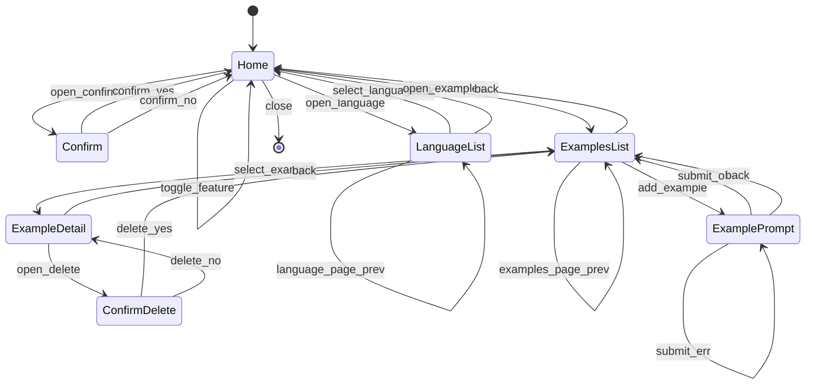

# Bot Settings Panel Spec (Telegram Keyboards)

This document specifies the admin panel UX and behavior for per-chat feature toggles using Telegram Bot API keyboards.

## Goals

- Provide a settings panel for chat managers.
- Allow per-chat feature toggles:
  - Gatekeeper challenge
  - LLM first-message spam check
  - Community voting on spam cases
- Manage custom spam examples for the LLM checker.
- Use Telegram inline keyboards, deep links, and message edits.
- Keep UX consistent and responsive via a simple state machine and a single renderer.
- No metrics or tracing; logs only.

## Bot API References (Telegram)

- InlineKeyboardMarkup / InlineKeyboardButton (callback_data limit 1-64 bytes)
- ReplyKeyboardMarkup (not used for admin panel)
- answerCallbackQuery (acknowledge button presses)
- editMessageText / editMessageReplyMarkup (in-place UI updates)
- deleteMessage (cleanup and timeout handling)
- sendChatAction (typing)
- getChatMember / getChatAdministrators (manager checks)
- my_chat_member updates (bot membership tracking)

## Definitions

- Manager: user who is one of:
  - chat creator, or
  - administrator with `can_manage_chat = true`, or
  - administrator with `can_promote_members = true`.
- Privileged moderator:
  - Manager, or
  - administrator with `can_restrict_members = true`.
- Spam example: a custom text sample stored per chat and used by the LLM checker.
- Settings panel: UI shown in private chat via inline keyboards.
- Feature flags:
  - gatekeeper_enabled
  - llm_first_message_enabled
  - community_voting_enabled

## Entry Points

### Group Chat Command

- Command: `/settings@<bot_username>`
- Preconditions:
  - Message is in group or supergroup.
  - Sender is a user (not anonymous/sender_chat).
- On success:
  - Send typing action every 7 seconds while checks are running.
  - Validate sender is a Manager.
  - Send a placeholder message (translated).
  - Persist manager record in DB.
  - Persist bot membership record for this chat.
  - Edit the placeholder into the final message with two buttons:
    - Open private settings URL: `https://t.me/<bot_username>?start=settings_<encoded_chat_id>`
    - Delete button with "❌" label, which deletes:
      - the bot message with the link, and
      - the original command message.
    - Callback payload includes the encoded command message id.
- On failure:
  - If sender is not a Manager or is anonymous:
    - Delete the command message.
    - Delete the placeholder if present.
    - No response.
  - If chat type is not group/supergroup:
    - Ignore.
  - If `chat_bot_membership.is_member = false` for this chat:
    - Ignore.
  - If bot cannot send or delete messages in the group:
    - Mark `chat_bot_membership.is_member = false` and stop.

### Private Chat Start

- Command: `/start settings_<encoded_chat_id>`
- Preconditions:
  - User is a Manager for the target chat.
  - Bot is still present in that chat.
- On success:
  - Send a placeholder message (translated).
  - Send typing action every 7 seconds while checks are running.
  - Render Settings Home by editing the placeholder.
- On failure:
  - Show "No access".

### Private Chat /settings (not used)

- Not supported; only deep-link entry from group.

## Deep Link Payload

- Format: `settings_<encoded_chat_id>`
- Must fit in 64 bytes.

## Chat ID Encoding (Base64 URL)

- Use base64 URL encoding (no padding) of 8-byte big-endian absolute chat ID.
- Keep sign separately:
  - If chat_id is negative, prefix `~` to the encoded string.
  - If positive, no prefix.
- Length:
  - Encoded 8 bytes -> 11 chars.
  - Optional sign -> 12 chars max.

Example:

- chat_id = 123 -> `/start settings_AAAAAAAAHs` (example)
- chat_id = -100123 -> `/start settings_~AAAAAAGGk-s` (example)

## State Machine (UI)



## UI Pages

### Home

- Title: "Settings"
- Body: chat name and chat id.
- Buttons:
  - "Language: <name> (<code>)"
  - "Gatekeeper: <status_emoji>"
  - "LLM First Message: <status_emoji>"
  - "Community Voting: <status_emoji>"
  - "Spam Examples"
  - "❌"

### Confirm (optional)

- Title: "Confirm change"
- Body: feature and target state.
- Buttons: "Confirm", "Cancel".

### Language List

- Title: "Language"
- Body: paged list of languages (name + code from language catalog).
- Current language is marked with a checkbox emoji.
- Page size: 5 (configurable, keyboard-safe).
- Buttons:
  - Language buttons in 2 columns, labeled "<name> (<code>)".
  - Navigation row: "⬅️" / "↩️" / "➡️" (disabled when not applicable).
- Selecting a language updates chats.language and returns to Home.

### Examples List

- Title: "Spam Examples"
- Body: paged list of examples (one per line with short index and preview).
  - Preview is a single line: replace newlines with spaces, trim, truncate to 80 chars, add "..." when truncated.
- Page size: 5 (configurable, keyboard-safe).
- Buttons:
  - "Add Example"
  - Example buttons in 2 columns, labeled by index (1-5)
  - Navigation row: "⬅️" / "↩️" / "➡️" (disabled when not applicable)

### Example Detail

- Title: "Spam Example"
- Body: full example text.
- Buttons:
  - "Delete"
  - "↩️"

### Example Prompt (input)

- Title: "Add Spam Example"
- Body: instructions and validation errors (if any).
- Buttons:
  - "↩️"

### ConfirmDelete

- Title: "Delete example?"
- Body: short preview.
- Buttons: "Delete", "↩️".

## Rendering Model (Redux-like)

### State

```
UIState {
  session_id: uint64
  page: Home | Confirm | LanguageList | ExamplesList | ExampleDetail | ExamplePrompt | ConfirmDelete
  chat_id: int64
  user_id: int64
  features: FeatureFlags
  language: string
  pending_action: Action?
  language_page: int
  list_page: int
  selected_example_id: int64
  prompt_error: string?
}
```

### Actions

```
Action {
  type: open_settings | toggle_feature | open_confirm | confirm_yes | confirm_no | close |
        open_language | language_page_next | language_page_prev | select_language |
        open_examples | examples_page_next | examples_page_prev | add_example | submit_example |
        select_example | delete_example | open_delete | delete_yes | delete_no
  chat_id: int64
  feature: gatekeeper | llm_first_message | community_voting
  language: string
  example_id: int64
}
```

### Reducer

- Input: (state, action) -> new state
- Effects (side effects) run after reducer:
  - Persist feature flags
  - Persist language
  - Persist UI state
  - Insert/delete chat_spam_examples
  - Load paged language list
  - Load paged examples list
  - Edit message
  - answerCallbackQuery

### Renderer

Single `Render(state) -> (text, inline_keyboard)` used by:

- `/start` handler
- callback query handler

Renderer must also:

- Create or refresh admin_panel_commands rows for each button.
- Use short command_id values in callback_data.
- Remove stale commands for the session before inserting new ones.
- Use translator for all text and button labels.

## Prompt Input Handling

- When page is ExamplePrompt, the next text message from the same user is treated as input.
- Map the text message to submit_example action.
- If input is empty or longer than 4096 chars, keep ExamplePrompt and show a translated error.
- On success:
  - Insert chat_spam_examples row.
  - Delete the current panel message.
  - Send a new panel message below the user input.
  - Update admin_panel_sessions.message_id.
  - Return to ExamplesList (page 1).

## Long Operations and Placeholders

- If an action performs Telegram API calls or other long work:
  - Send a placeholder message (translated) when entering the flow.
  - Send chat action typing (sendChatAction) every 7 seconds until completion.
  - Edit the placeholder into the final content.
- Applies to `/settings@<bot_username>` and `/start settings_<encoded_chat_id>` flows.
- For `/start settings_<encoded_chat_id>`, the placeholder becomes the panel message.
- If the action is short and has no Telegram API calls, do not send typing.

## Data Model Changes

### Chat Settings

Extend the existing chats table with columns:

- gatekeeper_enabled BOOLEAN NOT NULL DEFAULT true
- llm_first_message_enabled BOOLEAN NOT NULL DEFAULT true
- community_voting_enabled BOOLEAN NOT NULL DEFAULT true
- language column already exists in chats table (no schema change)

### Chat Manager Registry (required)

```
chat_managers (
  chat_id INTEGER NOT NULL,
  user_id INTEGER NOT NULL,
  can_manage_chat BOOLEAN NOT NULL,
  can_promote_members BOOLEAN NOT NULL,
  can_restrict_members BOOLEAN NOT NULL,
  updated_at TIMESTAMP NOT NULL,
  PRIMARY KEY (chat_id, user_id)
)
```

### Chat Spam Examples (required)

```
chat_spam_examples (
  id INTEGER PRIMARY KEY,
  chat_id INTEGER NOT NULL,
  text TEXT NOT NULL,
  created_by_user_id INTEGER NOT NULL,
  created_at TIMESTAMP NOT NULL
)
```

### Bot Membership Registry (required)

```
chat_bot_membership (
  chat_id INTEGER PRIMARY KEY,
  is_member BOOLEAN NOT NULL,
  updated_at TIMESTAMP NOT NULL
)
```

### Admin Panel Sessions (required)

```
admin_panel_sessions (
  id INTEGER PRIMARY KEY,
  user_id INTEGER NOT NULL,
  chat_id INTEGER NOT NULL,
  page TEXT NOT NULL,
  state_json TEXT NOT NULL,
  message_id INTEGER NOT NULL DEFAULT 0,
  created_at TIMESTAMP NOT NULL,
  updated_at TIMESTAMP NOT NULL
)
```

### Admin Panel Callback Commands (required)

```
admin_panel_commands (
  id INTEGER PRIMARY KEY,
  session_id INTEGER NOT NULL REFERENCES admin_panel_sessions(id) ON DELETE CASCADE,
  payload TEXT NOT NULL,
  created_at TIMESTAMP NOT NULL
)
```

## Manager Resolution Routine

- On `/settings@<bot_username>` in group:
  - Send chat action typing every 7 seconds until all checks are completed.
  - Send placeholder message (translated).
  - Validate sender is Manager via getChatMember.
  - If not Manager or anonymous:
    - Delete the command message.
    - Delete the placeholder if possible.
    - Stop.
  - Persist `(chat_id, user_id)` in `chat_managers` with permission flags.
  - Set `chat_bot_membership.is_member = true`.
  - Edit placeholder into the deep-link message with the delete button.
  - Stop typing action.
- On `/start settings_<encoded_chat_id>`:
  - Decode chat_id.
  - Check `chat_bot_membership` for `is_member = true`; deny if missing or false.
  - Check `chat_managers` for `(chat_id, user_id)`; deny if missing.
  - Re-validate with getChatMember and refresh record.
  - If API reports bot removed, set `chat_bot_membership.is_member = false`.

## Bot Membership Tracking

- Primary source: `my_chat_member` updates.
  - If bot is added or promoted, set `chat_bot_membership.is_member = true`.
  - If bot is kicked or left, set `chat_bot_membership.is_member = false`.
- When `/settings` is used in group, set `chat_bot_membership.is_member = true`.
- If any API call fails with "bot was kicked" or "chat not found", set `is_member = false`.
- If sendMessage or deleteMessage in a group fails with "forbidden", set `is_member = false`.
- If `chat_bot_membership` is missing on `/start`, deny and ask to run `/settings` in the group.

## Feature Flag Effects

- gatekeeper_enabled:
  - Gatekeeper handler checks this flag.
  - Status is rendered with checkbox emoji in UI.
- llm_first_message_enabled:
  - Reactor skips LLM check if false.
  - If true, pass chat_spam_examples texts to the LLM checker as spam samples.
  - Status is rendered with checkbox emoji in UI.
- community_voting_enabled:
  - If enabled:
    - Non-privileged users start voting.
    - Privileged moderators perform immediate ban.
  - If disabled:
    - Voting is not started.
    - Privileged moderators perform immediate ban.
    - Other users receive "voting disabled" response.
  - Status is rendered with checkbox emoji in UI.

## Chat Language Behavior

- Language list source: i18n.GetLanguagesList() (lowercase codes from translations.yml).
- Language catalog: map code -> human-readable name (English names).
- Selecting a language updates chats.language for the chat.
- Current language is shown on Home as "<name> (<code>)" and marked in Language List.
- If no chat language is set, fallback is user.LanguageCode if supported, else default language.
- Use a checkbox emoji to indicate the current selection.

## Spam Examples Behavior

- Examples are stored per chat in chat_spam_examples.
- List order: newest first.
- Paging uses page_size = 5 (configurable, keyboard-safe).
- Add uses ExamplePrompt input flow.
- Delete removes the row permanently.

## Moderation Command (/ban)

- Command: `/ban` in reply to a suspicious message.
- If sender is a Privileged moderator:
  - Immediate ban and delete all messages for the target.
- Otherwise:
  - If community_voting_enabled is true, start a vote.
  - If community_voting_enabled is false, reply "voting disabled".

## Callback Data Encoding

Callback data must fit 64 bytes.

Use short IDs stored in DB to avoid long payloads.

Format:

```
<session_id>_<command_id>
```

Where:

- session_id: base64 URL (no padding) of admin_panel_sessions.id, minimal bytes.
- command_id: base64 URL (no padding) of admin_panel_commands.id, minimal bytes.
- payload (action, feature, example_id, etc.) is stored in admin_panel_commands.payload.
- ids are positive BigSerial values (no sign).

Examples:

- `AQ_Ag`
- `Bw_AQ`

## Group Link Message Delete Callback

- Format: `del_<encoded_chat_id>_<encoded_message_id>`
- encoded_chat_id: same as deep-link chat id encoding.
- encoded_message_id: base64 URL (no padding) of 4-byte big-endian message_id.
- callback_data must fit 64 bytes.

## Inline Keyboard Constraints

- callback_data: 1-64 bytes (Bot API limit).
- Bot API docs do not specify max rows/columns; use conservative UI caps:
  - max 8 rows per keyboard.
  - prefer multi-column rows (2-3 buttons) for lists and navigation.
  - navigation row uses Prev / Back / Next in a single row.
- Page sizes are set to keep keyboards within these caps.
- Navigation buttons are emoji-only: "⬅️", "↩️", "➡️", "❌".

## Authorization Rules

- Group command: Manager only, non-anonymous.
- Group delete button:
  - Allowed for any Manager or Privileged moderator.
  - If not allowed, ignore.
- Private actions (all except Close):
  - Require `chat_bot_membership.is_member = true`.
  - Re-check manager status via getChatMember on every action.
  - If not allowed, refuse and render "No access".
- Close:
  - Allowed without manager check, but only for the same user who opened the panel.
- Callback queries:
  - Only the user who opened settings can modify state.

## State Persistence Rules

- All admin panel state is persisted in DB; no in-memory state.
- Persisted state must include current screen, user_id, chat_id, and session id.
- On `/start settings_<encoded_chat_id>`:
  - If an active session exists for the same user_id + chat_id:
    - Delete its message if present.
    - Delete the session row.
  - Create a new admin_panel_sessions row and initial state.
  - Render and store message_id.
- Each callback:
  - Decodes session_id and command_id from callback_data.
  - Loads `admin_panel_sessions` by session_id.
  - Loads `admin_panel_commands` by command_id and session_id.
  - Applies reducer to session state.
  - Persists updated session (and updated_at).
  - Renders from persisted state.
- If message_id is missing or message edit fails:
  - Send a new message and update message_id.
- Session inactivity timeout:
  - Panel expires after 1 hour of no actions.
  - Expired panel message is deleted and session cleared.

## Admin Panel Cleanup Routine

- Periodic task (every 5 minutes):
  - Find `admin_panel_sessions` entries with `updated_at < now - 1h`.
  - Delete the message.
  - Remove session row (cascades to admin_panel_commands).

## UX Details

- Most updates are in-place using editMessageText or editMessageReplyMarkup.
- Prompt success replaces the panel message by sending a new message below the user input.
- Every button press is acknowledged via answerCallbackQuery.
- "Close" removes the keyboard and deletes the session.
- Provide a "Back" path to avoid dead ends.

## Translations (i18n)

- All admin panel text, placeholders, and button labels go through the translator.
- Translation keys are English source strings in `resources/i18n/translations.yml`.
- Use `%s` placeholders for dynamic values.
- Reuse existing keys when possible; add new entries only when required.
- Language names are data from the language catalog; they are inserted into translated templates.
- Emojis are not part of translation keys; concatenate them with translated strings at render time.

## Error Handling

- If chat no longer exists or bot removed:
  - Show error and disable actions.
- If Telegram API errors:
  - Log with context and show a short error message.
